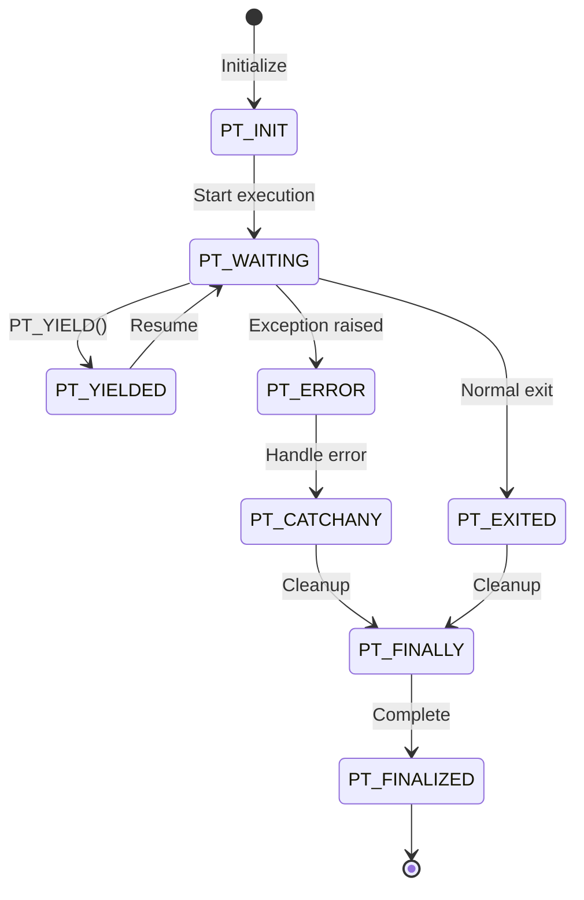
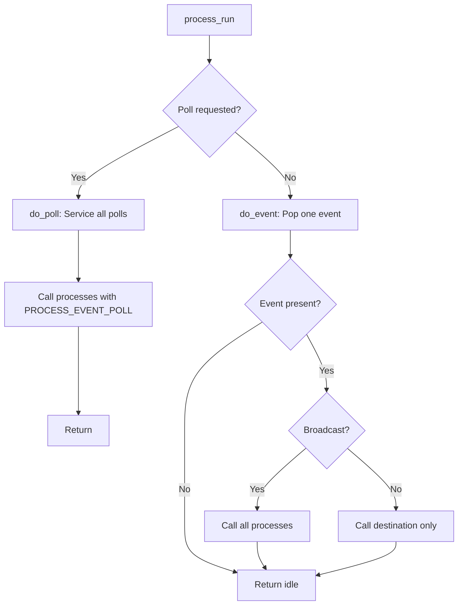

# Protoduino

**A Revolutionary Embedded Operating Framework for Education and Innovation**

Protoduino transforms Arduino boards into sophisticated embedded systems with professional-grade capabilities—all while remaining accessible to students and educators. Built on an enhanced version of Adam Dunkels' [protothreads](http://dunkels.com/adam/pt/about.html), it brings modern operating system concepts to resource-constrained microcontrollers without sacrificing simplicity or performance.

## Why Protoduino?

Traditional Arduino programming forces students into blocking, sequential code that quickly becomes unwieldy for real-world applications. Protoduino bridges the gap between simple sketches and professional embedded systems by providing:

- **Cooperative multitasking** without the overhead of traditional RTOSes
- **Native exception handling** for robust error management
- **Professional IPC mechanisms** (messages and streaming pipes)
- **Deterministic, real-time behavior** perfect for teaching embedded systems concepts
- **Zero malloc() design** ensuring predictable memory usage

Perfect for courses in embedded systems, IoT, robotics, and computer engineering—or for hobbyists ready to level up their Arduino projects.

---

## 🎓 For Educators

Protoduino provides a **progressive learning path** from basic Arduino to professional embedded development:

1. **Start Simple**: Students begin with familiar Arduino functions
2. **Add Concurrency**: Introduce lightweight protothreads for multitasking
3. **Learn IPC**: Teach inter-process communication with messages and pipes
4. **Master Error Handling**: Explore exception handling and recovery patterns
5. **Understand Schedulers**: Dive into kernel design and real-time systems

Each concept builds naturally on the previous one, with extensive documentation and examples.

---

## 🚀 Key Features

### 1. **Protothreads v2: Cooperative Multitasking Made Easy**

Run multiple tasks simultaneously without stack overhead. Enhanced with native exception handling and finalization semantics.



**Key enhancements over v1.4:**
- **Exception handling**: `PT_RAISE()`, `PT_CATCH()`, `PT_CATCHANY()` for robust error management
- **Finalization**: `PT_FINALLY()` blocks ensure cleanup always runs
- **State encoding**: Error codes embedded in return values (PT_ERROR + code)
- **Iterator support**: `PT_FOREACH()` and `PT_YIELD()` for elegant generator patterns

📖 [**Read the Protothreads v2 Documentation**](./docs/protothreads.md) for detailed API reference and examples.

---

### 2. **Professional IPC Layer: Messages & Pipes**

Two complementary communication primitives designed for microcontrollers:

**Structured Messages** - RPC-style typed packets
```c
ipc_msg_t *m = ipc_msg_alloc_from_pool(&pool);
void *argv[] = {"/dev/uart0", (void*)115200};
ipc_msg_init(m, MSG_UART_INIT, 2, argv);
process_post(uart_proc, PROCESS_EVENT_MSG, m);
```

**Streaming Pipes** - Zero-copy ring buffers for high-throughput data
```c
// ISR writes bytes
ISR(USART_RX_vect) {
    uint8_t b = UDR0;
    ipc_pipe_write(&uart_pipe, &b, 1);  // Wakes reader automatically
}

// Process reads bytes
uint8_t buf[16];
size_t n = ipc_pipe_read(&uart_pipe, buf, sizeof(buf));
```

**Design principles:**
- ✅ Zero malloc - fixed-size pools
- ✅ ISR-safe with atomic operations
- ✅ O(1) deterministic operations
- ✅ Scheduler-agnostic (reusable across systems)

📖 [**Read the IPC Documentation**](./docs/ipc.md) for architecture details and integration patterns.

---

### 3. **Protoduino Kernel: Game-Loop Scheduler**

A tiny, deterministic cooperative scheduler designed for predictable real-time behavior:



**Features:**
- Priority-based process scheduling
- Global event queue + optional per-process inboxes
- Automatic error propagation to error logger
- Integrates seamlessly with protothreads lifecycle
- Under 2KB code footprint

📖 [**Read the Scheduler Documentation**](./docs/scheduler.md) for complete design details, debugging guides, and Arduino examples.

---

### 4. **Ontological Error Taxonomy**

A groundbreaking **8-bit error classification system** that goes beyond simple error codes:

- **256 error codes (0-255)** organized hierarchically
- **Mathematical foundation**: Hamming weights, inversions, symmetry classes
- **Four primordial roots**: Init/Success (0x00), Before/IO (0x55), After/Data (0xAA), Run/Fatal (0xFF)
- **Programmatic analysis**: Error relationships, depths, entropy, balance
- **Embedded-optimized**: Fits in uint8_t, minimal overhead

**Why an ontology matters:**
- Enables **automated error recovery** by inferring related errors
- Improves **debugging** through hierarchical classification
- Provides **semantic structure** for AI-powered log analysis
- Ensures **interoperability** across distributed systems

**Looking ahead:** The taxonomy provides a foundation for quantum error correction in the emerging Quantum-AI era.

📖 [**Read the Error Taxonomy Documentation**](./docs/errors.md) for the mathematical framework and future quantum applications.

---

### 5. **UTF-8 and Unicode Support**

Professional text handling ported from Plan 9's proven implementation:

```c
// UTF-8 string manipulation
const char *str = "Hello 世界";
int len = utflen(str);           // Character count (not bytes)
Rune r = utfrune(str, L'世');    // Find Unicode character

// Stream integration
Stream *s = &Serial;
Rune rune;
utf8_stream_getrune(s, &rune);   // Read UTF-8 from serial
utf8_stream_putrune(s, rune);    // Write UTF-8 to serial

// 16-bit Unicode (Rune16)
Rune16 wstr[64];
rune16cpy(wstr, L"Unicode text");
```

Perfect for internationalized displays, GPS coordinates, or any application requiring proper text handling.

---

## 📚 Complete Documentation

Protoduino includes extensive, professional-grade documentation:

| Document | Description |
|----------|-------------|
| [**Protothreads v2**](./docs/protothreads.md) | Enhanced cooperative multitasking with exception handling |
| [**IPC Layer**](./docs/ipc.md) | Messages and streaming pipes for inter-process communication |
| [**Kernel Scheduler**](./docs/scheduler.md) | Game-loop scheduler design, debugging, and integration |
| [**Error Taxonomy**](./docs/errors.md) | Ontological 8-bit error classification system |
| [**Module Loader**](./docs/loader.md) | Dynamic code loading and runtime extensibility |

Each document includes theory, practical examples, debugging guides, and Mermaid diagrams.

---

## 🎯 Getting Started

### Installation

1. Download the latest release from [GitHub](https://github.com/jklarenbeek/protoduino)
2. Extract to your Arduino libraries folder
3. Restart Arduino IDE

### Your First Protothread

```cpp
#include <protoduino.h>

PROCESS(blink_process, "blink", 1);

PROCESS_THREAD(blink_process, ev, data)
{
    static unsigned long last = 0;
    static bool state = false;

    PROCESS_BEGIN();

    pinMode(LED_BUILTIN, OUTPUT);

    while(1) {
        PROCESS_WAIT_UNTIL(millis() - last > 1000);

        state = !state;
        digitalWrite(LED_BUILTIN, state);
        last = millis();
    }

    PROCESS_END();
}

void setup() {
    process_init(NULL);
    process_start(&blink_process);
}

void loop() {
    process_run();  // Run scheduler
}
```

### Learning Path

1. **Basics**: Start with examples in `examples/01-10` for protothread fundamentals
2. **IPC**: Explore `examples/11-20` for message passing and pipes
3. **Advanced**: Study `examples/21-30` for error handling and modules
4. **Projects**: Build complete systems combining all concepts

---

## 🔬 For Students

Protoduino is an ideal platform for learning embedded systems:

- **Hands-on**: Write real firmware, not simulations
- **Progressive**: Start simple, scale to complexity
- **Professional**: Learn patterns used in production systems
- **Accessible**: Runs on affordable Arduino hardware
- **Well-documented**: Every concept explained with examples

**Course topics covered:**
- Cooperative vs. preemptive multitasking
- Inter-process communication patterns
- Real-time scheduling and determinism
- Error handling and recovery
- Memory management in constrained systems
- State machine design

---

## 🛠️ For Professionals

Protoduino provides production-ready patterns:

- **Deterministic timing**: O(1) operations, predictable behavior
- **Zero dynamic allocation**: No malloc, no fragmentation
- **ISR-safe primitives**: Atomic operations throughout
- **Comprehensive error handling**: Exception-like semantics in C
- **Modular architecture**: Clean separation of concerns

**Real-world applications:**
- Industrial sensor networks
- Battery-powered IoT devices
- Real-time data acquisition
- Robotics control systems
- Protocol gateways

---

## 🌟 Why Choose Protoduino?

| Feature | Traditional Arduino | Protoduino |
|---------|---------------------|------------|
| Multitasking | Blocking delays, state machines | Cooperative protothreads |
| Error Handling | Return codes, global errno | Native exceptions, ontological taxonomy |
| IPC | Global variables | Messages and pipes |
| Scheduler | Manual loop() management | Priority-based kernel |
| Extensibility | Recompile and reflash | Dynamic module loading |
| Memory Safety | malloc/free risks | Fixed pools, zero fragmentation |

---

## 🤝 Contributing

Protoduino is open-source and welcomes contributions:

- **Bug reports**: Open issues on GitHub
- **Documentation**: Help improve examples and guides
- **Features**: Propose new capabilities
- **Education**: Share classroom experiences

---

## 📖 License

Protoduino is released under an open-source license. See LICENSE file for details.

---

## 🔗 Resources

- **GitHub Repository**: https://github.com/jklarenbeek/protoduino
- **Original Protothreads**: http://dunkels.com/adam/pt/about.html
- **Plan9Port (UTF-8 library source)**: https://github.com/9fans/plan9port
- **Contiki-OS**: Related embedded OS using protothreads

---

## 🎓 Academic Use

If you use Protoduino in academic research or teaching, please cite:

```
Protoduino: A Cooperative Multitasking Framework for Arduino
https://github.com/jklarenbeek/protoduino
```

---

**Ready to transform your embedded projects? Start with the [Protothreads v2 tutorial](./docs/protothreads.md) and explore the examples!**