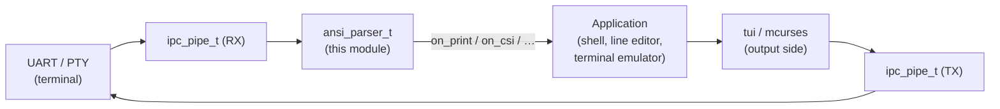

# ANSI / VT Input Parser
### Byte-Fed • Non-Blocking • UTF-8 Native • Zero Malloc

---

## Table of Contents

1. [Overview](#1-overview)
2. [Where it fits](#2-where-it-fits)
3. [The state machine](#3-the-state-machine)
4. [Quick Start](#4-quick-start)
5. [Handlers](#5-handlers)
6. [CSI parameters](#6-csi-parameters)
7. [Key decoding](#7-key-decoding)
8. [Lone ESC and flushing](#8-lone-esc-and-flushing)
9. [Examples](#9-examples)
10. [API Reference](#10-api-reference)

---

## 1. Overview

`ansi.h` / `ansi.c` provide the **input-side** terminal parser — the
counterpart to mcurses (which is output-side). You feed it the raw bytes
arriving from a terminal or host program, one at a time, and it classifies
them into structured actions and invokes your handlers:

| Action | Trigger | Handler |
|---|---|---|
| **print** | a printable character (UTF-8 decoded to a codepoint) | `on_print(ctx, cp)` |
| **execute** | a C0 control byte (CR, LF, TAB, BS) or DEL/Backspace | `on_execute(ctx, ctrl)` |
| **CSI** | `ESC [ params ; … intermediates final` | `on_csi(ctx, csi)` |
| **ESC / SS2 / SS3** | `ESC <inter> final`, `ESC N x`, `ESC O x` | `on_esc(ctx, inter, final)` |
| **OSC** | `ESC ] … (BEL │ ST)` | `on_osc(ctx, data, len)` |
| **DCS** | `ESC P … ST` | `on_dcs_hook` / `on_dcs_put` / `on_dcs_unhook` |

The parser is a hand-coded implementation of Paul Williams' DEC VT500 parser
(<https://vt100.net/emu/dec_ansi_parser>), the same model used by libvterm
and vte. It is **non-blocking** (push one byte, get zero or more callbacks),
**zero-malloc** (all state in a caller-allocated `ansi_parser_t`; OSC/DCS
bytes go into a caller-owned buffer), **integer-only**, and **instance-based**
(no globals — multiple parsers can coexist).

> **UTF-8 native.** In the GROUND state, bytes `0x80–0xFF` are decoded as
> UTF-8 — they are **not** treated as 8-bit C1 controls (those collide with
> UTF-8 and are unused by UTF-8 terminals). Only the 7-bit escape forms
> (`ESC [`, `ESC ]`, `ESC P`, …) are recognised. Malformed sequences emit
> `U+FFFD`.

---

## 2. Where it fits



A shell reads keystrokes through the parser (`on_print` for text, decoded
`KEY_*` for special keys) and draws its UI with the TUI/mcurses output stack.
A terminal *emulator* would instead route the CSI/SGR/OSC actions into a
screen-cell buffer. The parser is the shared substrate for both.

---

## 3. The state machine

States follow the Williams model:

```
GROUND ──ESC──► ESCAPE ──'['──► CSI_ENTRY ─► CSI_PARAM ─► CSI_INTER ─► (final) ─► GROUND
   ▲              │   │                                    └─► CSI_IGNORE ─┘
   │              │   ├──']'──► OSC ───(BEL│ST)──► GROUND
   │              │   ├──'P'──► DCS_ENTRY ─► … ─► DCS_PASS ──ST──► GROUND
   │              │   ├──'N'/'O'─► SS2/SS3 ─(one byte)─► GROUND
   │              │   ├──'X'/'^'/'_'─► STR_IGNORE ──ST──► GROUND
   │              │   └──(final)──► GROUND        (ESC dispatch / charset)
   │              └──intermediate──► ESCAPE_INTER ─► (final) ─► GROUND
   └───────────────────────────────────── print / execute
```

`CAN` (0x18) and `SUB` (0x1A) abort any sequence back to GROUND. `ESC`
anywhere starts a fresh sequence (closing an open OSC/DCS string first).
C0 controls embedded mid-sequence are executed immediately (Williams
"anywhere" rule), so e.g. a CR arriving inside a half-typed escape is not lost.

---

## 4. Quick Start

```c
#include "lib/text/ansi.h"

static void on_print(void *ctx, uint32_t cp)            { /* a character */ }
static void on_execute(void *ctx, uint8_t ctrl)         { /* CR/LF/TAB/BS */ }
static void on_csi(void *ctx, const ansi_csi_t *csi)    { /* CSI sequence */ }
static void on_esc(void *ctx, uint8_t inter, uint8_t f) { /* ESC / SS3   */ }

static const ansi_handlers_t H = {
    on_print, on_execute, on_csi, on_esc,
    /* osc */ 0, /* dcs_hook */ 0, /* dcs_put */ 0, /* dcs_unhook */ 0,
};

static ansi_parser_t parser;
static char          oscbuf[32];     /* optional; pass NULL,0 to drop OSC/DCS */

void setup(void) {
    ansi_parser_init(&parser, &H, /*ctx*/ NULL, oscbuf, sizeof(oscbuf));
}

/* In your input loop: drain the RX pipe, feed bytes, flush when empty. */
void poll_input(void) {
    uint8_t b;
    while (rx_available(&b))          /* your UART/pipe read */
        ansi_parse(&parser, b);
    ansi_parser_flush(&parser);       /* deliver a pending lone ESC */
}
```

---

## 5. Handlers

The handler table is not copied — it may live in flash (`const`). Any field
may be `NULL` to ignore that action. `ctx` is the opaque pointer from
`ansi_parser_init()`, handed back to every handler (point it at your shell /
editor / screen state).

| Handler | Called when |
|---|---|
| `on_print(ctx, cp)` | a printable Unicode codepoint is complete |
| `on_execute(ctx, ctrl)` | a C0 control (`< 0x20`) or DEL (`0x7F`) is seen in GROUND |
| `on_csi(ctx, csi)` | a CSI sequence reaches its final byte |
| `on_esc(ctx, inter, final)` | an ESC/charset/SS2/SS3 sequence completes (SS3 ⇒ `inter == 'O'`) |
| `on_osc(ctx, data, len)` | an OSC string is terminated (`data` is NUL-terminated, possibly truncated) |
| `on_dcs_hook/put/unhook` | a DCS string starts / streams data / ends |

---

## 6. CSI parameters

`ansi_csi_t` carries everything about a CSI (and DCS) sequence:

```c
typedef struct {
    int16_t  params[ANSI_MAX_PARAMS];   /* -1 = absent / use default */
    uint8_t  nparams;
    uint8_t  intermediate[ANSI_MAX_INTERMEDIATE];
    uint8_t  nintermediate;
    uint8_t  private_marker;            /* '<' '=' '>' '?' or 0 */
    uint8_t  final;                     /* the command byte */
} ansi_csi_t;
```

Absent parameters are `-1` so a dispatcher can apply command-specific
defaults. Use the helper:

```c
int16_t row = ansi_csi_param(csi, 0, 1);   /* params[0], default 1 */
int16_t col = ansi_csi_param(csi, 1, 1);
```

Sub-parameter separators `:` are treated like `;` (keeps SGR truecolour
`38:2:r:g:b` parsing working). Examples:

| Input | `nparams` | `params` | `private_marker` | `final` |
|---|---|---|---|---|
| `ESC [ H` | 0 | — | 0 | `H` |
| `ESC [ 10 ; 20 H` | 2 | `10, 20` | 0 | `H` |
| `ESC [ ? 25 h` | 1 | `25` | `?` | `h` |
| `ESC [ 1 ; 5 C` | 2 | `1, 5` | 0 | `C` |
| `ESC [ ; 5 H` | 2 | `-1, 5` | 0 | `H` |

---

## 7. Key decoding

For a shell reading the keyboard, two helpers turn sequences into the
project's `KEY_*` codes (from `vtkeys.h`) plus a modifier bitfield:

```c
uint8_t  mods;
uint16_t key = ansi_key_from_csi(csi, &mods);   /* in on_csi  */
/* or, in on_esc when inter == 'O' (SS3): */
uint16_t key = ansi_key_from_ss3(final, &mods);
```

Returns `0` when the sequence is **not** a key (so it stays available for its
real meaning). Recognised:

| Sequence(s) | Key |
|---|---|
| `CSI A/B/C/D`, `SS3 A/B/C/D` | `KEY_UP/DOWN/RIGHT/LEFT` |
| `CSI H/F`, `SS3 H/F`, `CSI 1~ / 4~` | `KEY_HOME / KEY_END` |
| `CSI 2~ / 3~` | `KEY_IC` (Insert) / `KEY_DC` (Delete) |
| `CSI 5~ / 6~` | `KEY_PPAGE / KEY_NPAGE` |
| `CSI Z` | `KEY_BTAB` |
| `CSI 11~…24~`, `SS3 P/Q/R/S` | `KEY_F(1)…KEY_F(12)` |
| `CSI 1 ; <mod> X` | the key for `X` + modifier bits |

Modifier bits: `ANSI_MOD_SHIFT | ANSI_MOD_ALT | ANSI_MOD_CTRL | ANSI_MOD_META`
(xterm encoding: `mods = param − 1`).

> **Input vs. output disambiguation.** A cursor-movement command such as
> `CSI 10;20 H` (CUP) or `CSI 5 A` (CUU) is **not** a key — the decoder
> returns `0` for letter-finals whose first parameter is not `1`. Likewise
> `CSI r;c R` (cursor position report) is never a key, so your shell can read
> it as a CPR reply.

---

## 8. Lone ESC and flushing

A user pressing the **ESC key** sends a bare `0x1B` with nothing after it.
The parser cannot know whether more bytes (a longer sequence) are coming, so
it waits. Call `ansi_parser_flush()` when the input source is drained (the RX
pipe is empty): if a lone ESC is pending it is delivered via
`on_execute(KEY_ESCAPE)` and the parser returns to GROUND. This is the
standard escape-timeout pattern.

---

## 9. Examples

| Example | What it shows |
|---|---|
| [`examples/23-ansi-parser`](../examples/23-ansi-parser/23-ansi-parser.ino) | Feeds a crafted stream (text, UTF-8, CUP, SGR, DECSET, arrows, Ctrl+arrow, F5, SS3 F1, OSC title, CPR) and prints a decode trace. |
| [`examples/24-ansi-keys`](../examples/24-ansi-keys/24-ansi-keys.ino) | A shell-style line editor: printable input, Backspace, decoded special keys, Enter to submit, lone-ESC flush. |

Both run head-less and are verified deterministically under protosim:

```bash
protosim examples/23-ansi-parser.elf -m atmega328p -f 16000000 \
    --uart0-out out.txt --exit-on-uart "<DONE>" --max-steps 20000000
```

Verified decode trace (example 23):

```
PRINT  U+0048 'H'         CSI    params=10;20 final='H'        (CUP — not a key)
PRINT  U+00E9             CSI    (?) params=25 final='h'       (DECSET)
PRINT  U+250C             CSI    params=- final='A'  -> KEY UP
CTRL   0x0D CR            CSI    params=1;5 final='C' -> KEY RIGHT [Ctrl]
                          CSI    params=15 final='~' -> KEY F5
                          ESC    inter='O' final='P' -> SS3 KEY F1
                          OSC    len=7 "0;title"
                          CSI    params=6;7 final='R' -> CPR row=6 col=7
```

---

## 10. API Reference

### Types

| Type | Description |
|---|---|
| `ansi_parser_t` | Parser instance (caller-allocated, no globals). |
| `ansi_handlers_t` | Table of action callbacks (may be `const`/flash). |
| `ansi_csi_t` | Parsed CSI/DCS params, intermediates, private marker, final. |

### Functions

| Function | Description |
|---|---|
| `ansi_parser_init(p, handlers, ctx, strbuf, strcap)` | Initialise; `strbuf` collects OSC/DCS bytes (`NULL,0` to drop them). |
| `ansi_parser_reset(p)` | Return to GROUND, discard any partial sequence. |
| `ansi_parse(p, byte)` | Feed one byte. |
| `ansi_parse_buf(p, buf, len)` | Feed a buffer. |
| `ansi_parser_flush(p)` | Deliver a pending lone ESC when input is drained. |
| `ansi_csi_param(csi, i, def)` | Resolve param `i`, returning `def` if absent. |
| `ansi_key_from_csi(csi, &mods)` | Map a CSI to a `KEY_*` code (0 if not a key). |
| `ansi_key_from_ss3(final, &mods)` | Map an SS3 final (from `ESC O x`) to a `KEY_*` code. |

### Compile-time limits

| Macro | Default | Meaning |
|---|---|---|
| `ANSI_MAX_PARAMS` | 8 | Numeric params captured per sequence. |
| `ANSI_MAX_INTERMEDIATE` | 2 | Intermediate bytes captured per sequence. |

---

*Protoduino ANSI/VT Input Parser · Developer Reference*
