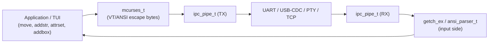
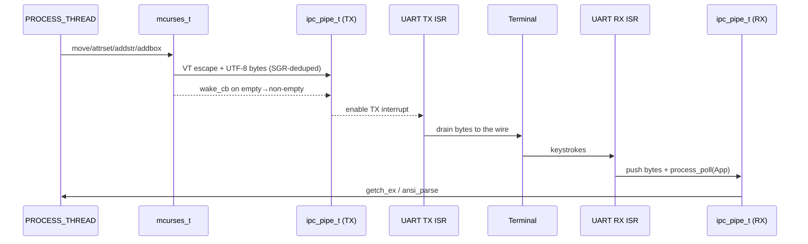

# mcurses — Lean Terminal Output Library
### Instance-Based • Transport-Agnostic • UTF-8 Native • Zero Malloc

---

## Table of Contents

1. [Overview](#1-overview)
2. [Where it fits](#2-where-it-fits)
3. [The `mcurses_t` instance](#3-the-mcurses_t-instance)
4. [Wiring it up](#4-wiring-it-up)
5. [Quick Start](#5-quick-start)
6. [Lifecycle](#6-lifecycle)
7. [Cursor & attributes](#7-cursor--attributes)
8. [Output](#8-output)
9. [Screen & line editing](#9-screen--line-editing)
10. [Input](#10-input)
11. [TX back-pressure & loss accounting](#11-tx-back-pressure--loss-accounting)
12. [UTF-8 & box drawing](#12-utf-8--box-drawing)
13. [Single-instance convenience layer](#13-single-instance-convenience-layer)
14. [Memory footprint](#14-memory-footprint)
15. [How it all works together](#15-how-it-all-works-together)
16. [API Reference](#16-api-reference)

---

## 1. Overview

**mcurses** is a small ncurses-flavoured terminal library for protoduino. It
turns high-level calls (`move`, `addstr`, `attrset`, `addbox`, `clrtoeol`, …)
into the **VT100/ANSI escape byte stream** a terminal understands — and it
writes those bytes into an [`ipc_pipe_t`](./ipc.md), never to hardware
directly. Whatever drains that pipe (a UART ISR, USB-CDC, a PTY/TCP bridge
under [protosim](https://github.com/jklarenbeek/protosim)) is the transport.

### Design principles

| Principle | What it means |
|---|---|
| **Zero globals** | All state lives in a caller-allocated `mcurses_t`. Multiple independent screens can coexist. |
| **Transport-agnostic** | Output goes to a TX `ipc_pipe_t`; input comes from an RX `ipc_pipe_t`. mcurses knows nothing about UARTs. |
| **UTF-8 native** | Strings are streamed as raw UTF-8 bytes — no rune buffers, no re-encode. |
| **Zero malloc** | No dynamic allocation anywhere. |
| **SGR-deduplicated** | Attribute escapes are only re-emitted when the attribute actually changes, minimising pipe traffic. |
| **Lossless or accounted** | Writes honour the pipe's partial-write contract: with a drain hook installed nothing is lost; without one, dropped bytes are *counted*, never silently discarded. |

Every public function comes in an explicit-instance form suffixed `_ex`
(`addstr_ex(&scr, …)`). An optional thin wrapper layer gives the classic
single-instance names (`addstr("…")`) — see §13.

---

## 2. Where it fits

mcurses is the **output side** of protoduino's terminal stack. The
[TUI layout engine](./tui.md) sits on top of it, and the
[ANSI input parser](./ansi.md) is its symmetric **input side** counterpart.



Because the only coupling is the pipe, the *same* screen code runs over a
real 9600-baud UART on an Uno, over USB-CDC, or against protosim's virtual
UART for head-less testing.

---

## 3. The `mcurses_t` instance

All screen state is one plain struct you allocate (static or on the stack):

```c
typedef struct mcurses {
    ipc_pipe_t *txpipe, *rxpipe;   /* output to / input from the terminal     */
    uint8_t     rows, cols;        /* screen dimensions                        */
    uint8_t     cury, curx;        /* tracked cursor (0-based)                 */
    uint8_t     scroll_top, scroll_bot; /* DECSTBM scroll region              */
    uint16_t    attr, last_attr;   /* current SGR / last one actually sent     */
    uint8_t     nodelay, halfdelay;/* input timing                             */
    /* state flags + TX back-pressure (tx_dropped, tx_drain) ...               */
} mcurses_t;
```

Callers should treat it as opaque and use the API functions. The struct is
exposed (not hidden behind a pointer) precisely so it can live in a process's
persistent state with no allocation — see §15.

---

## 4. Wiring it up

mcurses needs a TX pipe (required) and optionally an RX pipe, both
initialised with [`ipc_pipe_init()`](./ipc.md). You connect those pipes to a
transport. On AVR that is the `uart0` driver: its TX-complete ISR pulls bytes
out of the TX pipe, and its RX-complete ISR pushes received bytes into the RX
pipe. This is the pattern used by
[`examples/21-process-mcurses`](../examples/21-process-mcurses/21-process-mcurses.ino):

```c
static uint8_t    tx_buf[96], rx_buf[32];
static ipc_pipe_t tx_pipe, rx_pipe;

/* UART TX ISR asks for the next byte to transmit */
static int_fast16_t on_tx_complete(void) {
    uint8_t b;
    return (ipc_pipe_read(&tx_pipe, &b, 1) > 0) ? (int_fast16_t)b : -1;
}
/* mcurses wrote to the (empty) TX pipe → kick the UART TX interrupt */
static void tx_wake_cb(void *ctx) { (void)ctx; uart0_tx_enable_int(); }
/* UART RX ISR delivers a received byte */
static void on_rx_byte(uint_fast8_t ch) {
    uint8_t b = (uint8_t)ch;
    ipc_pipe_write(&rx_pipe, &b, 1);
    process_poll(&my_proc.base);          /* wake the reader */
}

void setup(void) {
    ipc_pipe_init(&tx_pipe, tx_buf, sizeof(tx_buf), tx_wake_cb, NULL);
    ipc_pipe_init(&rx_pipe, rx_buf, sizeof(rx_buf), NULL,       NULL);
    uart0_on_tx_complete(on_tx_complete);
    uart0_on_rx_complete(on_rx_byte);
    uart0_open(9600);
    /* mcurses_init + initscr_ex ... (see Quick Start) */
}
```

> The `wake_cb` on the TX pipe is what makes output flow: `ipc_pipe_write`
> calls it on the empty→non-empty transition, and the callback enables the
> UART TX interrupt so the ISR starts draining. See §11 for what happens when
> output outruns the pipe.

---

## 5. Quick Start

```c
#include <protoduino.h>
#include "lib/text/mcurses.h"

static uint8_t    tx_buf[96], rx_buf[32];
static ipc_pipe_t tx_pipe, rx_pipe;
static mcurses_t  scr;

void setup(void) {
    /* ... ipc_pipe_init + uart0 wiring as in §4 ... */

    mcurses_init(&scr, &tx_pipe, &rx_pipe, 24, 80);   /* dimensions */
    initscr_ex(&scr);                                  /* alt screen, clear */

    mvaddstr_ex(&scr, 0, 0, "Hello, mcurses!");
    attrset_ex(&scr, MCURSES_ATTR_BOLD | MCURSES_FG_CYAN);
    mvaddstr_ex(&scr, 2, 2, "Bold cyan text");
    attrset_ex(&scr, MCURSES_ATTR_NORMAL);
    mvaddbox_ex(&scr, 4, 0, 5, 30, 1);                 /* single-line box */
    refresh_ex(&scr);
}
```

A complete, runnable two-process demo (status dashboard + line-editor input)
lives in
[`examples/21-process-mcurses`](../examples/21-process-mcurses/21-process-mcurses.ino).

---

## 6. Lifecycle

| Function | Purpose |
|---|---|
| `mcurses_init(scr, tx, rx, rows, cols)` | Bind pipes + dimensions. `tx` must be pre-initialised; `rx` may be NULL if input is unused. Call before `initscr_ex`. |
| `initscr_ex(scr)` | Enter the alternate screen (`ESC[?1049h`), reset attributes, clear, home. Returns non-zero on success. |
| `endwin_ex(scr)` | Restore the terminal to normal mode (leave the alternate screen). |
| `mcurses_set_drain(scr, cb, ctx)` | Install an optional TX back-pressure drain hook (§11). |

---

## 7. Cursor & attributes

| Function | Effect |
|---|---|
| `move_ex(scr, y, x)` | Emit cursor-position (CUP) and update tracked `cury/curx`. |
| `attrset_ex(scr, attr)` | Set the current SGR attribute (see below). The escape is only sent lazily, when something is actually drawn and the attribute differs from the last one emitted. |
| `curs_set_ex(scr, vis)` | Cursor visibility: `0` invisible, `1` normal, `2` very visible. |

### Attribute model

Attributes are a `uint16_t` bitfield (the same encoding the TUI engine and the
ANSI parser use):

```c
attrset_ex(&scr, MCURSES_ATTR_BOLD | MCURSES_FG(7) | MCURSES_BG(1));
//                 │                   │              └─ background colour index
//                 │                   └─ foreground colour index
//                 └─ style bit
```

| Style flag | SGR | | Colour macro | Index |
|---|---|---|---|---|
| `MCURSES_ATTR_NORMAL` | 0 | | `MCURSES_FG(c)` / `MCURSES_BG(c)` | 0 = terminal default |
| `MCURSES_ATTR_BOLD` | 1 | | … `_BLACK` (1) `_RED` (2) `_GREEN` (3) | 1–8 → ANSI 30–37 / 40–47 |
| `MCURSES_ATTR_DIM` | 2 | | … `_YELLOW` (4) `_BLUE` (5) `_MAGENTA` (6) | |
| `MCURSES_ATTR_UNDERLINE` | 4 | | … `_CYAN` (7) `_WHITE` (8) | |
| `MCURSES_ATTR_BLINK` | 5 | | FG occupies bits `[8..11]` | |
| `MCURSES_ATTR_REVERSE` | 7 | | BG occupies bits `[12..15]` | |
| `MCURSES_ATTR_INVISIBLE` | 8 | | | |

---

## 8. Output

| Function | Writes |
|---|---|
| `addch_ex(scr, ch)` | One ASCII character; advances the cursor (wraps at `cols`). |
| `addch_utf8_ex(scr, utf8, len)` | One UTF-8 character by pointer + byte length (`len = 0` auto-detects from the lead byte). Counts as one display column. |
| `addstr_ex(scr, s)` | A NUL-terminated UTF-8 string, streamed as raw bytes. |
| `addnstr_ex(scr, s, byte_len)` | A bounded UTF-8 byte range (need not be NUL-terminated). |
| `addstr_P_ex(scr, s_P)` | A PROGMEM (AVR flash) string — saves SRAM for static labels. |
| `addbox_ex(scr, y, x, h, w, style)` | A box-drawing border rectangle (§12). |
| `refresh_ex(scr)` | Flush pending output toward the transport. |

All string writers stream the UTF-8 bytes directly to the TX pipe (no
intermediate decode), advancing the tracked cursor one column per rune. Each
also routes through the back-pressure path in §11. There are `mv…_ex`
shortcuts that combine a `move_ex` with the draw, e.g.
`mvaddstr_ex(scr, y, x, s)`.

> **UTF-8 column counting** is one column per rune (the project's
> 1-rune ≈ 1-cell model); double-width CJK is not yet tracked. Malformed or
> truncated multi-byte input never causes an out-of-bounds read — the writer
> stops at the NUL.

---

## 9. Screen & line editing

| Function | Effect |
|---|---|
| `clear_ex(scr)` / `erase_ex(scr)` | Clear the whole screen, home the cursor. |
| `clrtobot_ex(scr)` | Clear from the cursor row to the bottom. |
| `clrtoeol_ex(scr)` | Clear from the cursor column to end of line. |
| `insch_ex(scr, ch)` | Insert a character; the rest of the line shifts right. |
| `delch_ex(scr)` | Delete the character under the cursor; the line shifts left. |
| `insertln_ex(scr)` | Insert a blank line; lines below scroll down. |
| `deleteln_ex(scr)` | Delete the current line; lines below scroll up. |
| `setscrreg_ex(scr, top, bot)` | Set the DECSTBM scroll region `[top..bot]`. |
| `scroll_ex(scr)` | Scroll the scroll region up one line. |

A scrolling log window is the classic combination: set a scroll region with
`setscrreg_ex`, move to its bottom row, call `scroll_ex` to open a fresh line,
write the entry, then reset the region — exactly what example 21's event log
does.

---

## 10. Input

mcurses can also *read* keys from the RX pipe:

| Function | Purpose |
|---|---|
| `getch_ex(scr)` | Read one key; translates a handful of VT escape sequences to `KEY_*` codes (vterm.h). Returns `MCURSES_KEY_ERR` (0xFF) when non-blocking and nothing is available. |
| `getnstr_ex(scr, buf, maxlen)` | Read a line with minimal editing (printable, Backspace, Enter to finish, Esc to cancel), echoing as it goes. |
| `nodelay_ex(scr, onoff)` | Non-blocking `getch` (return immediately when the pipe is empty). |
| `halfdelay_ex(scr, tenths)` | Block in `getch` for at most `tenths × 100 ms`. |

> `getch_ex` uses a small fixed escape-sequence table (vterm.h) — fine for
> arrow/function keys in a simple UI. For a shell or anything needing
> **near-full ANSI** input (CSI parameters, modifiers, OSC, cursor-position
> reports), feed the RX bytes to the [ANSI parser](./ansi.md) instead; it is
> the proper, complete input state machine. The two share the same `KEY_*`
> code space.

---

## 11. TX back-pressure & loss accounting

`ipc_pipe_write()` is **best-effort**: if the TX pipe is full it writes only
what fits and reports a short count. mcurses funnels *every* byte through a
single internal emitter that respects this contract, so output is never
*silently* truncated:

```mermaid
flowchart TD
    w["write N bytes"] --> p{"all fit?"}
    p -- yes --> done["done"]
    p -- no --> h{"drain hook?"}
    h -- yes --> drain["call tx_drain → make space"] --> w
    h -- no --> count["tx_dropped += shortfall\n(return, don't block)"]
```



- **With a drain hook** (`mcurses_set_drain(scr, cb, ctx)`): when the pipe
  fills, `cb` is invoked to make room — e.g. transmit queued bytes on a polled
  UART, or run a synchronous pipe→UART drain. Output is **lossless**, even a
  full-screen redraw larger than the pipe buffer.
- **Without a drain hook**: the unwritten bytes are added to the saturating
  `scr->tx_dropped` counter and the call returns rather than blocking the
  cooperative scheduler. The loss is then **visible** (check `tx_dropped`) and
  can be acted on (enlarge the buffer, throttle updates).

In the common interrupt-driven setup the TX pipe drains continuously in the
background, so `tx_dropped` stays `0` without any hook. Install a hook when a
single burst can exceed the pipe (e.g. tight synchronous test harnesses, or a
large `clear` + repaint).
[`examples/25-tui-robust`](../examples/25-tui-robust/25-tui-robust.ino)
demonstrates both: lossless with a hook, and counted (not silent) without one.

---

## 12. UTF-8 & box drawing

Box and line characters come from the Unicode box-drawing block and are
defined as `ACS_*` constants in [`vterm.h`](../src/lib/text/vterm.h)
(`ACS_ULCORNER`, `ACS_HLINE`, `ACS_VLINE`, …). `addbox_ex` draws a full
rectangle in one call; its `style` argument matches `tui_border_style_t` so
the value is portable between the mcurses and TUI APIs:

| `style` | Appearance |
|---|---|
| `0` | none — nothing drawn |
| `1` | single `┌─┐│ │└─┘` |
| `2` | double `╔═╗║ ║╚═╝` |
| `3` | round `╭─╮│ │╰─╯` |

> The terminal must support Unicode box-drawing for styles 1–3. Characters are
> emitted as UTF-8 byte sequences via the same TX path as text.

---

## 13. Single-instance convenience layer

Define `MCURSES_USE_DEFAULT_INSTANCE` before including the header to compile in
thin wrappers that match the classic mcurses names — `addstr("…")`,
`move(y,x)`, `getch()`, etc. — operating on a `mcurses_default` pointer you
set:

```c
#define MCURSES_USE_DEFAULT_INSTANCE
#include "lib/text/mcurses.h"

mcurses_t *mcurses_default;   /* point at your instance before initscr() */
```

This is purely ergonomic sugar; the `_ex` forms remain available and are
required when juggling more than one screen. The `mv*` combination macros
(`mvaddstr`, `mvaddch_utf8`, `mvaddbox`, `getyx`, …) exist in both flavours.

---

## 14. Memory footprint

| Item | Bytes (AVR) | Notes |
|---|---|---|
| `mcurses_t` | ~26 | Cursor, attrs, scroll region, flags, back-pressure fields. |
| TX pipe buffer | tunable | 64–128 typical; bigger = fewer drops without a drain hook. |
| RX pipe buffer | tunable | 16–32 typical for keyboard input. |
| `ipc_pipe_t` × 2 | ~24 | Pipe structs. |

No flash strings or tables are allocated in RAM; PROGMEM labels
(`addstr_P_ex`) keep static UI text in flash. The library compiles clean on
AVR, ARM, ESP32, and host GCC.

---

## 15. How it all works together

Putting the pieces in one picture — a cooperative process owns an `mcurses_t`
in its persistent state and shares the TX/RX pipes with the UART ISR:



The layering, bottom to top:

1. **Transport** — a UART (or USB-CDC / PTY / TCP) moves bytes on and off the
   wire via ISRs.
2. **[`ipc_pipe_t`](./ipc.md)** — lock-free ring buffers decouple the ISR from
   application code; the TX wake callback kicks the transport, the RX side
   wakes the reader.
3. **mcurses** *(this document)* — the output-side driver: it renders
   high-level calls into the VT/ANSI byte stream, tracks the cursor and
   attributes, deduplicates SGR, and accounts for back-pressure.
4. **[TUI](./tui.md)** — a declarative, damage-tracked layout engine that emits
   its draw calls *through* mcurses.
5. **[ANSI parser](./ansi.md)** — the input-side counterpart: it consumes RX
   bytes and decodes printable text, control keys, CSI/OSC/DCS sequences, and
   `KEY_*` codes — the foundation for an interactive shell.

The throughline is the `ipc_pipe_t`: mcurses is deliberately ignorant of the
transport, which is why the identical screen code runs on real hardware and
under protosim's virtual UART for deterministic, head-less testing.

---

## 16. API Reference

### Lifecycle
`mcurses_init` · `initscr_ex` · `endwin_ex` · `mcurses_set_drain`

### Cursor & attributes
`move_ex` · `attrset_ex` · `curs_set_ex` · `getyx_ex`

### Output
`addch_ex` · `addch_utf8_ex` · `addstr_ex` · `addnstr_ex` · `addstr_P_ex` ·
`addbox_ex` · `refresh_ex` · and `mvaddch_ex` / `mvaddstr_ex` /
`mvaddnstr_ex` / `mvaddch_utf8_ex` / `mvaddstr_P_ex` / `mvaddbox_ex`

### Screen & line editing
`clear_ex` / `erase_ex` · `clrtobot_ex` · `clrtoeol_ex` · `insch_ex` ·
`delch_ex` · `insertln_ex` · `deleteln_ex` · `setscrreg_ex` · `scroll_ex` ·
and `mvinsch_ex` / `mvdelch_ex`

### Input
`getch_ex` · `getnstr_ex` · `nodelay_ex` · `halfdelay_ex` · `mvgetnstr_ex`

### Attribute / colour macros
`MCURSES_ATTR_*` · `MCURSES_FG(c)` / `MCURSES_BG(c)` · `MCURSES_FG_*` /
`MCURSES_BG_*` · `MCURSES_KEY_ERR`

### Single-instance wrappers (`MCURSES_USE_DEFAULT_INSTANCE`)
`initscr` · `endwin` · `move` · `attrset` · `addstr` · `addch` · `getch` ·
… (one per `_ex` function) · `mcurses_cury` / `mcurses_curx`

---

*Protoduino mcurses · Terminal Output Library · Developer Reference*
