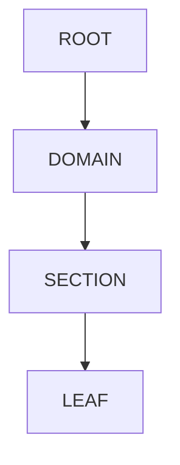
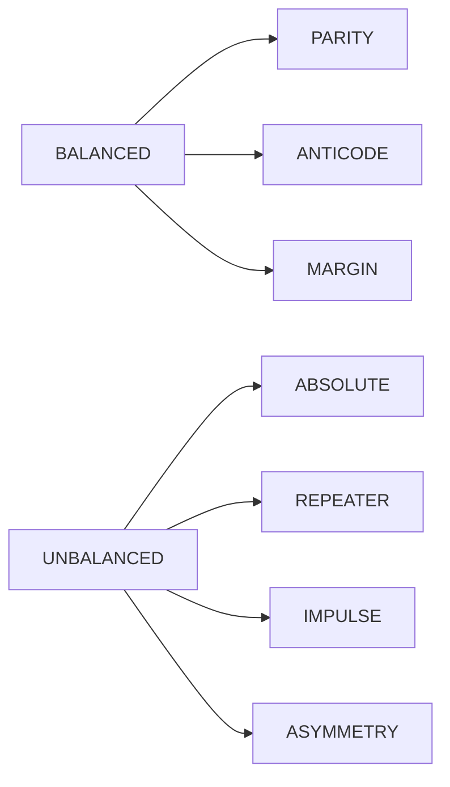
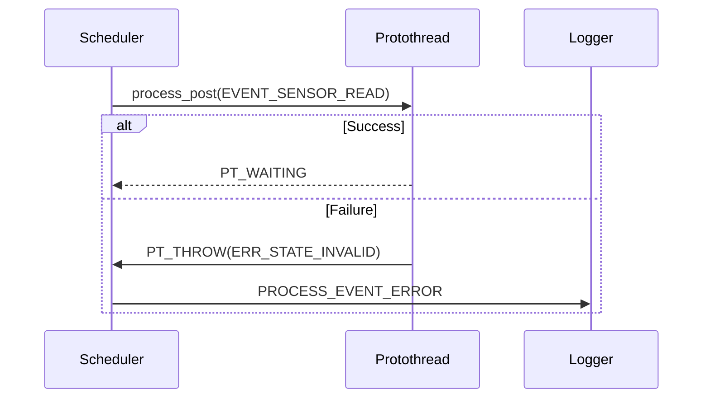

# Protoduino Event-Error Ontology

## A Mathematical Framework for Embedded System State Representation Integrated with Protothreads and Kernel Scheduler

**Version:** 1.1
**Author:** jklarenbeek@gmail.com
**Date:** January 2026

---

## Table of Contents

1. [Overview](#overview)
2. [Theoretical Foundation](#theoretical-foundation)
3. [Mathematical Properties](#mathematical-properties)
4. [Generation Recipe](#generation-recipe)
5. [Hierarchical Structure](#hierarchical-structure)
6. [Symmetry Classes](#symmetry-classes)
7. [Event-Error Duality](#event-error-duality)
8. [Practical Applications](#practical-applications)
9. [Implementation Guide](#implementation-guide)
10. [Advanced Topics](#advanced-topics)
11. [Validation Checklist](#validation-checklist)
12. [References & Further Reading](#references--further-reading)

---

## Overview

The Protoduino Event-Error Ontology is a **mathematically rigorous, self-consistent 8-bit taxonomy** that models the complete lifecycle of embedded systems through complementary event and error spaces, fully integrated with Protothreads v2 for lightweight cooperative multitasking and the Protoduino kernel scheduler for event-driven process management. Unlike traditional error code schemes that grow organically, this system leverages **group theory, information theory, and bitwise symmetry operations** to create a predictable, analyzable framework for system state representation, where events trigger scheduler actions and errors propagate through Protothread exceptions.

This ontology holds profound implications for the future of humanity, AI, and quantum noise research. By encoding states with entropy and symmetry, it provides a lens for understanding uncertainty and chaos in computational flows—mirroring quantum phenomena like noise and superposition. In AI, it enables traceable execution graphs for explainable models; in embedded systems, it fosters resilient designs against noisy environments.

### Key Innovations

- **Dual Ontology**: Events and errors exist as inverse pairs (`~event & 0xFF = error`), with events posted via the scheduler's `process_post()` and errors raised in Protothreads using `PT_RAISE` or `PT_THROW`.
- **Hierarchical Depth**: 4-level tree structure (ROOT → DOMAIN → SECTION → LEAF), mapping to Protothread states and scheduler lifecycles.
- **Symmetry Preservation**: TWINS, SHADOWS, MIRRORS provide structural invariants, ensuring consistent behavior in Protothread finalization (`PT_FINALLY`) and scheduler error logging (`PROCESS_EVENT_ERROR`).
- **Information Theoretic**: Shannon entropy and Hamming distance encode semantic relationships, aiding in scheduler priority decisions and Protothread error recovery.
- **Finite State Automaton**: Natural mapping to FSM transitions and error recovery, with Protothread macros like `PT_WAIT_EVENT` handling scheduler-dispatched events.

### Why This Matters

Traditional error handling treats errors as exceptions—afterthoughts to normal flow. This ontology treats **events and errors as dual manifestations of the same underlying process**, seamlessly integrated with Protoduino's components. When `EVENT_SENSOR_READ (0x54)` fails in a Protothread, it raises `ERR_STATE_INVALID (0xAB)` where `0xAB = ~0x54`, triggering scheduler logging via `PROCESS_EVENT_ERROR`. This isn't coincidence—it's **ontological necessity**, ensuring cooperative scheduling and exception propagation in resource-constrained environments like AVR/Arduino.

---

## Theoretical Foundation

### Ontology vs. Taxonomy

**Ontology** defines the fundamental nature and relationships of entities within a domain. **Taxonomy** organizes these entities into hierarchical classifications.

The Protoduino system is:
- **Ontologically grounded** in bitwise operations representing state transformations, aligned with Protothread control flow and scheduler event dispatching.
- **Taxonomically structured** through a 4-level hierarchy mapping to system lifecycle phases, from Protothread initialization (`PT_INIT`) to finalization (`PT_FINAL`).

### Philosophical Basis

The framework rests on three axioms, adapted to Protoduino's Protothreads and scheduler:

1. **Duality Axiom**: Every event has a corresponding failure mode (error), where scheduler-posted events (`process_post`) can trigger Protothread errors (`PT_ERROR`), enabling graceful recovery in cooperative tasks.
2. **Hierarchy Axiom**: System states decompose into ROOT → DOMAIN → SECTION → LEAF, mirroring Protothread nesting (e.g., `PT_SPAWN` for child threads) and scheduler process hierarchies.
3. **Symmetry Axiom**: Structural relationships encode semantic relationships, ensuring invariants in scheduler polls (`PROCESS_EVENT_POLL`) and Protothread symmetries (e.g., MIRRORS for stable states).

These aren't arbitrary—they reflect **how embedded systems actually work** in Protoduino:
- Initialization fails differently than shutdown (QUADRANT symmetry), with errors propagating via `PT_RAISE` to scheduler logs.
- Communication errors differ from scheduling errors (DOMAIN separation), handled via IPC pipes/messages in the scheduler.
- Sensor saturation is the inverse of sensor reading (EVENT-ERROR duality), triggering `PT_THROW` in a Protothread and `process_poll` for recovery.

### Information-Theoretic Perspective

Each 8-bit code is a **256-state discrete space** where:
- **Hamming distance** measures semantic similarity, useful for Protothread error clustering in scheduler recovery strategies.
- **Shannon entropy** quantifies information content, guiding scheduler priority (high-entropy states for runtime flow).
- **Bit operations** represent state transformations, integrated with Protothread line counters (`lc_t`) and scheduler event queues.

Example:
```
EVENT_INIT_START:  0x00 = 00000000  (entropy: 0.0,    absolute certainty) → Scheduler init phase.
EVENT_RUN_ACTIVE:  0x55 = 01010101  (entropy: 1.0,    maximum uncertainty) → Protothread running state.
EVENT_SHUTDOWN:    0xFF = 11111111  (entropy: 0.0,    absolute certainty) → Final `process_exit`.
ERR_FLOW_BLOCKED:  0xAA = 10101010  (entropy: 1.0,    balanced failure) → `PT_ERROR` in thread. (Note: 0xAA = ~0x55, preserving duality and maximum entropy.)
```

All event-error pairs must use distinct codes via inversion to avoid contextual ambiguity in scheduler posting vs. Protothread raising.

The system begins and ends with **zero entropy** (deterministic states) and achieves **maximum entropy** during runtime (balanced operational states), aligning with scheduler's poll-event loop.

### Formal Notation and Definitions

Let \( x \in \{0, \dots, 255\} \) represent an 8-bit code.

- **Nibbles**: High nibble \( h(x) = (x \gg 4) \land 0x0F \); low nibble \( l(x) = x \land 0x0F \).
- **Hamming Weight**: \( w(x) = \) number of 1-bits in \( x \), also denoted as popcount(x).
- **Shannon Entropy**: \( e(x) = -p_1 \log_2 p_1 - p_0 \log_2 p_0 \), where \( p_1 = w(x)/8 \), \( p_0 = 1 - p_1 \). If \( p_1 = 0 \) or 1, \( e(x) = 0 \). (Note: Use precise log2 in analysis tools; approximate in runtime via very_fast_log2.)
- **Hamming Distance**: \( d(x, y) = w(x \oplus y) \).
- **ROOT**: Codes where repeated center operations converge to themselves (depth 0).
- **DOMAIN**: Direct children of ROOTS (depth 1).
- **SECTION**: Depth 2.
- **LEAF**: Depth 3.
- **TWIN**: \( h(x) = l(x) \).
- **SHADOW**: \( h(x) = \neg l(x) \land 0x0F \).
- **MIRROR**: reverse(x) = x.
- **BALANCED**: \( w(x) = 4 \), \( e(x) \approx 1.0 \).
- **UNBALANCED**: \( w(x) \neq 4 \).
- **PARITY**: center(x) = \neg x.
- **ANTICODE**: BALANCED and SHADOW.
- **MARGIN**: BALANCED, not PARITY, not SHADOW.
- **ABSOLUTE**: ROOTS 0x00 or 0xFF.
- **REPEATER**: UNBALANCED TWIN, not ABSOLUTE.
- **IMPULSE**: \( w(x) = 1 \) or 7.
- **ASYMMETRY**: UNBALANCED, not TWIN, not IMPULSE.
- **Reserved Codes**: ERR_SUCCESS (0x00), ERR_YIELDING (0x01), ERR_EXITING (0x02), ERR_ENDING (0x03), ERR_FINALIZED (0xFF). These are necessary for Protothreads in the Protoduino framework: 0x00 for successful completion, 0x01 for PT_YIELD, 0x02 for PT_EXIT, 0x03 for PT_END, 0xFF for finalization. These are shared duals for events.

See errors.h for macro implementations.

---

## Mathematical Properties

### Core Operations

The ontology defines five fundamental bitwise operations, used in Protoduino for state transitions in Protothreads and scheduler error handling:

#### 1. Inverse Operation
\[ \neg x = \sim x \land 0xFF \]
**Semantic meaning**: Failure mode of a process, mapping scheduler events to Protothread errors. Precondition: x is 8-bit. Postcondition: \( \neg (\neg x) = x \); preserves quadrant (root(\( \neg x \)) = root(x)).
**Example**: \( \neg \) EVENT_BOOT_START (0x01) = ERR_SAVE_FAIL (0xFE), used in `PT_THROW(self, ERR_SAVE_FAIL)`. Exhaustive: For x=0x00, \( \neg x = 0xFF \); for x=0x55, \( \neg x = 0xAA \). Edge: x=0xFF, \( \neg x = 0x00 \) (ROOT duality).

Initialization's inverse is persistence failure—systems that cannot boot cannot save state, triggering scheduler `PROCESS_EVENT_ERROR`.

#### 2. Reverse Operation (Bit Reflection)
\[ \text{reverse}(x) = \] swap bits 7-0 (e.g., 0bABCD_EFGH → 0bHGFE_DCBA).
**Semantic meaning**: Symmetrical counterpart, for mirrored states in Protothread iterators (`PT_FOREACH`). Precondition: x is 8-bit. Postcondition: reverse(reverse(x)) = x; preserves balance (w(reverse(x)) = w(x)).
**Example**: reverse(0x01) = 0x80 (IMPULSE to IMPULSE). Exhaustive: For MIRRORS like 0x00, reverse(x)=x. Edge: Non-MIRRORS like 0x02 → 0x40.

#### 3. Opposite Operation (Nibble Swap)
\[ \text{opposite}(x) = (l(x) \ll 4) \lor h(x) \]
**Semantic meaning**: Complementary perspective, for quadrant swaps in scheduler broadcasts. Precondition: x is 8-bit. Postcondition: opposite(opposite(x))=x; may change root quadrant.
**Example**: opposite(0x01)=0x10 (INIT to AFTER). Exhaustive: For TWINS like 0x00, opposite(x)=x. Edge: 0x55 → 0x55 (PARITY invariant).

#### 4. Center Operation (Nuclear Convergence)
\[ \text{center}(x) = ((x \ll 1) \land 0xF0) \lor ((x \gg 1) \land 0x0F) \]
**Semantic meaning**: Parent in hierarchy, for ascending to DOMAIN/ROOT in error recovery. Precondition: x is 8-bit. Postcondition: Iterating converges to ROOT; depth decreases by 1.
**Example**: center(0x01)=0x00 (DOMAIN to ROOT). Exhaustive: Max depth=3; ROOTS fixed (center(0x00)=0x00). Edge: 0xFF → 0xFF.

#### 5. Root Operation
\[ \text{root}(x) = \] iterate center until ROOT.
**Semantic meaning**: Quadrant (semantic basin), for grouping related states in FSMs. Precondition: x is 8-bit. Postcondition: One of 4 ROOTS; preserves duality (root(~x)=root(x)).
**Example**: root(0x01)=0x00 (Q1: INIT). Exhaustive: 64 codes per ROOT (256/4). Edge: Non-convergent impossible by design.

See errors.h for C implementations; these operations apply identically to events, enabling dual headers.

---

## Generation Recipe

This section provides a prescriptive algorithm to generate the ontology from first principles, producing `ontology-proof.csv` and headers like `events.h`/`errors.h`. The JS port (`ontology-claim.js`) and resulting CSV serve as claim and proof, verifiable in any repo.

### Algorithm

1. **Enumerate Codes**: Loop x from 0 to 255.
2. **Compute Operations**: For each x, calculate inverse, reverse, opposite, center, root, depth (iterate center), distance (Hamming to 0), ones (popcount), entropy (Shannon via log2), binary string.
3. **Classify Hierarchy**: ROOT if depth=0; DOMAIN if depth=1 and root(parent)=ROOT; SECTION if depth=2; LEAF if depth=3.
4. **Classify Symmetry**: Apply definitions (e.g., TWIN if h(x)==l(x); BALANCED if ones==4).
5. **Assign Semantics**: Based on quadrant (root(x)): Q1 (0x00)=INIT; Q2 (0x55)=BEFORE; Q3 (0xAA)=AFTER; Q4 (0xFF)=RUN. Append RESERVED for 0x00,0x01,0x02,0x03,0xFF.
6. **Output CSV**: Columns: hex,classes,hierarchy,symmetry,inverse,opposite,reverse,parent,depth,distance,ones,entropy,bin,value.
7. **Generate Headers**: Parse CSV to create enums (e.g., EVENT_INIT_START=0x00 for events; ERR_SHUTDOWN_FAIL=0xFF for errors). Mirror macros/functions (EV_IS_ROOT = ERR_IS_ROOT).

Pseudocode (Python-like for LLM/script):
```python
import math
def generate_ontology():
    data = []
    for x in range(256):
        inv = (~x & 0xFF)
        rev = reverse_bits(x)  # Implement SWAR reversal
        opp = ((x & 0x0F) << 4) | ((x >> 4) & 0x0F)
        cen = ((x << 1) & 0xF0) | ((x >> 1) & 0x0F)
        rt = root(x)  # Iterate cen to fixed point
        dep = depth(x)  # Count iterations
        dist = bin(x).count('1')  # To 0, or generalize
        ones = bin(x).count('1')
        p1 = ones / 8.0
        ent = 0 if p1 in (0,1) else - (p1 * math.log2(p1) + (1-p1) * math.log2(1-p1))
        classes = classify_classes(x)  # e.g., 'RESERVED|INIT' if x in [0,1,2,3,255] and rt==0
        hierarchy = classify_hierarchy(dep)
        symmetry = classify_symmetry(x, ones)
        bin_str = f'{x:08b}'
        data.append({'hex': f'0x{x:02X}', 'classes': classes, ...})  # Fill all
    write_csv('ontology-proof.csv', data)
    generate_headers(data)  # Enums, macros from data
```

Validate output against checklist; use for AI-driven extensions (e.g., quantum noise simulation via entropy perturbations).

---

## Hierarchical Structure

The 256 codes partition into:
- 4 ROOTS (fixed points).
- 12 DOMAINS (direct children).
- 48 SECTIONS.
- 192 LEAFS.

Quadrants (per ROOT):
- Q1 (0x00): INIT (low entropy, deterministic boot).
- Q2 (0x55): BEFORE (high entropy, preparatory flow).
- Q3 (0xAA): AFTER (high entropy, post-action).
- Q4 (0xFF): RUN (low entropy, shutdown).

See `ontology-proof.csv` for exhaustive listing.



---

## Symmetry Classes

- **Balanced (Popcount=4)**: High entropy for dynamic states (e.g., runtime flow in scheduler loops). Count: C(8,4)=70.
- **Unbalanced**: Low entropy for static phases (e.g., init/shutdown in Protothreads). Count: 256-70=186.
- **Parity**: Center == inverse, for movable states (e.g., 0x55/0xAA roots). Count: 2 (ROOTs).
- **Anticode**: Balanced + shadow, for handshakes (e.g., message recv in IPC). Count: 16.
- **Margin**: Balanced non-parity non-shadow, for boundaries (e.g., priority adjust in scheduler). Count: 70 - (parity + anticode count).
- **Absolute**: Abstract roots (0x00/0xFF), for absolute certainties in system start/end. Count: 2.
- **Repeater**: Unbalanced twin non-abstract, for repeating patterns in iterators. Count: 16-4=12 (non-ROOT TWINS).
- **Impulse**: 1 or 7 ones, for impulse events (e.g., boot start in scheduler). Count: C(8,1)+C(8,7)=16.
- **Asymmetry**: Unbalanced non-twin non-impulse, for general cases. Count: 186 - (repeater + impulse + absolute).

Examples tie to framework: TWINS for stable processes, SHADOWS for pipe wake callbacks.



Exhaustive Examples: 0x55 (BALANCED|PARITY, entropy=1.0); 0x3C (BALANCED|ANTICODE|SHADOW|MIRROR); 0x00 (UNBALANCED|ABSOLUTE|TWIN|MIRROR). Edge: 0x01 (UNBALANCED|IMPULSE, ones=1); 0xFE (UNBALANCED|IMPULSE, ones=7).

Metrics: 16 TWINS (4 per quadrant); 16 SHADOWS; 16 MIRRORS; entropy ranges 0.0-1.0; verify: sum(ones over all x)= 256*4=1024 (average 4 ones/code).

---

## Event-Error Duality

Duality ensures every scheduler event has a Protothread error counterpart:
- Event `process_post(proc, EVENT_SENSOR_READ, data)` succeeds or fails to `PT_THROW(self, ERR_STATE_INVALID)`.
- Errors post to logger via scheduler's `PROCESS_EVENT_ERROR`, allowing recovery in parent threads (`PT_CATCHANY`).

This duality models Protoduino's cooperative nature: Events drive forward (yields/polls), errors reverse (finalization/exit). Formal: For event e, error = \neg e; root(e) = root(\neg e); d(e, \neg e)=8 (max distance, full inversion).

Exhaustive Examples: EVENT_INIT_START (0x00) ↔ ERR_SHUTDOWN_FAIL (0xFF); EVENT_SENSOR_READ (0x54) ↔ ERR_STATE_INVALID (0xAB). Edge: Reserved pairs, e.g., ERR_SUCCESS (0x00) ↔ ERR_FINALIZED (0xFF, but note 0xFF is reserved for finalization, not error).



---

## Practical Applications

### 1. Error Propagation in Protothreads

Use duality for chained recovery:
```c
PT_BEGIN(self);
PT_WAIT_EVENT(self, EVENT_SENSOR_READ);
if (fail) PT_RAISE(self, ERR_SENSOR_FAULT);  // Inverse of event
PT_CATCHANY(self) { /* Recover */ }
PT_END(self);
```

Scheduler handles via `call_process` and error posting.

### 2. Scheduler Event Handling

Post events hierarchically:
```c
process_post(&sensor_proc, EVENT_SENSOR_READ, data);
if (error) process_post(&logger, PROCESS_EVENT_ERROR, ERR_SENSOR_FAULT);
```

### 3. FSM Design

Use quadrants for states: Init (Q1) → I/O (Q2) → Parsing (Q3) → Shutdown (Q4).

### 4. Diagnostic Tools

Hamming distance for similar error clustering in logs; entropy for detecting chaotic flows (e.g., quantum-like noise in AI models).

### 5. Code Compression

Compress high-frequency codes (ROOTs/DOMAINS) in scheduler queues.

### 6. Distributed System Coordination

Nodes share ontology for events/errors in IPC pipes/messages.

### Mapping to Software Flow

- Init: Low-entropy ROOT events for PT_INIT.
- Runtime: High-entropy BALANCED for PT_YIELD.
- Error: UNBALANCED for PT_THROW.
- Analysis: Trace entropy spikes (>0.9) for bottlenecks; use distance for transition costs in FSMs.

---

## Implementation Guide

### Event Handler Pattern

```c
// event_handler.c

#include <protoduino>
#include <dbg/errors.h>
#include <sys/process.h>
#include <sys/ipc.h>

typedef uint8_t (*EventHandler)(uint8_t event, void *context);

typedef struct {
    uint8_t event_code;
    EventHandler handler;
    uint8_t error_fallback;  // = ~event_code automatically
} EventRegistration;

// Global event registry
static EventRegistration event_registry[256];

void register_event_handler(uint8_t event, EventHandler handler) {
    event_registry[event].event_code = event;
    event_registry[event].handler = handler;
    event_registry[event].error_fallback = ~event & 0xFF;
}

uint8_t dispatch_event(uint8_t event, void *context) {
    if (event_registry[event].handler == NULL) {
        // No handler registered → automatic error
        return event_registry[event].error_fallback;
    }

    uint8_t result = event_registry[event].handler(event, context);

    // If handler returns non-zero, it's an error code
    if (result != 0x00) {
        // Verify error is in same semantic space
        uint8_t expected_error = ~event & 0xFF;
        if (err_op_root(result) != err_op_root(expected_error)) {
            // Handler returned error from wrong quadrant
            // → Log warning, use canonical error
            log_warning("Handler for 0x%02X returned wrong error 0x%02X",
                        event, result);
            return expected_error;
        }
    }

    return result;
}
```

### FSM Integration

```c
// state_machine.c

#include <protoduino.h>
#include <sys/process.h>

typedef struct {
    uint8_t current_state;
    uint8_t event_received;
    uint8_t next_state;
    uint8_t (*guard)(void);  // Optional guard condition
} Transition;

typedef struct {
    const char *name;
    Transition *transitions;
    size_t num_transitions;
} StateMachine;

uint8_t fsm_step(StateMachine *fsm, uint8_t event) {
    for (size_t i = 0; i < fsm->num_transitions; i++) {
        Transition *t = &fsm->transitions[i];

        if (t->current_state == fsm->current_state &&
            t->event_received == event) {

            // Check guard condition
            if (t->guard != NULL && !t->guard()) {
                continue;  // Guard failed, try next transition
            }

            // Transition allowed
            uint8_t old_state = fsm->current_state;
            fsm->current_state = t->next_state;

            log_transition(fsm->name, old_state, event, t->next_state);
            return 0x00;  // Success
        }
    }

    // No valid transition found → error
    uint8_t error = ~event & 0xFF;
    log_error(fsm->name, fsm->current_state, event, error);
    return error;
}
```

### Testing Strategy

```c
// test_symmetry.c

#include <protoduino.h>
#include <dbg/errors.h>
#include <assert.h>

void test_twin_property() {
    // All ROOTs must be TWINs
    assert(ERR_IS_TWIN(0x00));
    assert(ERR_IS_TWIN(0x55));
    assert(ERR_IS_TWIN(0xAA));
    assert(ERR_IS_TWIN(0xFF));

    // Each quadrant has exactly 4 TWINs
    uint8_t twin_counts[4] = {0, 0, 0, 0};
    for (uint16_t i = 0; i < 256; i++) {
        if (ERR_IS_TWIN(i)) {
            uint8_t q = err_op_root(i) >> 6;  // Quadrant index
            twin_counts[q]++;
        }
    }
    for (int q = 0; q < 4; q++) {
        assert(twin_counts[q] == 4);
    }
}

void test_duality() {
    // Verify event-error inverses
    assert(err_op_inverse(EVENT_INIT_START) == ERR_SHUTDOWN_FAIL);
    assert(err_op_inverse(EVENT_SENSOR_READ) == ERR_STATE_INVALID);
    // ... more assertions
}

void test_scheduler_integration() {
    // Simulate scheduler with ontology error
    struct process test_proc;
    process_post(&test_proc, EVENT_SENSOR_READ, NULL);
    // Assert error posts PROCESS_EVENT_ERROR with inverse
}
```

### Template for events.h and errors.h

#### events.h
- Enum: `event_t` (uint8_t) with EVENT_* names from CSV (e.g., EVENT_INIT_START=0x00).
- Macros: EV_IS_* (mirror ERR_IS_*).
- Functions: ev_op_inverse (~event), ev_op_center, etc. (identical to err_op_*).
- String Mapper: event_to_string(uint8_t ev) — use CSV for descriptions.
- Duality: #define EVENT_TO_ERROR(ev) (~(ev) & 0xFF)
- Analysis: ev_op_entropy for flow metrics.

#### errors.h
- Enum: `error_t` with ERR_* (duals of EVENT_*).
- Duality: #define ERROR_TO_EVENT(err) (~(err) & 0xFF)
- Protothread Tie: #define PT_RAISE_ERROR(ev) PT_RAISE(self, EVENT_TO_ERROR(ev))

---

## Advanced Topics

### 1. Ontology in Distributed Systems

Use duality for multi-node coordination via scheduler IPC: Events in pipes trigger remote Protothread errors.

### 2. Performance Optimization

High-entropy codes for frequent scheduler events; low-entropy for rare Protothread finals.

### 3. Security Implications

Reserve LEAFs for crypto errors; symmetries for tamper detection in scheduler queues.

### 4. Extensions for AI/ML

Entropy for uncertainty in edge AI; hierarchies for model state machines in Protothreads. Ties to quantum noise: Simulate perturbations by flipping bits proportional to entropy.

### 5. Compression Schemes

ROOT/DOMAIN: 2-bit encoding; SECTION: 4-bit; LEAF: No compression. Aligns with scheduler message pools.

### 6. Integration with Pipes

Duality in streaming: Event for data ready (`process_poll`), error for overflow (`PT_THROW`).

---

## Validation Checklist

- Exactly 4 ROOTS, 12 DOMAINS, 48 SECTIONS, 192 LEAFs.
- All ROOTS are TWINS; 16 TWINS total (4 per quadrant).
- 16 SHADOWS, 16 MIRRORS.
- 70 BALANCED codes (C(8,4)=70).
- Entropy: 0.0 for pure (ones=0 or 8); 1.0 for balanced.
- Duality: For all x, inverse(inverse(x))=x; root(x)=root(inverse(x)).
- Hierarchy: For all x, depth(x) ≤ 3; center at depth 0 fixed.
- Reserved: 0x00,0x01,0x02,0x03,0xFF marked RESERVED.
- Sum of ones over all codes: 1024 (average 4).
- All MIRRORS satisfy reverse(x)=x; count=16.
- Code Checks: Assert sum(ones)==1024; test_duality() passes; no overlaps with reserved.

---

## References & Further Reading

- Group Theory: Klein four-group for ROOT symmetries.
- Information Theory: Shannon's original paper for entropy.
- Protothreads v2: See `protothreads.md`.
- Scheduler: See `scheduler.md`.
- Unified IPC Layer: See `ipc.md`.
- Proof: `ontology-proof.csv` (generated via `ontology-claim.js` from `errors.h` port).
- Further: Quantum applications in noise research—explore entropy as proxy for decoherence in AI simulations.
- common events: see `common-events.md`
- common errors: see `common-errors.md`
