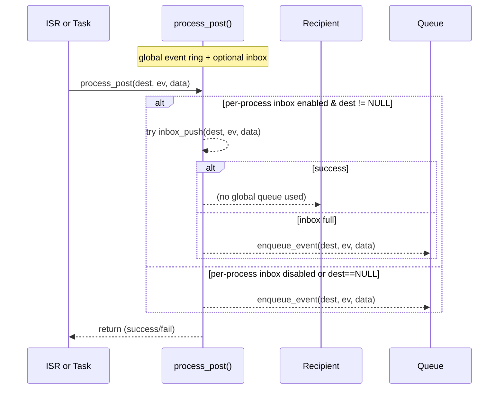
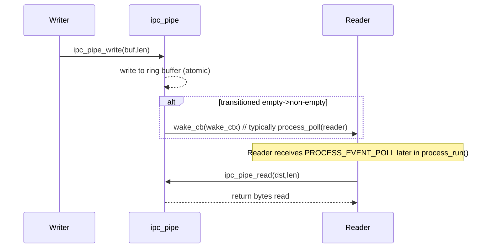

# Protoduino Kernel Scheduler — design, use, and debugging

This document explains the protoduino kernel scheduler implemented in `process.h` and `process.c`, how it integrates with Protothreads v2 (`pt.h`), how messaging and pipes work via `ipc.h`/`ipc.c`, how to design state machines with protothreads, and practical tests & debugging tips for very small MCUs (AVR/Arduino). It includes step-by-step explanations and mermaid diagrams to visualize the scheduler behaviour and message flows.

---

## Table of contents

1. Overview — What this scheduler provides
2. Inner workings of the kernel scheduler
3. Scheduler ↔ Protothreads integration (lifecycle & semantics)
4. Messaging & streaming pipes (`ipc.h`/`ipc.c`)
5. Flow and sequence diagrams (Mermaid)
6. Tutorial — designing state machines with protothreads
7. Verification checklist for tiny MCU scheduling
8. Debugging guide — typical problems and resolutions
9. Examples — Arduino Studio (producer/consumer, pipe usage, error logger)
10. Appendix — tips & advanced notes

---

# 1. Overview — What this scheduler provides

This scheduler is small, deterministic, and designed for resource-constrained microcontrollers. Key properties:

* Global event queue (ring buffer) connecting all processes.
* Optional compile-time per-process inbox (small ring) for direct messages.
* Hybrid IPC: structured messages (`ipc_msg_t*`) for packet/RPC style, and zero-copy streaming **pipes** (ring buffers) for efficient byte streams.
* Protothreads v2 integration: `PROCESS_THREAD` functions use `pt.h` semantics (PT_WAITING, PT_YIELDED, PT_EXITED, PT_ENDED, PT_ERROR, PT_FINALIZED).
* `process_run()` follows a game-loop style: do all polls first, then handle exactly one event — keeps cycles small and predictable.
* ISR-safe `process_post()` (uses atomic sections via `CC_ATOMIC_RESTORE()`).
* Error reporting: PT errors posted as `PROCESS_EVENT_ERROR` with raw ptstate_t error codes (4–254).

---

# 2. Inner workings of kernel scheduler

### Key data structures

* `struct process`: describes a process (priority, state, protothread control block, optional inbox).
* `events[]` (global ring): each entry `{ dest, ev, data }` where dest==NULL means broadcast.
* `process_list`: linked list of registered processes, sorted by priority (smaller numeric prio == higher priority).
* `poll_requested` flag and per-process `needspoll` flag to indicate polls to be serviced.

### Core loop (`process_run()`)

1. If `poll_requested` is set, call `do_poll()` which scans process_list and calls each process with `PROCESS_EVENT_POLL` for those whose `needspoll` is set. `do_poll()` services *all* polls and returns if it ran any.
2. If no polls were handled, `process_run()` handles *exactly one* event from the global queue (or one per-process inbox item if enabled) and returns quickly. This is the "game loop" constraint: one event -> return.

Why this pattern? On tiny MCUs, processing all polls first ensures responsive streaming (pipes) while bounding event processing time to a single event per `process_run()` call to keep frame/tick latency predictable.

### Posting events

* `process_post(dest, ev, data)`:

  * Atomic: uses `CC_ATOMIC_RESTORE()` to safely update ring indices.
  * If `PROCESS_CONF_PER_PROCESS_INBOX` is enabled and dest != NULL, the scheduler first tries to push into the recipient's inbox (fast path). If inbox full or not enabled, falls back to global queue.
  * Returns 1 on success, 0 if the queue is full.

* `process_poll(proc)`: sets `proc->needspoll = 1` and `poll_requested = 1`. Used by IPC pipes to notify readers that data arrived.

### Event dispatch

* If event is broadcast (dest==NULL): the scheduler calls every registered process (in priority order) once with the event.
* If directed: only destination process receives the event.
* For per-process inbox: inbox items may be popped before global events to prioritize direct messages.

### Error reporting

* If a protothread returns an error code (PT_ISERROR(ret)), the scheduler posts `PROCESS_EVENT_ERROR` to the configured `process_error_logger` using a small rotating `error_pool` so the message pointer remains valid temporarily.

---

# 3. How the scheduler works with protothreads

### PT lifecycle recap (as implemented)

* `PT_INIT(&pt)`: initialize the protothread.
* `pt_thread(&pt, ev, data)` returns a `ptstate_t`:

  * `PT_WAITING` / `PT_YIELDED` — running/paused: scheduler should return and not finalize.
  * `PT_EXITED`, `PT_ENDED` — thread indicates it will exit; scheduler must arm finalization (call `PT_FINAL(&pt)`) and then schedule the protothread until it returns `PT_FINALIZED`.
  * `PT_ERROR` (4..254) — real error. Scheduler must post error to logger, call `PT_FINAL(&pt)`, schedule until `PT_FINALIZED`, then remove.
  * `PT_FINALIZED` — thread is finished and can be removed.

### Scheduler behavior when calling a process

`call_process(p, ev, data)`:

1. Mark `p->state = PROCESS_STATE_RUNNING`.
2. Call `ret = p->thread(&p->pt, ev, data)`.
3. If `PT_ISRUNNING(ret)` (i.e., `ret < PT_EXITED`), mark `p->state = PROCESS_STATE_CALLED` and return.
4. If `ret == PT_EXITED || ret == PT_ENDED || PT_ISERROR(ret)`:

   * If `PT_ISERROR(ret)`, post `PROCESS_EVENT_ERROR` with raw `ret`.
   * Call `PT_FINAL(&p->pt)` to set LC to final-state.
   * Repeatedly call `p->thread(&p->pt, ev, data)` until it returns `PT_FINALIZED`. Any errors in finalizer are also forwarded to error logger.
   * After `PT_FINALIZED`, remove process (`process_exit`).
5. If `ret == PT_FINALIZED` (rare), remove process immediately.

### Design rules for process authors

* **Never use `switch`/`case` inside `PROCESS_THREAD`** (protothread LC uses switch internally): use `if/else`.
* Use `PROCESS_WAIT_EVENT()` / `PROCESS_WAIT_EVENT_UNTIL()` / `PROCESS_WAIT_EVENT()` patterns.
* For child protothreads, use `PT_SPAWN`, `PT_WAIT_THREAD`, etc., and follow error-catching macros (`PT_CATCH`, `PT_CATCHANY`) as needed.
* Finalization (`PT_FINALLY`) must be written in the protothread; the scheduler only *arms* finalization (calls `PT_FINAL`) when exit/error occurs.

---

# 4. Messages and pipes (`ipc.h` / `ipc.c`)

### Two IPC primitives

* **Messages (packets):** `ipc_msg_t` objects (type, argc, argv[]) allocated from a fixed-size `ipc_pool`. Use for RPC or multi-argument messages. Sent via `process_post(dest, PROCESS_EVENT_MSG, (process_data_t)msg)`.

  * Ownership: sender allocates message (or static), sets args, posts. Receiver is responsible for freeing message back to pool via `ipc_pool_free()` or using agreed ownership.
  * Good for case-by-case, discrete packet semantics (command requests, responses, notifications).

* **Streaming pipes:** `ipc_pipe_t` ring buffers for bytes. Writers call `ipc_pipe_write(pipe, data, len)` which writes bytes into buffer and, if the buffer was empty, calls a user-provided `wake_cb(wake_ctx)` callback (commonly `process_poll(reader_proc)` or a small wrapper that `process_post()`s `PROCESS_EVENT_POLL` — you decide). Readers call `ipc_pipe_read(pipe, dst, len)` in response to `PROCESS_EVENT_POLL` to consume bytes.

### Why both?

* Packets are structured and can carry typed arguments; perfect for RPC.
* Pipes deliver high-throughput, low-overhead streaming without creating many events or allocating messages per byte. Pipe writes are zero-copy into the ring buffer and wake the reader only when necessary.

---

# 5. Flow & sequence diagrams (Mermaid)

Below are diagrams illustrating the scheduler's main run loop, posting, event dispatch, and pipe writer/reader flow. Paste these to any Mermaid renderer (e.g., VSCode Mermaid preview, GitHub, Mermaid Live Editor).

### Scheduler main loop (activity)

```mermaid
flowchart TD
  A[Start: process_run()] --> B{poll_requested?}
  B -- yes --> C[do_poll(): iterate processes]
  C --> D[call each process with PROCESS_EVENT_POLL]
  D --> E[return to caller]
  B -- no --> F[do_event(): pop one event]
  F --> G{event present?}
  G -- no --> H[return (idle)]
  G -- yes --> I{dest==NULL?}
  I -- yes --> J[broadcast: call_process each process]
  I -- no --> K[call_process(dest)]
  J --> H
  K --> H
```

### Event posting (sequence)



### Pipe writer -> reader (sequence)



### Protothread lifecycle on dispatch (sequence)

```mermaid
sequenceDiagram
  participant Scheduler
  participant Process as p->thread()
  Scheduler->>Process: call p->thread(pt, ev, data)
  alt PT_ISRUNNING (WAITING/YIELDED)
    Process-->>Scheduler: return PT_WAITING/PT_YIELDED
    Scheduler-->>Process: mark CALLED
  else EXITED/ENDED/ERROR
    Process-->>Scheduler: return PT_EXITED/PT_ENDED/PT_ERROR
    Scheduler->>Process: PT_FINAL(&pt)
    loop finalizer
      Scheduler->>Process: call p->thread(pt, ev, data)
      alt PT_ISERROR
         Process-->>Scheduler: ret=error; Scheduler posts to error logger
      end
    end
    Process-->>Scheduler: ret==PT_FINALIZED
    Scheduler-->>Process: process_exit()
  else PT_FINALIZED
    Process-->>Scheduler: ret==PT_FINALIZED
    Scheduler-->>Process: process_exit()
  end
```

---

# 6. Tutorial — designing state machines with protothreads

This section teaches how to turn a state machine into a protothread-based process. Protothreads let you express state machines naturally with local variables preserved across yields, without creating full threads.

### The pattern

General protothread state machine pattern:

```c
PROCESS(foo_process, "foo", 1);

PROCESS_THREAD(foo_process, ev, data)
{
    PROCESS_BEGIN();

    while (1) {
        // state A: wait for event
        PROCESS_WAIT_EVENT_UNTIL(ev == MY_EVENT_START);
        // run some action, then go to waiting for event B
        do_action();
        PROCESS_WAIT_EVENT_UNTIL(ev == MY_EVENT_STEP);
        // step, possibly yield periodically for long operations
        for (int i=0; i<1000; ++i) {
            // if heavy compute, yield occasionally:
            if ((i & 0xF) == 0) {
                PROCESS_YIELD(); // uses PT_YIELD, but we avoid switching to 'switch' in thread
            }
        }
    }

    PROCESS_END();
}
```

Key tips:

* Use `PROCESS_WAIT_EVENT_UNTIL()` rather than `switch(ev)` inside the thread.
* Keep `if/else` for branching on event values, not `switch`.
* Use `PT_SPAWN`, `PT_WAIT_THREAD` for child protothreads (nested state machines).
* For long-running tasks, break into smaller chunks and `PROCESS_YIELD()` (or `PT_WAIT_ONE`) to let scheduler run other processes.

### Example: simple UART echo state machine

```c
PROCESS(uart_reader, "uart", 1);

PROCESS_THREAD(uart_reader, ev, data)
{
    PROCESS_BEGIN();

    static uint8_t buf[32];
    while (1) {
        // wait for poll from pipe
        PROCESS_WAIT_EVENT_UNTIL(ev == PROCESS_EVENT_POLL);
        // read bytes from pipe (the pipe buffer is shared)
        size_t got;
        while ((got = ipc_pipe_read(&uart_pipe, buf, sizeof(buf))) > 0) {
            // echo or process
            uart_write(buf, got);
        }
    }

    PROCESS_END();
}
```

### Converting a hand-rolled state machine into a protothread

1. Identify event triggers and internal states.
2. For each blocking wait, replace with `PROCESS_WAIT_EVENT()` or `PROCESS_WAIT_EVENT_UNTIL()`.
3. Use local static variables for state storage (they persist across yields).
4. For sub-steps, use loops and `PROCESS_YIELD()` as needed.
5. For cleanup, write a `PT_FINALLY` block inside the thread — the scheduler will call it on exit/error.

---

# 7. Verification checklist for tiny MCU scheduling

Before labeling behavior "correct", run this checklist on target hardware (AVR / ATmega variants):

### Configuration & compile-time checks

* [ ] `PROCESS_CONF_EVENT_QUEUE_SIZE` set suitably for your memory and expected concurrency.
* [ ] `PROCESS_CONF_PER_PROCESS_INBOX` configured as intended.
* [ ] `CC_ATOMIC_RESTORE()` defined and maps to `ATOMIC_BLOCK(ATOMIC_RESTORESTATE)` on AVR.
* [ ] `ipc_pool` buffers sized and aligned: `block_size >= sizeof(void*)`.

### Functional tests

* [ ] Register two simple processes; verify `process_start()` sets INIT delivered and both execute.
* [ ] Post directed events and confirm only target process receives them.
* [ ] Post broadcast events and confirm all active processes receive them.
* [ ] Call `process_poll()` and ensure `do_poll()` delivers `PROCESS_EVENT_POLL` (test with `ipc_pipe`).
* [ ] Use `ipc_pipe_write()` in ISR and confirm reader wakes and reads data.
* [ ] Allocate a message from `ipc_pool` and post as `PROCESS_EVENT_MSG`; verify receiver uses and frees it.
* [ ] Raise a PT error using `PT_RAISE()` inside a process and verify `PROCESS_EVENT_ERROR` posted with raw PT error code.

### Stress tests

* [ ] Fill the global queue to capacity; ensure `process_post()` fails gracefully (returns 0).
* [ ] Fill per-process inbox (if enabled) and confirm fallback or failure behavior.
* [ ] Write to a pipe faster than the reader; confirm backpressure (write returns 0 when full).
* [ ] Run with interrupts posting events and verify no queue corruption.

---

# 8. Debugging guide

### Symptoms → root causes → fixes

#### 1) Queue overflow: `process_post()` returns 0 (events not accepted)

* Cause: global queue full (too many events outstanding) or per-process inbox full.
* Fixes:

  * Increase `PROCESS_CONF_EVENT_QUEUE_SIZE` (if memory allows).
  * Use per-process inbox (reduces global queue pressure).
  * Reduce event frequency: group events or use a single message with multiple data items.
  * Apply backpressure: drop, retry later, or reduce ISR event generation frequency.

#### 2) Missed polls (reader never wakes)

* Cause: your `ipc_pipe_write()` wake callback not wired to `process_poll()` or you forgot to set `wake_cb`.
* Fix:

  * Ensure `ipc_pipe_init(pipe, buf, size, pipe_wake_cb, (void*)reader_process)` with `pipe_wake_cb` implementing `process_poll(reader_proc)`.
  * Verify `process_poll()` sets `poll_requested = 1` and `needspoll` for process.

#### 3) Processes never run after `PROCESS_START` or INIT ignored

* Cause: process never inserted into `process_list` (maybe `process_start()` not called), or process incorrectly initialized state not PROCESS_STATE_NONE.
* Fix:

  * Confirm `process_start()` call and verify `p->state` changed.
  * Check priority insertion logic — lower numeric prio should be handled earlier.

#### 4) Lost or corrupted message pointers

* Cause: message freed too early or pointer to stack memory passed as `process_data_t`.
* Fix:

  * Use `ipc_pool_alloc()` for messages or ensure message payloads are static/global or in a safe pool.
  * Receiver must `ipc_pool_free()` the message if ownership is specified that way.

#### 5) Complex arrays/strings sent as argv[] pointers appear invalid

* Cause: sender used stack-allocated buffer that went out of scope.
* Fix:

  * Always allocate payloads from pool or static storage (or copy into a pool-allocated buffer).

#### 6) Unexpected `PT_FINALIZED` / process removal

* Cause: process returned `PT_EXITED` / `PT_ENDED` or threw an error, scheduler executed finalization and removed it.
* Fix:

  * Inspect code: if you need the process to continue, ensure returns are PT_WAITING or PT_YIELDED, not EXITED/ENDED.
  * Check `PT_RAISE()` usage — ensure it is intended.

#### 7) Errors not reaching logger

* Cause: `process_error_logger` not set in `process_init()` or logger queue full.
* Fix:

  * Call `process_init(&error_logger_proc)` or set `process_error_logger` appropriately.
  * Ensure error logger process exists and can accept `PROCESS_EVENT_ERROR`.

---

# 9. Examples — Using the kernel with Arduino Studio

Below are minimal, copy-paste-friendly examples showing common uses. Use the Arduino IDE (or PlatformIO) and include the `src` directory in your sketch.

> Note: adapt includes to your project layout.

### Example 1 — Simple producer/consumer with message pool

`main.ino` (simplified):

```c
#include "Arduino.h"
#include "sys/process.h"
#include "sys/ipc.h"

/* message pool: 4 messages */
static uint8_t msgpool_buf[sizeof(ipc_msg_t) * 4];
static struct ipc_pool msgpool;

/* define two processes */
PROCESS(producer_proc, "producer", 2);
PROCESS(consumer_proc, "consumer", 2);

PROCESS_THREAD(producer_proc, ev, data)
{
    PROCESS_BEGIN();

    while (1) {
        /* create message and post to consumer */
        ipc_msg_t *m = ipc_msg_alloc_from_pool(&msgpool);
        if (!m) {
            /* pool empty: wait a bit and retry */
            delay(10);
        } else {
            void *argv[1] = { (void*) "hello" };
            ipc_msg_init(m, 1, 1, argv);
            if (!process_post(&consumer_proc, PROCESS_EVENT_MSG, (process_data_t)m)) {
                /* queue full: free and try later */
                ipc_msg_free_to_pool(&msgpool, m);
            }
            /* sleep 1 second */
            delay(1000);
        }
        PROCESS_WAIT_EVENT(); /* yields to scheduler */
    }

    PROCESS_END();
}

PROCESS_THREAD(consumer_proc, ev, data)
{
    PROCESS_BEGIN();
    while (1) {
        PROCESS_WAIT_EVENT_UNTIL(ev == PROCESS_EVENT_MSG);
        ipc_msg_t *m = (ipc_msg_t*)data;
        if (m) {
            // use m->argv[0] ...
            Serial.println((char*)m->argv[0]);
            ipc_msg_free_to_pool(&msgpool, m);
        }
    }
    PROCESS_END();
}

/* Arduino setup/loop */
void setup() {
    Serial.begin(115200);
    ipc_pool_init(&msgpool, msgpool_buf, sizeof(ipc_msg_t), 4);
    process_init(NULL);
    process_start(&consumer_proc);
    process_start(&producer_proc);
}

void loop() {
    process_run();
}
```

Notes:

* `delay()` is blocking and not ideal in PTs — prefer `PROCESS_WAIT_EVENT_UNTIL()` with a timer process.
* On real AVR, replace `delay()` with a timer-based event or `millis()` checks in the PT to stay cooperative.

### Example 2 — Pipe between ISR writer and process reader

`main.ino`:

```c
#include "Arduino.h"
#include "sys/process.h"
#include "sys/ipc.h"

/* static pipe buffer */
static uint8_t uart_pipe_buf[64];
static ipc_pipe_t uart_pipe;

/* reader process */
PROCESS(uart_reader, "uart_reader", 2);

void pipe_wake_cb(void *ctx) {
    /* glue: ctx is pointer to process; we poll it */
    process_poll((struct process*)ctx);
}

PROCESS_THREAD(uart_reader, ev, data)
{
    PROCESS_BEGIN();
    uint8_t tmp[16];
    while (1) {
        PROCESS_WAIT_EVENT_UNTIL(ev == PROCESS_EVENT_POLL || ev == PROCESS_EVENT_INIT);
        /* read all available bytes */
        size_t n;
        while ((n = ipc_pipe_read(&uart_pipe, tmp, sizeof(tmp))) > 0) {
            // handle bytes (print to serial)
            for (size_t i = 0; i < n; ++i) Serial.write(tmp[i]);
        }
    }
    PROCESS_END();
}

/* Imagine a UART RX ISR that calls this small routine. On real hardware,
   put it in the ISR. Here we simulate it in loop(). */
void uart_rx_sim_push(const uint8_t *buf, size_t len) {
    ipc_pipe_write(&uart_pipe, buf, len);
}

void setup() {
    Serial.begin(115200);
    process_init(NULL);
    ipc_pipe_init(&uart_pipe, uart_pipe_buf, sizeof(uart_pipe_buf), pipe_wake_cb, &uart_reader);
    process_start(&uart_reader);
}

void loop() {
    // Simulator: occasionally push bytes as if from ISR
    static unsigned long last = 0;
    if (millis() - last > 1000) {
        const char *s = "tick\n";
        uart_rx_sim_push((const uint8_t*)s, strlen(s));
        last = millis();
    }
    process_run();
}
```

Key notes:

* `ipc_pipe_write()` should be safe to call from ISR if your `CC_ATOMIC_RESTORE()` is ISR-safe (on AVR `ATOMIC_BLOCK` is used). If calling from ISR, ensure `wake_cb` is ISR-safe or simply calls `process_post_from_isr()`/`process_poll()` using a safe wrapper.

---

# 10. Appendix — tips & advanced notes

* Keep per-process work short inside `PROCESS_THREAD` to keep system responsive.
* Prefer `PROCESS_WAIT_EVENT_UNTIL()` over `delay()` to avoid blocking.
* Use per-process inbox for high-volume directed messaging to reduce pressure on the global queue.
* When memory is tight, keep `PROCESS_CONF_EVENT_QUEUE_SIZE` small (4–8) but test the application under worst-case loads.
* When migrating to multi-core or richer RTOS, keep the same event and pipe semantics; you can implement a lock around queues instead of atomic blocks.

---

## Final words

This scheduler is deliberately tiny and deterministic. It fits very well on AVR-class MCUs while still providing expressive, powerful protothread-based concurrency and a flexible IPC layer (messages + pipes). Use the verification checklist to test on real boards, and follow the debugging guide to root-cause the most common issues.
