# Protoduino Process Scheduler
### Developer & Maintainer Reference — v2.0
> Cooperative multitasking on 2 KB of SRAM

---

## Table of Contents

1. [Introduction](#1-introduction)
2. [Core Concepts](#2-core-concepts)
3. [Struct Layout & Cast Safety](#3-struct-layout--cast-safety)
4. [Defining Process Types](#4-defining-process-types)
5. [Writing Thread Bodies](#5-writing-thread-bodies)
6. [The Scheduler Loop](#6-the-scheduler-loop)
7. [Events & Polling](#7-events--polling)
8. [IPC Pipes](#8-ipc-pipes)
9. [Structured Logging](#9-structured-logging)
10. [Pools & Multiple Instances](#10-pools--multiple-instances)
11. [Configuration Reference](#11-configuration-reference)
12. [Migration Guide (v1 → v2)](#12-migration-guide-v1--v2)
13. [Internals for Maintainers](#13-internals-for-maintainers)
- [Appendix A — Complete API Quick-Reference](#appendix-a--complete-api-quick-reference)

---

## 1. Introduction

Protoduino is a cooperative process scheduler for resource-constrained AVR microcontrollers — think Arduino Uno or Mega: 2 KB of SRAM, no heap, no `malloc`. It lets you write multiple concurrent tasks (processes) using a clean, readable macro API while the entire runtime fits in a few hundred bytes of flash.

This document is the single authoritative reference for anyone writing code that uses the scheduler (**developers**) or maintaining the scheduler itself (**maintainers**). It covers every public API, explains the design decisions behind them, and gives concrete, copy-pasteable examples for every feature.

### What makes this scheduler different

| Property | Detail |
|---|---|
| **Zero dynamic allocation** | Every byte of SRAM is accounted for at link time. Processes, pipes, and event queues are all static arrays. |
| **Predictable latency** | One call to `process_run()` handles at most one event or one round of polls — worst case is O(N processes). |
| **Ergonomic API** | The Clay-inspired macro system lets you describe a process as a type with named fields, not as a struct full of `static` locals. |
| **Fully scalable** | Strip everything you don't need via config knobs: names, inboxes, pipelines. The minimal build is as small as Contiki's original protothread core. |

> **TARGET HARDWARE** — All examples assume an AVR ATmega328P (Arduino Uno) unless stated otherwise. The scheduler compiles clean on any C99 toolchain including ARM Cortex-M and host GCC for unit testing.

---

## 2. Core Concepts

### 2.1 Cooperative multitasking

The scheduler is **cooperative**, not preemptive. A process runs until it explicitly yields control by calling one of the `PROCESS_WAIT_*` macros. No task can be interrupted mid-execution by another task (only by hardware ISRs). This means no mutexes are needed between processes — just careful use of yield points.

The trade-off: a process that never yields will starve everything else. Design every process to yield frequently, especially in loops that poll hardware.

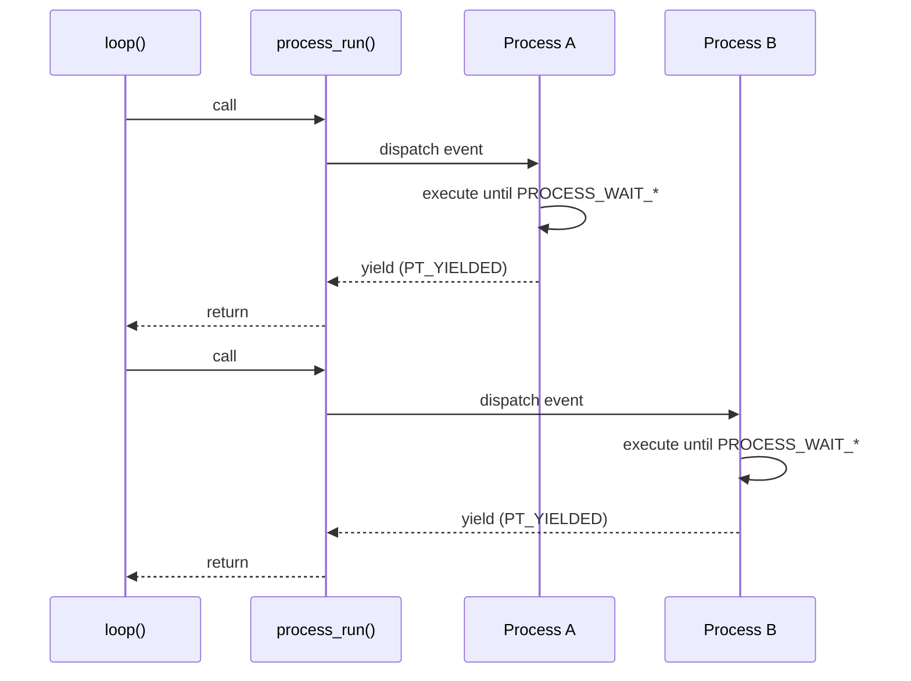
```mermaid
sequenceDiagram
    participant mainloop as loop()
    participant sched as process_run()
    participant A as Process A
    participant B as Process B

    mainloop->>sched: call
    sched->>A: dispatch event
    A->>A: execute until PROCESS_WAIT_*
    A-->>sched: yield (PT_YIELDED)
    sched-->>mainloop: return

    mainloop->>sched: call
    sched->>B: dispatch event
    B->>B: execute until PROCESS_WAIT_*
    B-->>sched: yield (PT_YIELDED)
    sched-->>mainloop: return
```

### 2.2 Protothreads

A protothread is a **stackless coroutine** that resumes from the same point it last yielded. The underlying mechanism is a Duff's Device `switch` statement stored in a single `lc_t` (line counter) field inside `struct pt`. The scheduler carries one `struct pt` per process inside `struct process`.

Because protothreads are stackless, **local variables inside a thread body do not survive a yield**. Use per-process struct fields (declared in `PROCESS_DEFINE`) for any state that must persist across yields.

> ⚠️ **IMPORTANT** — Never use plain `static` local variables for state that must survive a `PROCESS_WAIT_*` call. Static locals are shared across all re-entries and all instances of the same process type. Store persistent state in the concrete process struct accessed via `PROCESS_SELF`.

### 2.3 Events

Processes communicate via **events**. An event is a small record `(dest, ev, data)`. Events are enqueued atomically into a fixed-size ring buffer. Each call to `process_run()` dequeues and dispatches exactly one event — keeping latency bounded.

If `dest == NULL`, the event is **broadcast** to every active process.

### 2.4 Polls

A poll is a **lightweight notification** without ring-buffer overhead. Calling `process_poll(p)` sets a flag on `p` and raises `poll_requested`. On the next `process_run()` call, all flagged processes are called with `PROCESS_EVENT_POLL` before any queued events. Polls are the right tool for ISR-to-process wakeup.

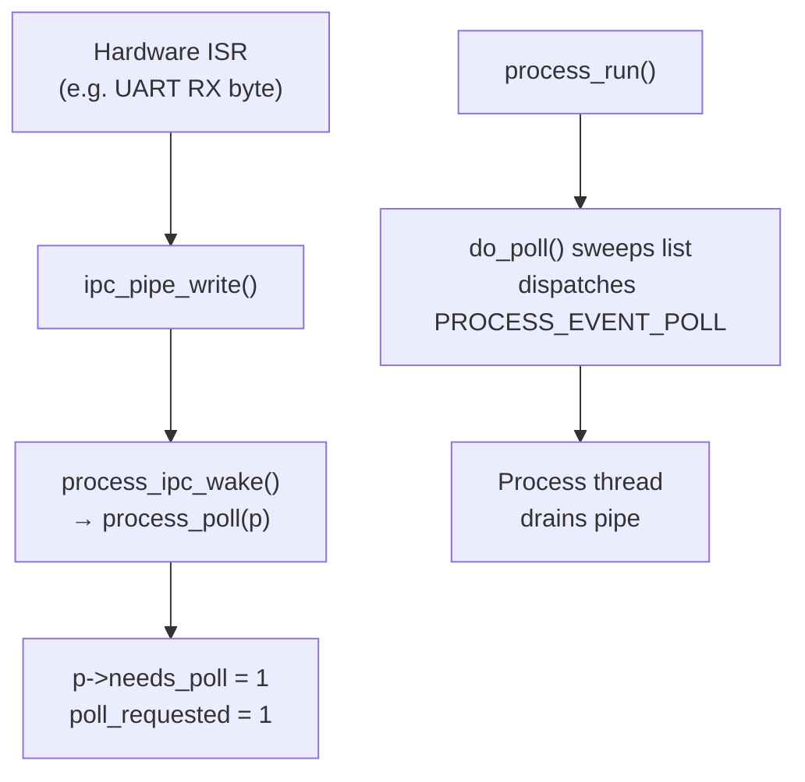
```mermaid
flowchart TD
    ISR["Hardware ISR\n(e.g. UART RX byte)"]
    ipc["ipc_pipe_write()"]
    wake["process_ipc_wake()\n→ process_poll(p)"]
    flag["p->needs_poll = 1\npoll_requested = 1"]
    run["process_run()"]
    poll["do_poll() sweeps list\ndispatches PROCESS_EVENT_POLL"]
    thread["Process thread\ndrains pipe"]

    ISR --> ipc --> wake --> flag
    run --> poll --> thread
```

---

## 3. Struct Layout & Cast Safety

Understanding the three-level struct hierarchy is essential. Get it wrong and you will corrupt the protothread `lc` or overwrite scheduler metadata.

### 3.1 The three levels

| Level | Type | Role |
|---|---|---|
| 1 — protothread engine | `struct pt` | Contains only `lc_t lc`. The Duff's Device resume point. |
| 2 — scheduler base | `struct process` | First member is `struct pt pt`. Holds all scheduler metadata: `next`, `name`, `prio`, `state`, thread pointer, optional pipe/inbox fields. |
| 3 — concrete process | `process_XYZ_t` | First member is `struct process base`. User fields follow. Produced by `PROCESS_DEFINE`. |

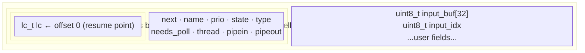
```mermaid
block-beta
  columns 1
  block:concrete["process_shell_t (concrete)"]
    block:base["struct process base  ← offset 0"]
      block:pt["struct pt pt  ← offset 0"]
        lc["lc_t lc  ← offset 0  (resume point)"]
      end
      meta["next · name · prio · state · type\nneeds_poll · thread · pipein · pipeout"]
    end
    user["uint8_t input_buf[32]\nuint8_t input_idx\n...user fields..."]
  end
```

### 3.2 C99 §6.7.2.1 cast safety

Because each level's first member is the level below, all three pointer types refer to the **same address**. These casts are valid C99:

```c
// All three point to the same address:
process_shell_t  *concrete  = &shell_proc;
struct process   *base      = &shell_proc.base;    // explicit field
struct pt        *pt_engine = &shell_proc.base.pt; // explicit field

// Also valid via §6.7.2.1:
(struct process *) concrete  == base       // true
(struct pt *)      base      == pt_engine  // true
```

The scheduler always stores and accepts `struct process *`. Inside a thread body, cast back to the concrete type with `PROCESS_SELF(name)`.

---

## 4. Defining Process Types

### 4.1 `PROCESS_DEFINE` — the primary macro

Use `PROCESS_DEFINE` to declare a named process type with per-instance state. The `...` argument is a verbatim C struct body — field declarations exactly as they would appear inside `struct { }`. No special syntax.

```c
PROCESS_DEFINE(blink, "blink", 2,
  uint8_t  led_pin;
  uint16_t interval_ms;
  uint8_t  state;
);
```

This single macro emits four things:

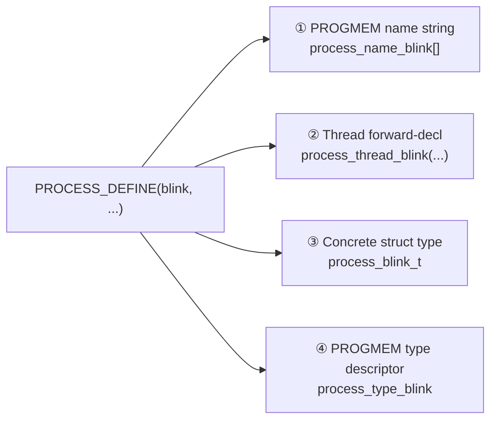
```mermaid
flowchart LR
    macro["PROCESS_DEFINE(blink, ...)"]
    n["① PROGMEM name string\nprocess_name_blink[]"]
    f["② Thread forward-decl\nprocess_thread_blink(...)"]
    t["③ Concrete struct type\nprocess_blink_t"]
    d["④ PROGMEM type descriptor\nprocess_type_blink"]

    macro --> n
    macro --> f
    macro --> t
    macro --> d
```

### 4.2 `DEVICE_DEFINE` — singleton variant

Identical to `PROCESS_DEFINE` but sets `.type = PROCESS_TYPE_DEVICE` in the descriptor. The scheduler enforces the singleton rule: if a process with the same `thread` pointer is already in the list, `process_start()` silently returns.

```c
DEVICE_DEFINE(uart_driver, "uart0", 0,
  ipc_pipe_t *rx;
  ipc_pipe_t *tx;
);
```

### 4.3 `PROCESS` — zero-field shorthand

For processes that carry no user state, `PROCESS(name, caption, prio)` is a one-liner that expands to `PROCESS_DEFINE` + `PROCESS_INSTANCE`. Fully compatible with existing protoduino sketches.

```c
// Simplest possible process:
PROCESS(heartbeat, "heartbeat", 5);

// Start it:
process_start(&heartbeat.base, NULL);
```

> **COMPATIBILITY** — Old code that wrote `PROCESS(name, c, p)` and then `process_start(&name, NULL)` still compiles. `&name` is `process_name_t*` which passes as `struct process*` because `base` is the first member.

### 4.4 `PROCESS_INSTANCE` — static single instance

Declares one static, zero-initialised instance of a type. C's default static storage ensures all fields (`lc`, child `struct pt`, user data) start at zero. `process_start()` fills in the scheduler metadata (`name`, `thread`, `prio`, `type`) from the PROGMEM type descriptor before inserting the process into the list.

```c
PROCESS_DEFINE(shell, "shell", 2,
  uint8_t input_buf[32];
  uint8_t input_idx;
);

PROCESS_INSTANCE(shell, shell_proc);

// Initialise any non-zero user fields, then start:
process_start(&shell_proc.base, NULL);
```

### 4.5 Macro expansion summary

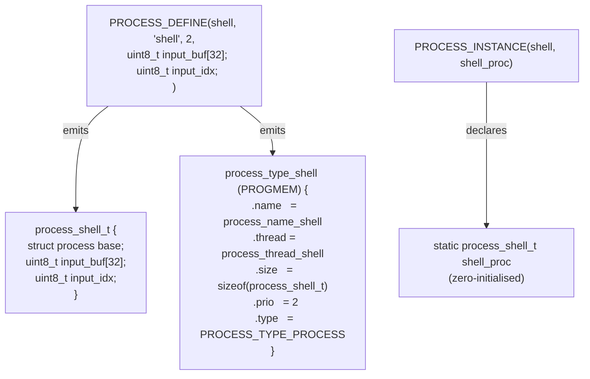
```mermaid
flowchart TD
    pd["PROCESS_DEFINE(shell, 'shell', 2,\n  uint8_t input_buf[32];\n  uint8_t input_idx;\n)"]
    pi["PROCESS_INSTANCE(shell, shell_proc)"]

    pd -->|"emits"| type["process_shell_t {\n  struct process base;\n  uint8_t input_buf[32];\n  uint8_t input_idx;\n}"]
    pd -->|"emits"| desc["process_type_shell (PROGMEM) {\n  .name   = process_name_shell\n  .thread = process_thread_shell\n  .size   = sizeof(process_shell_t)\n  .prio   = 2\n  .type   = PROCESS_TYPE_PROCESS\n}"]
    pi -->|"declares"| inst["static process_shell_t shell_proc\n(zero-initialised)"]
```

---

## 5. Writing Thread Bodies

### 5.1 `PROCESS_THREAD`

The thread function is opened with `PROCESS_THREAD(name, ev, data)`. The implicit first parameter `pt_process` is `struct process *` — all `PROCESS_*` macros inside the body use it directly.

```c
PROCESS_THREAD(blink, ev, data)
{
  blink_t *self = PROCESS_SELF(blink);  // cast once at the top

  PROCESS_BEGIN();

  self->led_pin     = 13;
  self->interval_ms = 500;

  while (1) {
    PROCESS_WAIT_EVENT_UNTIL(ev == PROCESS_EVENT_POLL);
    digitalWrite(self->led_pin, !digitalRead(self->led_pin));
  }

  PROCESS_END();
}
```

### 5.2 `PROCESS_SELF` — accessing user fields

`PROCESS_SELF(name)` casts `pt_process` (`struct process *`) back to `process_name_t *`. Always safe because `struct process base` is the first member of the concrete struct.

```c
// At the top of every thread body that has user fields:
blink_t *self = PROCESS_SELF(blink);

// Then use self-> for all persistent state:
self->led_pin     = 13;
self->interval_ms = 500;
```

### 5.3 Control flow macros

| Macro | Underlying PT call | Behaviour |
|---|---|---|
| `PROCESS_BEGIN()` | `PT_BEGIN(&pt_process->pt)` | Opens the protothread. Must be the first statement. |
| `PROCESS_END()` | `PT_END(&pt_process->pt)` | Closes the protothread. Process finalises when reached. |
| `PROCESS_EXIT()` | `PT_EXIT(&pt_process->pt)` | Early exit — triggers PT_FINALLY cleanup blocks. |
| `PROCESS_WAIT_EVENT()` | `PT_YIELD(...)` | Yield unconditionally. Resumes on next event. |
| `PROCESS_WAIT_EVENT_UNTIL(c)` | `PT_YIELD_UNTIL(..., c)` | Yield and retry until condition `c` is true. |
| `PROCESS_SPAWN(child, thread)` | `PT_SPAWN(...)` | Run a child protothread to completion before continuing. |

### 5.4 Child protothreads

Child protothreads are declared as `struct pt` fields inside `PROCESS_DEFINE`. They receive their own resume point and are passed to `PROCESS_SPAWN` by address.

```c
PROCESS_DEFINE(parser, "parser", 3,
  struct pt child_vt;   // child protothread state
  uint8_t   esc_buf[8];
  uint8_t   esc_idx;
);

PROCESS_THREAD(parser, ev, data) {
  parser_t *self = PROCESS_SELF(parser);
  PROCESS_BEGIN();

  // Spawn child — suspends this process until child returns
  PROCESS_SPAWN(&self->child_vt,
           vt_parse_thread(&self->child_vt,
                           self->esc_buf, &self->esc_idx));

  PROCESS_END();
}
```

### 5.5 Handling events

```c
PROCESS_THREAD(sensor, ev, data) {
  PROCESS_BEGIN();

  while (1) {
    PROCESS_WAIT_EVENT();

    if (ev == PROCESS_EVENT_INIT) {
      // First call — initialise hardware
      // Cast to data to struct process_args if not NULL

    } else if (ev == PROCESS_EVENT_POLL) {
      // ISR woke us — read sensor

    } else if (ev == PROCESS_EVENT_MSG) {
      // Directed message with payload
      struct my_msg *m = (struct my_msg *)data;
      handle_message(m);

    } else if (ev == PROCESS_EVENT_EXIT) {
      // Another process asked us to shut down
      PROCESS_EXIT();
    }
  }

  PROCESS_END();
}
```

---

## 6. The Scheduler Loop

### 6.1 `process_init`

Call once at startup before any other scheduler function. Pass an optional error-logger process (or `NULL`).

```c
void setup() {
  process_init(NULL);                   // no logger
  // — or —
  process_init(&logger_proc.base);      // structured logging

  process_start(&shell_proc.base, NULL);
}
```

But you could also use autostart to do most of the initialization, including IPC, automatically.

```c
void setup() {
  protoduino_start();
}
```

### 6.2 `process_run`

Call from Arduino's `loop()`. Each call performs **at most one unit of work**:

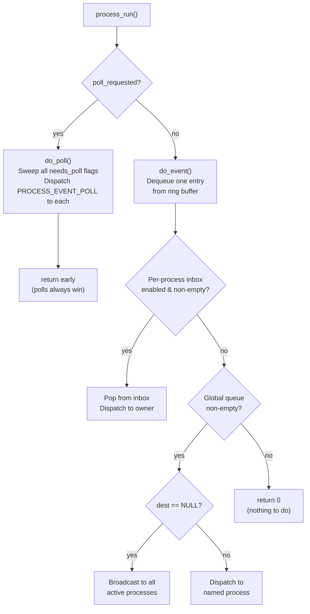
```mermaid
flowchart TD
    run["process_run()"]
    poll_check{"poll_requested?"}
    do_poll["do_poll()\nSweep all needs_poll flags\nDispatch PROCESS_EVENT_POLL to each"]
    early["return early\n(polls always win)"]
    do_event["do_event()\nDequeue one entry\nfrom ring buffer"]
    inbox_check{"Per-process inbox\nenabled & non-empty?"}
    inbox["Pop from inbox\nDispatch to owner"]
    global_check{"Global queue\nnon-empty?"}
    broadcast_check{"dest == NULL?"}
    broadcast["Broadcast to all\nactive processes"]
    directed["Dispatch to\nnamed process"]
    idle["return 0\n(nothing to do)"]

    run --> poll_check
    poll_check -- yes --> do_poll --> early
    poll_check -- no --> do_event
    do_event --> inbox_check
    inbox_check -- yes --> inbox
    inbox_check -- no --> global_check
    global_check -- no --> idle
    global_check -- yes --> broadcast_check
    broadcast_check -- yes --> broadcast
    broadcast_check -- no --> directed
```

```c
void loop() {
  process_run();   // one tick — call repeatedly
}
```

### 6.3 `process_start`

Registers a pre-allocated static instance and sends `PROCESS_EVENT_INIT` with an optional `process_args` payload in the data argument. Only resets the protothread `lc` — user fields are the caller's responsibility. For `PROCESS_TYPE_DEVICE`, rejects if an instance with the same `thread` pointer already runs.

```c
// Initialise any fields the thread needs on first INIT, then start:
shell_proc.input_idx = 0;
process_start(&shell_proc.base, NULL);  // &base is struct process *
```

### 6.4 `process_new`

The preferred way to start a dynamically-managed process from a pool. Zero-inits the entire concrete struct via `memset`, reads scheduler metadata from the PROGMEM type descriptor, then calls `process_start()`.

```c
shell_t *s = shell_pool_alloc();
if (s) {
  // process_new zero-inits s entirely — user fields start at 0.
  struct process *p = process_new(&process_type_shell, s);
  if (!p) { /* queue full or singleton conflict */ }
}
```

### 6.5 `process_destroy`

Requests orderly shutdown. Sets state to `PROCESS_STATE_EXITING` and arms `PT_FINAL`. The next scheduler call runs any `PT_FINALLY` / cleanup blocks, then `process_unlink()` removes the process from the list and resets its state to `PROCESS_STATE_NONE`, freeing the pool slot.

```c
process_destroy(&shell_proc.base);
// shell_proc.base.state == PROCESS_STATE_NONE after cleanup completes
```

> **DEVICES** — `process_destroy()` is silently ignored for `PROCESS_TYPE_DEVICE` instances. Devices run until system reset by design.

---

## 7. Events & Polling

### 7.1 `process_post` — enqueue an event

Atomically enqueues one event. Returns `1` on success, `0` if the ring buffer is full. Safe to call from ISR context. `p == NULL` broadcasts to all active processes.

```c
// Directed event with payload:
process_post(&logger_proc.base, PROCESS_EVENT_MSG, &my_payload);

// Broadcast — every active process receives it:
process_post(NULL, MY_CUSTOM_EVENT, NULL);

// From an ISR (identical behaviour, self-documenting name):
process_post_from_isr(&sensor_proc.base, PROCESS_EVENT_POLL, NULL);
```

### 7.2 Event flow: directed vs broadcast

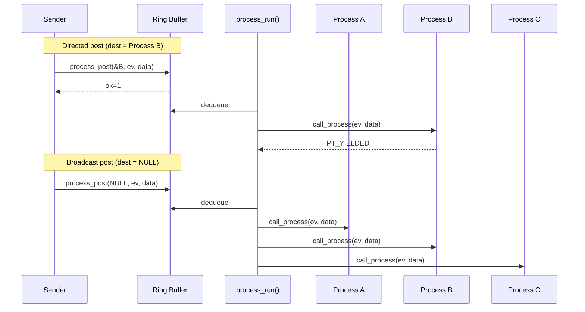
```mermaid
sequenceDiagram
    participant Sender
    participant Queue as Ring Buffer
    participant Sched as process_run()
    participant A as Process A
    participant B as Process B
    participant C as Process C

    Note over Sender,Queue: Directed post  (dest = Process B)
    Sender->>Queue: process_post(&B, ev, data)
    Queue-->>Sender: ok=1
    Sched->>Queue: dequeue
    Sched->>B: call_process(ev, data)
    B-->>Sched: PT_YIELDED

    Note over Sender,Queue: Broadcast post  (dest = NULL)
    Sender->>Queue: process_post(NULL, ev, data)
    Sched->>Queue: dequeue
    Sched->>A: call_process(ev, data)
    Sched->>B: call_process(ev, data)
    Sched->>C: call_process(ev, data)
```

### 7.3 `process_poll` — lightweight ISR wakeup

Sets a flag on `p` — no ring-buffer slot consumed. On the next `process_run()`, the process is called with `PROCESS_EVENT_POLL` before any queued events. This is the preferred wake mechanism for ISRs that produce data for a pipe.

```c
// Inside an ISR — ipc_pipe_write() calls the wake_cb automatically:
static void on_rx_byte(uint_fast8_t b) {
  uint8_t byte = b;
  ipc_pipe_write(&rx_pipe, &byte, 1);
  // wake_cb = process_ipc_wake → process_poll(&shell_proc.base)
}
```

### 7.4 Standard event reference

| Event | Value | When sent | `data` payload |
|---|---|---|---|
| `PROCESS_EVENT_NONE` | `0x00` | Never sent; used as queue sentinel. | `NULL` |
| `PROCESS_EVENT_INIT` | `0x01` | `process_start()` / `process_new()` — first event a process ever receives. | `NULL` or `struct process_args` |
| `PROCESS_EVENT_POLL` | `0x02` | `process_poll()` sets a flag; dispatched by `do_poll()` before events. | `NULL` |
| `PROCESS_EVENT_EXIT` | `0x03` | Convention: send to ask a process to clean up. Not auto-sent by scheduler. | `NULL` or reason code |
| `PROCESS_EVENT_ERROR` | `0x04` | Sent to the logger by `process_log()` for every log entry. | `struct error_info *` |
| `PROCESS_EVENT_MSG` | varies | User-directed message. If leaked on exit, a warning is logged. | application-defined |
| `PROCESS_EVENT_PIPE` | varies | Pipe data ready notification. | `ipc_pipe_t *` |

### 7.5 Custom events

```c
#define EVT_SENSOR_READY   0x10
#define EVT_CMD_PARSE_DONE 0x11
#define EVT_DISPLAY_UPDATE 0x12

// Post a custom event with a typed payload:
static sensor_reading_t reading = { .temp = 245, .hum = 68 };
process_post(&display_proc.base, EVT_SENSOR_READY, &reading);
```

Define your own events as `uint8_t` constants above `0x10` to avoid collisions with the reserved range.

### 7.6 Per-process inbox (`PROCESS_CONF_EVENT_INBOX`)

When enabled, each process has a small private inbox (depth `PROCESS_CONF_INBOX_SIZE`, default 4). Directed posts are placed in the inbox first; this reduces contention on the shared global queue and improves directed-message latency.

```c
// Enable in protoduino_config.h:
#define PROCESS_CONF_EVENT_INBOX  1
#define PROCESS_CONF_INBOX_SIZE   8   // tune to your burst rate
```

> **MEMORY COST** — Each inbox slot costs `sizeof(process_event_t) + sizeof(process_data_t)` bytes. On AVR that is 3 bytes/slot. An inbox of depth 8 costs 24 bytes per process.

---

## 8. IPC Pipes

Pipes provide a **byte-stream channel** between two processes (or between an ISR and a process). A pipe is a fixed-size ring buffer (`ipc_pipe_t`) with an optional wake callback that fires when the pipe transitions from empty to non-empty.

### 8.1 Pipe architecture

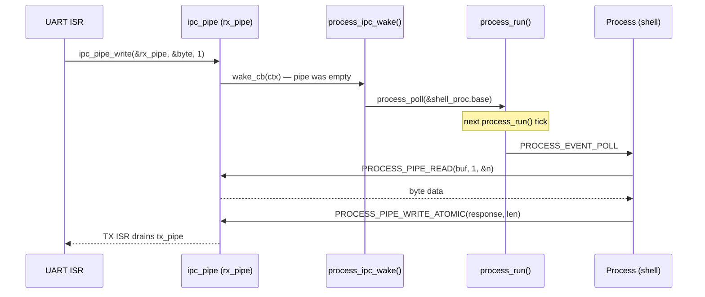
```mermaid
sequenceDiagram
    participant ISR as UART ISR
    participant pipe as ipc_pipe (rx_pipe)
    participant wake as process_ipc_wake()
    participant sched as process_run()
    participant proc as Process (shell)

    ISR->>pipe: ipc_pipe_write(&rx_pipe, &byte, 1)
    pipe->>wake: wake_cb(ctx) — pipe was empty
    wake->>sched: process_poll(&shell_proc.base)
    Note over sched: next process_run() tick
    sched->>proc: PROCESS_EVENT_POLL
    proc->>pipe: PROCESS_PIPE_READ(buf, 1, &n)
    pipe-->>proc: byte data
    proc->>pipe: PROCESS_PIPE_WRITE_ATOMIC(response, len)
    pipe-->>ISR: TX ISR drains tx_pipe
```

### 8.2 Declaring and initialising pipes

Pipe buffers must have static lifetime and must be declared **outside** the process struct — they are shared with ISR callbacks.

```c
// Declare at file scope:
static uint8_t    rx_buf[64];
static ipc_pipe_t rx_pipe;

static uint8_t    tx_buf[64];
static ipc_pipe_t tx_pipe;

// Initialise in setup() before starting the process:
ipc_pipe_init(&rx_pipe, rx_buf, sizeof(rx_buf),
              process_ipc_wake, &shell_proc.base);
ipc_pipe_init(&tx_pipe, tx_buf, sizeof(tx_buf),
              tx_wake_cb, NULL);
```

### 8.3 Attaching pipes to a process

Use `PROCESS_SET_PIPEIN` and `PROCESS_SET_PIPEOUT` inside the thread body after `PROCESS_BEGIN()`. These macros set the pipe pointers on `pt_process` directly — no global variable required.

```c
PROCESS_THREAD(shell, ev, data) {
  shell_t *self = PROCESS_SELF(shell);
  PROCESS_BEGIN();

  PROCESS_SET_PIPEIN(&rx_pipe);   // read from UART RX
  PROCESS_SET_PIPEOUT(&tx_pipe);  // write to UART TX

  // Now use PROCESS_PIPE_* macros...
  PROCESS_END();
}
```

### 8.4 Pipe read / write macros

| Macro | Description |
|---|---|
| `PROCESS_PIPE_AVAILABLE()` | True if the input pipe has at least one byte ready. |
| `PROCESS_PIPE_SPACE()` | True if the output pipe has space for at least one byte. |
| `PROCESS_PIPE_READ(buf, max, &n)` | Read up to `max` bytes into `buf`. Stores actual count in `n`. Yields if no data. |
| `PROCESS_PIPE_WRITE_ATOMIC(buf, len)` | Write `len` bytes atomically (all or nothing). Yields until space is available. |
| `PROCESS_PIPE_WRITE(buf, len)` | Write `len` bytes, yielding between chunks as needed. |
| `PROCESS_PIPE_WRITE_BATCH(buf, len)` | Optimised batch write — best for large blocks. |

### 8.5 Complete pipe echo example

```c
PROCESS_THREAD(echo, ev, data) {
  echo_t *self = PROCESS_SELF(echo);
  PROCESS_BEGIN();

  PROCESS_SET_PIPEIN(&rx_pipe);
  PROCESS_SET_PIPEOUT(&tx_pipe);

  while (1) {
    PROCESS_WAIT_EVENT_UNTIL(
        ev == PROCESS_EVENT_POLL || ev == PROCESS_EVENT_INIT);

    while (PROCESS_PIPE_AVAILABLE()) {
      uint8_t ch;
      size_t  n;
      PROCESS_PIPE_READ(&ch, 1, &n);
      if (n == 0) break;
      PROCESS_PIPE_WRITE_ATOMIC(&ch, 1);  // echo back
    }
  }

  PROCESS_END();
}
```

### 8.6 `process_ipc_wake`

A ready-made wake callback for `ipc_pipe_init()`. Calls `process_poll(ctx)`. Pass `&my_proc.base` as `ctx`. ISR-safe.

```c
ipc_pipe_init(&rx_pipe, rx_buf, sizeof(rx_buf),
              process_ipc_wake, &my_proc.base);
// Every ipc_pipe_write() that fills an empty pipe
// automatically wakes my_proc via process_poll.
```

---

## 9. Structured Logging

The scheduler includes a lightweight log sink. Register a logger process in `process_init()` and it will receive every log entry as a `PROCESS_EVENT_ERROR` event with a `struct error_info *` payload.

### 9.1 Log flow

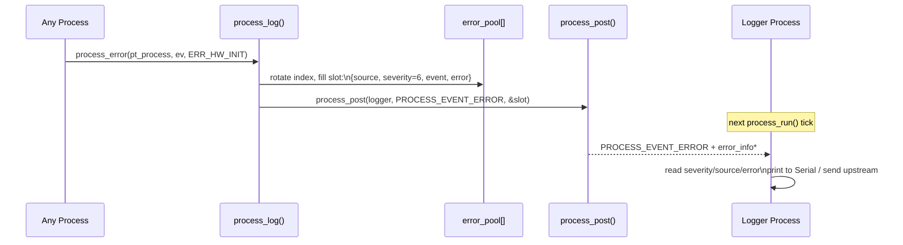
```mermaid
sequenceDiagram
    participant proc as Any Process
    participant log as process_log()
    participant pool as error_pool[]
    participant post as process_post()
    participant logger as Logger Process

    proc->>log: process_error(pt_process, ev, ERR_HW_INIT)
    log->>pool: rotate index, fill slot:\n{source, severity=6, event, error}
    log->>post: process_post(logger, PROCESS_EVENT_ERROR, &slot)
    Note over logger: next process_run() tick
    post-->>logger: PROCESS_EVENT_ERROR + error_info*
    logger->>logger: read severity/source/error\nprint to Serial / send upstream
```

### 9.2 Severity levels

| Function | Severity | Use for |
|---|---|---|
| `process_debug()` | 1 | Detailed trace output — disable in production |
| `process_flow()` | 2 | Control-flow checkpoints |
| `process_verbose()` | 3 | Verbose operational data |
| `process_info()` | 4 | Normal operational milestones |
| `process_warn()` | 5 | Unexpected but recoverable conditions |
| `process_error()` | 6 | Errors that affect functionality |
| `process_fatal()` | 7 | Unrecoverable errors — system must reset |

### 9.3 Calling the log functions

```c
PROCESS_THREAD(sensor, ev, data) {
  PROCESS_BEGIN();

  if (!sensor_init()) {
    process_error(pt_process, PROCESS_EVENT_ERROR, ERR_HW_INIT);
    PROCESS_EXIT();  // triggers PT_FINALLY cleanup
  }

  process_info(pt_process, PROCESS_EVENT_INIT, 0);
  PROCESS_END();
}
```

### 9.4 Writing a logger process

```c
PROCESS_DEFINE(logger, "logger", 0,  // priority 0 = highest
  /* no user fields needed */
);
PROCESS_INSTANCE(logger, logger_proc);

PROCESS_THREAD(logger, ev, data) {
  PROCESS_BEGIN();
  while (1) {
    PROCESS_WAIT_EVENT_UNTIL(ev == PROCESS_EVENT_ERROR);
    struct error_info *e = (struct error_info *)data;
    Serial.print(PROCESS_NAME_STRING(e->source));
    Serial.print(" sev=");
    Serial.println(e->severity);
  }
  PROCESS_END();
}

// In setup():
process_init(&logger_proc.base);
process_start(&logger_proc.base, NULL);
```

> **POOL SIZE** — Log entries use a rotating pool of `PROCESS_CONF_ERROR_POOL_SIZE` slots. If the logger is slow and logs arrive in bursts, old entries are silently overwritten. Tune `PROCESS_CONF_ERROR_POOL_SIZE` in `protoduino_config.h`.

---

## 10. Pools & Multiple Instances

Most embedded applications run one static instance of each process type. When you need multiple instances — multiple serial ports, multiple sensor nodes — use `PROCESS_POOL`.

### 10.1 `PROCESS_POOL`

Declares a static array of N instances plus an inline allocator `pool_name_alloc()`. Freeing is **automatic**: when `process_destroy()` finishes its cleanup phase, the scheduler sets the state back to `PROCESS_STATE_NONE`, making the slot available again on the next `pool_name_alloc()` call.

```c
PROCESS_DEFINE(sensor, "sensor", 3,
  uint8_t  pin;
  uint16_t last_reading;
);

PROCESS_POOL(sensor, sensor_pool, 4);  // 4 concurrent sensors

void add_sensor(uint8_t pin) {
  sensor_t *s = sensor_pool_alloc();
  if (!s) return;  // all slots busy

  // process_new: zero-inits, copies metadata, calls process_start()
  struct process *p = process_new(&process_type_sensor, s);
  if (p) {
    s->pin = pin;  // set before INIT event is processed
  }
}
```

### 10.2 Pool lifecycle

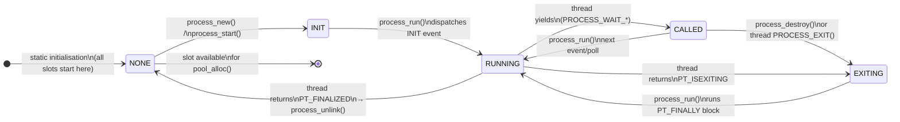
```mermaid
stateDiagram-v2
    direction LR
    [*] --> NONE : static initialisation\n(all slots start here)
    NONE --> INIT : process_new() /\nprocess_start()
    INIT --> RUNNING : process_run()\ndispatches INIT event
    RUNNING --> CALLED : thread yields\n(PROCESS_WAIT_*)
    CALLED --> RUNNING : process_run()\nnext event/poll
    CALLED --> EXITING : process_destroy()\nor thread PROCESS_EXIT()
    RUNNING --> EXITING : thread returns\nPT_ISEXITING
    EXITING --> RUNNING : process_run()\nruns PT_FINALLY block
    RUNNING --> NONE : thread returns\nPT_FINALIZED\n→ process_unlink()
    NONE --> [*] : slot available\nfor pool_alloc()
```

### 10.3 Identifying instances

Because every instance of the same type shares the same `thread` pointer, you cannot use that to distinguish them. Use a user field or compare `struct process *` pointers directly.

```c
// Find a specific sensor instance by pin:
sensor_t *find_sensor(uint8_t pin) {
  for (uint8_t i = 0; i < 4; i++) {
    if (sensor_pool[i].base.state != PROCESS_STATE_NONE
        && sensor_pool[i].pin == pin)
      return &sensor_pool[i];
  }
  return NULL;
}
```

### 10.4 Priority ordering

Processes are inserted into a singly-linked list sorted by `prio` (lower numeric = higher priority). Equal priorities are stable: they run in insertion order.

| Priority | Typical use |
|---|---|
| `0` | Critical drivers: logger, watchdog |
| `1` | Hardware interrupt handlers, UART drivers |
| `2` | Protocol processing, shell |
| `3` | Sensor readers, application logic |
| `4+` | Background tasks, telemetry, display updates |

---

## 11. Configuration Reference

Override any knob in `src/protoduino_config.h`. Never edit `process_conf.h` directly — that file only provides the defaults.

| Knob | Default | Memory impact | Description |
|---|---|---|---|
| `PROCESS_CONF_EVENT_QUEUE_SIZE` | `4` | `3 bytes × N` | Global event ring capacity. Increase if you post many events before `process_run()` drains them. |
| `PROCESS_CONF_ERROR_POOL_SIZE` | `4` | `4 bytes × N` | Rotating error_info pool. Increase if your logger can be slow. |
| `PROCESS_CONF_MAX_ARGS` | `4` | `2 + 2×N bytes` | Depth of `process_args_t argv[]`. |
| `PROCESS_CONF_EVENT_INBOX` | `0` | `0` or `3×INBOX_SIZE` per proc | Per-process inbox. Enable for lower directed-message latency. |
| `PROCESS_CONF_INBOX_SIZE` | `4` | see above | Inbox depth per process. Active only when `EVENT_INBOX=1`. |
| `PROCESS_CONF_PIPELINES` | `1` | `6 bytes` per process | Enable IPC pipe fields. Set to `0` to strip pipes entirely. |
| `PROCESS_CONF_PIPELINES_MAX_STAGES` | `3` | compile-time only | Maximum stages in a pipeline chain. |
| `PROCESS_CONF_NO_PROCESS_NAMES` | *(undef)* | ~20 bytes flash saved per process | Define to strip PROGMEM name strings. |

### 11.1 Minimal-footprint configuration

```c
// src/protoduino_config.h  — for a deeply constrained sensor node
#define PROCESS_CONF_NO_PROCESS_NAMES  1   // strip name strings (~20B/process)
#define PROCESS_CONF_PIPELINES         0   // strip pipe fields (6B/process)
#define PROCESS_CONF_EVENT_INBOX       0   // no per-process inbox
#define PROCESS_CONF_EVENT_QUEUE_SIZE  4   // minimum queue
#define PROCESS_CONF_ERROR_POOL_SIZE   2   // minimum error pool
```

### 11.2 High-throughput configuration

```c
// src/protoduino_config.h  — for a system with heavy inter-process messaging
#define PROCESS_CONF_EVENT_QUEUE_SIZE  16
#define PROCESS_CONF_ERROR_POOL_SIZE   8
#define PROCESS_CONF_EVENT_INBOX       1
#define PROCESS_CONF_INBOX_SIZE        8
#define PROCESS_CONF_PIPELINES         1
```

---

## 12. Migration Guide (v1 → v2)

All changes are source-compatible unless marked **breaking**.

| Old (v1) | New (v2) | Breaking? |
|---|---|---|
| `PROCESS(name, c, p)` | Unchanged. Still works. | No |
| `process_start(&name, NULL)` | `process_start(&name.base)` when using `PROCESS_DEFINE` + `PROCESS_INSTANCE`. Unchanged for `PROCESS()` shorthand. | Only for new-style |
| `process_exit(p)` | `process_destroy(p)` — old name kept as a `#define` alias. | No (alias provided) |
| `PROCESS_BEGIN()` with `struct pt *` | `PROCESS_BEGIN()` with `struct process *` — macro references `&pt_process->pt` internally. | No (transparent) |
| `static` locals in thread body | Fields in `PROCESS_DEFINE`, accessed via `PROCESS_SELF(name)`. | Manual refactor needed |
| Pipeline macros using `process_current->` | Pipeline macros now use `pt_process->` directly. | No (transparent) |

### Step-by-step migration of a single process

1. Wrap any `static` locals that survive yields into a `PROCESS_DEFINE` field block.
2. Add `type_t *self = PROCESS_SELF(name);` as the first line inside the thread body.
3. Replace all references to those static locals with `self->field`.
4. Change `process_start(&name, NULL)` to `process_start(&name.base, NULL)` if you used `PROCESS_INSTANCE`.
5. Replace `process_exit(p)` with `process_destroy(p)` (or leave as-is — the alias handles it).

---

## 13. Internals for Maintainers

This chapter documents the internal design of `process.c` for anyone working on the scheduler itself.

### 13.1 Static storage map

| Variable | Type | Purpose |
|---|---|---|
| `events[]` | `process_event_entry[QUEUE_SIZE]` | Global ring buffer. Entries: `(dest, ev, data)`. |
| `event_head` | `process_num_events_t` | Index of the most recently written slot. Advances on enqueue. |
| `event_tail` | `process_num_events_t` | Index of the next slot to read. Advances on dequeue. |
| `process_list` | `struct process *` | Head of the priority-sorted intrusive linked list. |
| `poll_requested` | `volatile uint8_t` | Non-zero when at least one process has `needs_poll` set. |
| `process_error_logger` | `struct process *` | Logger sink registered in `process_init()`. |
| `error_pool[]` | `struct error_info[POOL_SIZE]` | Rotating pool of log entries posted to the logger. |
| `error_pool_idx` | `uint8_t` | Monotonically incrementing index; wraps mod `POOL_SIZE`. |

### 13.2 Process lifecycle state machine

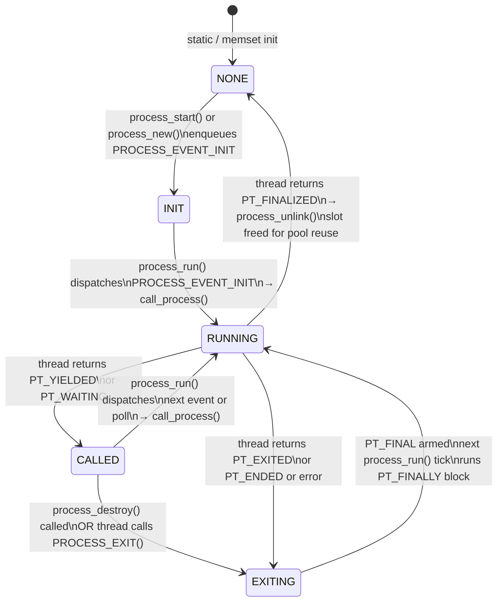
```mermaid
stateDiagram-v2
    direction TB

    [*] --> NONE : static / memset init

    NONE --> INIT : process_start() or process_new()\nenqueues PROCESS_EVENT_INIT

    INIT --> RUNNING : process_run() dispatches\nPROCESS_EVENT_INIT\n→ call_process()

    RUNNING --> CALLED : thread returns PT_YIELDED\nor PT_WAITING

    CALLED --> RUNNING : process_run() dispatches\nnext event or poll\n→ call_process()

    CALLED --> EXITING : process_destroy() called\nOR thread calls PROCESS_EXIT()

    RUNNING --> EXITING : thread returns PT_EXITED\nor PT_ENDED or error

    EXITING --> RUNNING : PT_FINAL armed\nnext process_run() tick\nruns PT_FINALLY block

    RUNNING --> NONE : thread returns PT_FINALIZED\n→ process_unlink()\nslot freed for pool reuse
```

### 13.3 `call_process` internals

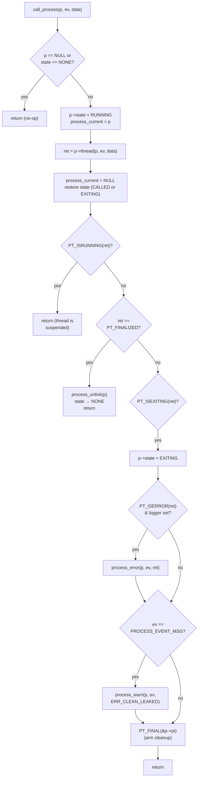
```mermaid
flowchart TD
    enter["call_process(p, ev, data)"]
    guard{"p == NULL or\nstate == NONE?"}
    abort["return (no-op)"]
    mark_running["p->state = RUNNING\nprocess_current = p"]
    invoke["ret = p->thread(p, ev, data)"]
    clear["process_current = NULL\nrestore state (CALLED or EXITING)"]
    isrunning{"PT_ISRUNNING(ret)?"}
    yield_return["return (thread is\nsuspended)"]
    isfinalized{"ret ==\nPT_FINALIZED?"}
    unlink["process_unlink(p)\nstate → NONE\nreturn"]
    isexiting{"PT_ISEXITING(ret)?"}
    set_exiting["p->state = EXITING"]
    log_error{"PT_ISERROR(ret)\n& logger set?"}
    log["process_error(p, ev, ret)"]
    leaked{"ev ==\nPROCESS_EVENT_MSG?"}
    warn["process_warn(p, ev,\nERR_CLEAN_LEAKED)"]
    arm["PT_FINAL(&p->pt)\n(arm cleanup)"]
    done["return"]

    enter --> guard
    guard -- yes --> abort
    guard -- no --> mark_running --> invoke --> clear
    clear --> isrunning
    isrunning -- yes --> yield_return
    isrunning -- no --> isfinalized
    isfinalized -- yes --> unlink
    isfinalized -- no --> isexiting
    isexiting -- yes --> set_exiting --> log_error
    log_error -- yes --> log --> leaked
    log_error -- no --> leaked
    leaked -- yes --> warn --> arm --> done
    leaked -- no --> arm
```

### 13.4 `do_poll` vs `do_event` ordering

`process_run()` always calls `do_poll()` first. If any process had `needs_poll` set, `do_poll()` runs them and **returns early** — `do_event()` is not called in that tick. This ensures poll notifications (e.g., ISR wakeup) are never starved by a full event queue.

`poll_requested` is cleared **before** the sweep, not after. This means an ISR that calls `process_poll()` *during* the sweep sets the flag again for the next tick without being lost.

### 13.5 Atomicity model

| Operation | Protection | Reason |
|---|---|---|
| `enqueue_event_nolock()` | `CC_ATOMIC_RESTORE()` | ISR may call `process_post` concurrently |
| `dequeue_event_nolock()` | `CC_ATOMIC_RESTORE()` | ISR may enqueue while main loop dequeues |
| Inbox push/fallback | Same `CC_ATOMIC_RESTORE()` block as fallback | Ensures a post lands in exactly one of inbox or queue |
| `process_poll()` | None needed | `needs_poll` and `poll_requested` are `uint8_t`; writes are atomic on AVR |

### 13.6 `process_unlink` vs `process_destroy`

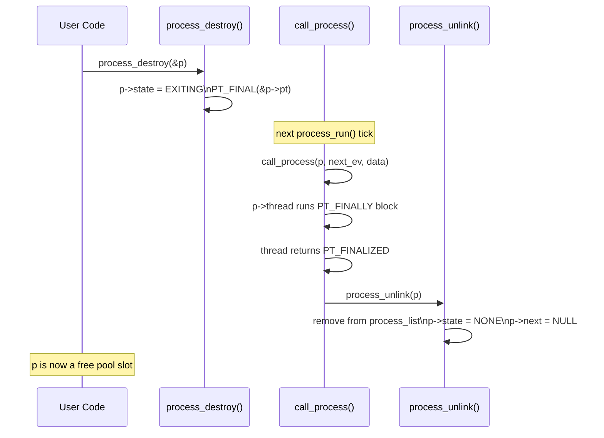
```mermaid
sequenceDiagram
    participant user as User Code
    participant pub as process_destroy()
    participant sched as call_process()
    participant internal as process_unlink()

    user->>pub: process_destroy(&p)
    pub->>pub: p->state = EXITING\nPT_FINAL(&p->pt)
    Note over sched: next process_run() tick
    sched->>sched: call_process(p, next_ev, data)
    sched->>sched: p->thread runs PT_FINALLY block
    sched->>sched: thread returns PT_FINALIZED
    sched->>internal: process_unlink(p)
    internal->>internal: remove from process_list\np->state = NONE\np->next = NULL
    Note over user: p is now a free pool slot
```

### 13.7 Error pool rotation

The rotating error pool is a circular array of `PROCESS_CONF_ERROR_POOL_SIZE` entries indexed by `error_pool_idx++`. When the pool is full, new entries **silently overwrite** the oldest. This is intentional: the pool is sized to handle a burst of log entries between logger ticks. If entries are being lost, increase `PROCESS_CONF_ERROR_POOL_SIZE` or give the logger process a higher priority (lower `prio` number).

### 13.8 Files that must not be changed

| File | Reason |
|---|---|
| `lc-switch.h` | Upstream protothread lc implementation. Changes break `PT_BEGIN`/`PT_END`/`PT_YIELD`. |
| `pt.h` | Upstream protothread macros. Changing breaks the protothread ABI. |
| `process_conf.h` | Only provides defaults. User overrides in `protoduino_config.h` must remain valid. |
| `types.h` | Shared type definitions used across the entire codebase. |

---

## Appendix A — Complete API Quick-Reference

### Declaration macros

| Macro | Description |
|---|---|
| `PROCESS_DEFINE(name, caption, prio, ...)` | Declare a process type with user fields in `...`. |
| `DEVICE_DEFINE(name, caption, prio, ...)` | Same, but singleton: only one instance at a time. |
| `PROCESS(name, caption, prio)` | Zero-field shorthand: `PROCESS_DEFINE` + `PROCESS_INSTANCE`. |
| `DEVICE(name, caption, prio)` | Zero-field singleton shorthand. |
| `PROCESS_INSTANCE(type, var)` | Declare one static instance of a type. |
| `PROCESS_POOL(type, pool, N)` | Declare N static instances + inline allocator. |
| `PROCESS_EXTERN(name)` | Forward-declare a process defined in another file. |

### Thread body macros

| Macro | Description |
|---|---|
| `PROCESS_THREAD(name, ev, data)` | Open the thread function body. |
| `PROCESS_SELF(name)` | Cast `pt_process` to `process_name_t *`. |
| `PROCESS_BEGIN()` | Open protothread — must be the first statement. |
| `PROCESS_END()` | Close protothread — process finalises when reached. |
| `PROCESS_EXIT()` | Early exit — runs `PT_FINALLY` cleanup. |
| `PROCESS_WAIT_EVENT()` | Yield unconditionally. |
| `PROCESS_WAIT_EVENT_UNTIL(c)` | Yield and retry until `c` is true. |
| `PROCESS_SPAWN(child, thread)` | Run child protothread to completion. |
| `PROCESS_CURRENT()` | Returns the currently-running `struct process *`. |

### Scheduler functions

| Function | Description |
|---|---|
| `process_init(logger)` | Initialise scheduler. `logger` may be `NULL`. |
| `process_start(p)` | Register and start a static instance. |
| `process_new(type, storage)` | Zero-init storage, copy metadata, then start. |
| `process_destroy(p)` | Initiate orderly shutdown (runs `PT_FINALLY`). |
| `process_run()` | One scheduler tick. Call from `loop()`. |
| `process_poll(p)` | Request `PROCESS_EVENT_POLL` — ISR-safe. |
| `process_post(p, ev, data)` | Enqueue event atomically — ISR-safe. |
| `process_post_from_isr(p, ev, data)` | Identical to `process_post`; ISR call-site alias. |
| `process_lookup_n(segment, len)` | Find first process matching RAM name fragment. |

### Logging functions

| Function | Severity |
|---|---|
| `process_debug(src, ev, code)` | 1 — debug |
| `process_flow(src, ev, code)` | 2 — flow |
| `process_verbose(src, ev, code)` | 3 — verbose |
| `process_info(src, ev, code)` | 4 — info |
| `process_warn(src, ev, code)` | 5 — warn |
| `process_error(src, ev, code)` | 6 — error |
| `process_fatal(src, ev, code)` | 7 — fatal |

### Pipeline macros (requires `PROCESS_CONF_PIPELINES > 0`)

| Macro | Description |
|---|---|
| `PROCESS_SET_PIPEIN(pipe)` | Attach input pipe to this process. |
| `PROCESS_SET_PIPEOUT(pipe)` | Attach output pipe to this process. |
| `PROCESS_PIPEIN()` | Returns the attached input `ipc_pipe_t *`. |
| `PROCESS_PIPEOUT()` | Returns the attached output `ipc_pipe_t *`. |
| `PROCESS_PIPE_AVAILABLE()` | True if input pipe has data. |
| `PROCESS_PIPE_SPACE()` | True if output pipe has space. |
| `PROCESS_PIPE_READ(buf, max, &n)` | Read up to `max` bytes; yields if empty. |
| `PROCESS_PIPE_WRITE_ATOMIC(buf, len)` | Write `len` bytes atomically; yields for space. |
| `PROCESS_PIPE_WRITE(buf, len)` | Write with per-chunk yields. |
| `PROCESS_PIPE_WRITE_BATCH(buf, len)` | Optimised batch write. |
| `process_ipc_wake(ctx)` | Wake callback for `ipc_pipe_init()` — calls `process_poll(ctx)`. |

---

*Protoduino Process Scheduler · Developer & Maintainer Reference · v2.0*