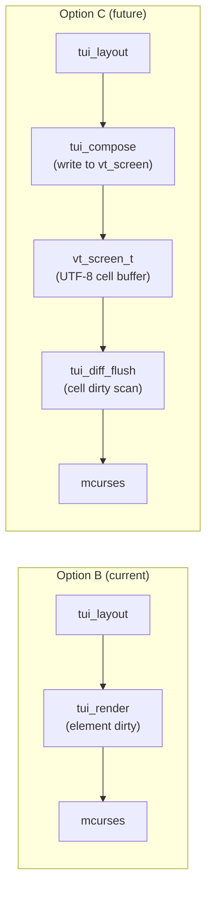
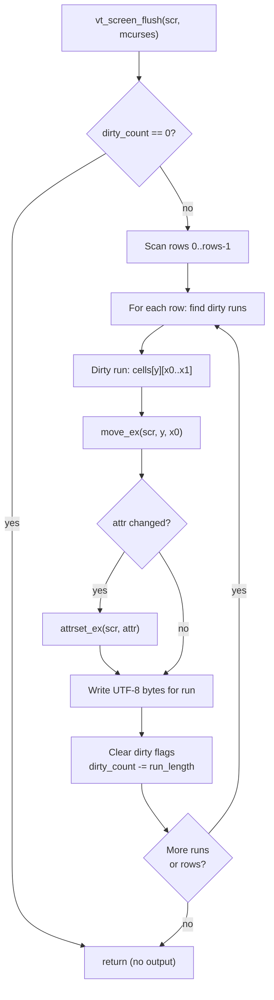

# TUI Roadmap — Option C: Full Virtual Terminal
### Future Evolution Path · UTF-8 Virtual Screen Buffer · Diff Rendering

---

## Table of Contents

1. [Overview](#1-overview)
2. [vt_screen Buffer](#2-vt_screen-buffer)
3. [Diff Rendering](#3-diff-rendering)
4. [Memory Requirements](#4-memory-requirements)
5. [Implementation Tasks](#5-implementation-tasks)
6. [Target Hardware](#6-target-hardware)
7. [Compatibility](#7-compatibility)

---

## 1. Overview

The TUI library is currently implemented as **Option B: Damage-Tracked Pipeline**. This roadmap describes **Option C: Full Virtual Terminal** — the next evolutionary step that adds a complete UTF-8 virtual screen buffer between the layout engine and the terminal.

### Option B vs Option C

| Aspect | Option B (Current) | Option C (Future) |
|---|---|---|
| **Rendering model** | Element-level dirty flags. Renderer redraws entire elements via mcurses calls. | Per-cell dirty flags. Renderer diffs the virtual screen against previous state and emits minimal VT sequences. |
| **Granularity** | Element (a whole header bar, body panel, etc.) | Single character cell |
| **Overdraw** | Possible when elements overlap or share borders | Zero overdraw — each cell is written at most once per frame |
| **Double-width chars** | Handled by mcurses (no cell tracking) | Tracked in cell buffer — correct cursor positioning for CJK |
| **Hit testing** | Requires walking element tree | Direct lookup: `screen[y][x]` → element ID |
| **RAM cost** | ~26 bytes per element (small) | ~7 bytes per cell × 80×24 = 13,440 bytes (large) |
| **Best for** | AVR (2–8KB SRAM), simple UIs | ARM (32KB+), complex UIs, mouse support |

### What Option C adds on top of Option B



The key insight: Option C inserts a **virtual screen buffer** (`vt_screen_t`) between layout and terminal output. Instead of directly emitting VT sequences for dirty elements, the renderer writes to the screen buffer. A separate diff engine then compares the buffer against the previous frame and emits only the changed cells.

---

## 2. vt_screen Buffer

### 2.1 Cell structure

Each screen position is represented by a `vt_cell_t` struct that stores UTF-8 bytes directly — no intermediate rune conversion:

```c
typedef struct vt_cell {
    uint8_t  utf8[4];    /* UTF-8 encoded character (1–4 bytes)    */
    uint8_t  len  : 3;   /* Number of valid bytes in utf8[] (0–4)  */
    uint8_t  dirty: 1;   /* Cell has changed since last flush      */
    uint8_t  wide : 1;   /* This cell is the left half of a        */
                          /* double-width character                 */
    uint8_t  cont : 1;   /* Continuation: right half of wide char  */
    uint8_t  _pad : 2;   /* Reserved                               */
    uint16_t attr;        /* MCURSES_ATTR_* | MCURSES_FG | BG      */
} vt_cell_t;
```

| Field | Size | Purpose |
|---|---|---|
| `utf8[4]` | 4 bytes | Raw UTF-8 bytes. Supports full BMP + supplementary planes. |
| `len` | 3 bits | Byte count (0 = empty/space, 1–4 = valid UTF-8). |
| `dirty` | 1 bit | Set when cell content or attr changes. Cleared after flush. |
| `wide` | 1 bit | Set on the left cell of a double-width CJK character. |
| `cont` | 1 bit | Set on the right cell (continuation) of a wide char. |
| `attr` | 2 bytes | Same attribute encoding as mcurses (SGR + FG/BG). |

**Total: 7 bytes per cell.**

### 2.2 Screen structure

```c
typedef struct vt_screen {
    vt_cell_t *cells;    /* Flat array: cells[y * cols + x]        */
    uint8_t    rows;     /* Screen height                          */
    uint8_t    cols;     /* Screen width                           */
    uint8_t    curs_y;   /* Virtual cursor row                     */
    uint8_t    curs_x;   /* Virtual cursor column                  */
    uint16_t   dirty_count; /* Number of dirty cells (optimisation) */
} vt_screen_t;
```

The cell array is **caller-allocated** (zero malloc):

```c
#define SCR_ROWS 24
#define SCR_COLS 80
static vt_cell_t screen_cells[SCR_ROWS * SCR_COLS];
static vt_screen_t vscreen;

vt_screen_init(&vscreen, screen_cells, SCR_ROWS, SCR_COLS);
```

### 2.3 Cell operations

| Operation | Description |
|---|---|
| `vt_screen_put_char(scr, y, x, utf8, len, attr)` | Write a character to cell `(y,x)`. Sets dirty if changed. |
| `vt_screen_put_str(scr, y, x, str, max_cols, attr)` | Write UTF-8 string starting at `(y,x)`, measuring display width. Returns columns consumed. |
| `vt_screen_clear(scr, attr)` | Fill all cells with space + given attr. Marks all dirty. |
| `vt_screen_clear_rect(scr, y, x, h, w, attr)` | Clear a rectangular region. |
| `vt_screen_scroll_up(scr, top, bot, n)` | Scroll rows `[top..bot]` up by `n` lines. New lines cleared. |
| `vt_screen_scroll_down(scr, top, bot, n)` | Scroll rows `[top..bot]` down by `n` lines. |
| `vt_screen_hline(scr, y, x, w, ch, attr)` | Draw horizontal line (border helper). |
| `vt_screen_vline(scr, y, x, h, ch, attr)` | Draw vertical line (border helper). |

---

## 3. Diff Rendering

### 3.1 Algorithm

The diff flush engine scans the cell buffer for dirty cells and coalesces adjacent dirty cells on the same row into runs. Each run produces one cursor-move + one string-output VT sequence:



### 3.2 Run coalescing

Instead of emitting one `move + addch` per dirty cell, the diff engine merges consecutive dirty cells on the same row into a single output run. This dramatically reduces VT overhead:

**Without coalescing** (naive):
```
ESC[1;1H  a  ESC[1;2H  b  ESC[1;3H  c  ESC[1;4H  d
  ↑ 7 bytes  ↑ 7 bytes  ↑ 7 bytes  ↑ 7 bytes = 28 bytes
```

**With coalescing**:
```
ESC[1;1H  abcd
  ↑ 7 bytes + 4 data bytes = 11 bytes  (61% reduction)
```

### 3.3 Attribute-break handling

Within a coalesced run, if the attribute changes between cells, the engine inserts an `attrset` call at the boundary:

```
ESC[1;1H ESC[1m ab ESC[7m cd ESC[0m
          ↑ bold    ↑ reverse
```

This is still much more efficient than per-cell rendering because the cursor-move overhead is paid only once per run.

---

## 4. Memory Requirements

### 4.1 vt_screen buffer

```
Cell size   = 7 bytes
80 × 24     = 1,920 cells
Buffer      = 1,920 × 7 = 13,440 bytes
```

### 4.2 Total system budget (Option C)

| Component | Bytes | Notes |
|---|---|---|
| `vt_cell_t` array | 13,440 | 80×24 screen |
| `vt_screen_t` struct | 8 | Screen metadata |
| `tui_context_t` + elements (16) | 456 | Same as Option B |
| TX pipe buffer | 256 | Larger for buffered output |
| RX pipe buffer | 32 | Input |
| `ipc_pipe_t` × 2 | 24 | Pipe structs |
| `mcurses_t` | 20 | Screen instance |
| `tui_render_queue_t` | 24 | Render state |
| Process / scheduler | 100 | Scheduler overhead |
| Stack + locals | 200 | Estimated |
| **Total** | **~14,560 bytes** | |

With scroll buffer (16×80): **~15,840 bytes**

> ⚠️ **MINIMUM RAM** — Option C requires **at least 32KB of RAM**. This rules out ATmega328P (2KB) and ATmega2560 (8KB). Target platforms: ARM Cortex-M0+ (SAMD21: 32KB), STM32F1 (20KB — tight), ESP32 (520KB), native/protosim.

### 4.3 Smaller screen sizes

For boards with limited RAM, reduce screen dimensions:

| Screen Size | Cell Count | Buffer Size | Total System |
|---|---|---|---|
| 40 × 12 | 480 | 3,360 bytes | ~4,500 bytes |
| 60 × 16 | 960 | 6,720 bytes | ~7,800 bytes |
| 80 × 24 | 1,920 | 13,440 bytes | ~14,600 bytes |
| 80 × 40 | 3,200 | 22,400 bytes | ~23,500 bytes |
| 120 × 40 | 4,800 | 33,600 bytes | ~34,800 bytes |

---

## 5. Implementation Tasks

### Phase 1: Core vt_screen

- [ ] Design `vt_cell_t` struct with UTF-8 native storage (4-byte inline, no rune conversion)
- [ ] Design `vt_screen_t` struct with flat cell array and metadata
- [ ] Implement `vt_screen_init()` — zero-fill cells, set dimensions
- [ ] Implement `vt_screen_put_char()` — write single UTF-8 char to cell, set dirty
- [ ] Implement `vt_screen_put_str()` — write UTF-8 string, handle multi-byte sequences, measure display width
- [ ] Implement `vt_screen_clear()` and `vt_screen_clear_rect()` — fill with space + attr
- [ ] Implement `vt_screen_scroll_up()` / `vt_screen_scroll_down()` — memmove cell rows
- [ ] Implement `vt_screen_hline()` / `vt_screen_vline()` — border drawing helpers
- [ ] Unit tests for all cell operations on host GCC / protosim

### Phase 2: Diff flush engine

- [ ] Implement dirty-cell scanner — row-major scan order
- [ ] Implement run coalescing — merge consecutive dirty cells into output runs
- [ ] Implement attribute-break detection within runs
- [ ] Implement `vt_screen_flush()` — emit VT sequences via mcurses for dirty runs
- [ ] Implement `dirty_count` maintenance — O(1) early-out when zero
- [ ] Benchmark: measure bytes emitted vs naive full-screen redraw
- [ ] Unit tests for coalescing edge cases (run boundaries, row transitions, attribute changes)

### Phase 3: TUI integration

- [ ] Implement `tui_compose_to_screen()` — walk element tree, write to vt_screen instead of mcurses
- [ ] Implement border composition — draw box-drawing chars into vt_screen cells
- [ ] Implement text composition — write element text into cell buffer with clipping
- [ ] Implement scroll buffer composition — render visible scroll lines into cells
- [ ] Integrate with `tui_render_frame()` as alternative backend
- [ ] Add compile-time switch: `TUI_RENDER_BUFFERED` vs `TUI_RENDER_DAMAGE`

### Phase 4: Advanced features

- [ ] Support double-width CJK characters in cell buffer (wide + continuation flags)
- [ ] Support combining characters (diacritics) — extend `utf8[4]` to `utf8[6]` if needed
- [ ] Add mouse event support — SGR 1006 mouse protocol
- [ ] Implement hit-test: `vt_screen_hittest(scr, y, x)` → element ID from cell lookup table
- [ ] Add optional element-ID-per-cell overlay array for hit testing (2 bytes/cell extra)

### Phase 5: Performance

- [ ] Performance benchmark: cycles per render frame on ARM Cortex-M0+
- [ ] Performance benchmark: cycles per render frame on ATmega2560 (40×12 screen)
- [ ] Measure UART utilisation: bytes/frame at 9600, 115200, and 1M baud
- [ ] Optimise run coalescing with SIMD-style dirty scanning (4 cells at a time)
- [ ] Profile memory access patterns for cache efficiency on ARM

---

## 6. Target Hardware

### 6.1 Primary targets

| Board | MCU | RAM | Screen Size | Notes |
|---|---|---|---|---|
| Arduino Nano Every | ATmega4809 | 6KB | 40×12 | Tight — use reduced screen |
| Adafruit Feather M0 | SAMD21 | 32KB | 80×24 | Primary ARM target |
| STM32 Blue Pill | STM32F103 | 20KB | 60×16 | Possible with reduced screen |
| ESP32 DevKit | ESP32 | 520KB | 80×40+ | No memory constraints |
| Raspberry Pi Pico | RP2040 | 264KB | 80×40+ | Excellent Option C platform |
| Native / Protosim | Host GCC | unlimited | any | Testing and development |

### 6.2 Not suitable

| Board | MCU | RAM | Reason |
|---|---|---|---|
| Arduino Uno | ATmega328P | 2KB | Far too small. Use Option B. |
| Arduino Mega | ATmega2560 | 8KB | Marginal even at 40×12. Use Option B. |
| Arduino Nano (classic) | ATmega328P | 2KB | Same as Uno. |
| ATtiny85 | ATtiny85 | 512B | Not a TUI target at all. |

---

## 7. Compatibility

### 7.1 Same TUI declaration API

The user-facing declaration API (`tui_begin_layout`, `TUI_CTX`, `TUI()`,
`TUI_TEXT`, `TUI_SCROLL`, `tui_end_layout`, `tui_compute_layout()`) remains
**identical** between Option B and Option C — it is the real API the
shipped headers and `docs/tui.md` describe. Only the render backend changes:

```c
/* This code works with BOTH Option B and Option C */
tui_begin_layout(&tui);
TUI_CTX(&tui) {
    TUI(TUI_ID("root"),
        &(tui_layout_config_t){ .direction = TUI_DIR_TOP_TO_BOTTOM,
                                .width  = TUI_SIZING_GROW(),
                                .height = TUI_SIZING_GROW() },
        &(tui_style_config_t){ .attr = MCURSES_ATTR_NORMAL })
    {
        TUI(TUI_ID("header"), &(tui_layout_config_t){ .height = TUI_SIZING_FIXED(1) }, NULL)
            { TUI_TEXT("Hello", MCURSES_ATTR_NORMAL); }
        TUI(TUI_ID("body"),   &(tui_layout_config_t){ .height = TUI_SIZING_GROW() },   NULL)
            { TUI_TEXT("World", MCURSES_ATTR_NORMAL); }
    }
}
tui_end_layout(&tui);

tui_compute_layout(&tui);

/* Option B: direct damage-tracked render */
#if TUI_RENDER_MODE == TUI_RENDER_DAMAGE
    tui_render_frame(&tui, &rq, &scr);
#endif

/* Option C: compose to vt_screen, then diff-flush */
#if TUI_RENDER_MODE == TUI_RENDER_BUFFERED
    tui_compose_to_screen(&tui, &vscreen);
    vt_screen_flush(&vscreen, &scr);
#endif
```

> The `TUI_RENDER_MODE` / `tui_compose_to_screen` / `vt_screen_flush` symbols
> above are **Option C roadmap** — not yet implemented. See the note in §1.

### 7.2 Compile-time selection

```c
/* In protoduino_config.h or your project config: */

/* Option B: element-level damage tracking (default) */
#define TUI_RENDER_MODE  TUI_RENDER_DAMAGE

/* Option C: full virtual screen buffer */
// #define TUI_RENDER_MODE  TUI_RENDER_BUFFERED
```

### 7.3 Runtime detection (future)

A possible future enhancement is runtime backend selection for systems that support both modes:

```c
/* Not yet implemented — future consideration */
tui_set_render_mode(&tui, TUI_RENDER_BUFFERED);
```

This would allow a single firmware binary to adapt to available RAM at startup (e.g., detect board variant via fuse bits or external SRAM).

### 7.4 Migration path

| From | To | Effort |
|---|---|---|
| Option B → Option C | Add `vt_screen_t` + cell array allocation. Change one `#define`. | Minimal — API unchanged. |
| Option C → Option B | Remove cell array. Change one `#define`. | Minimal — API unchanged. |
| Custom mcurses code → Option B | Refactor manual `move`/`addstr` calls into `TUI()` macros. | Medium — layout redesign. |

---

*Protoduino TUI Roadmap · Option C: Full Virtual Terminal · Future Development Reference*
