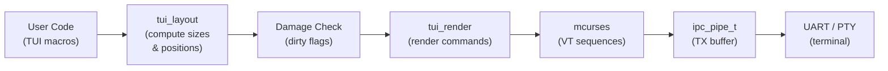
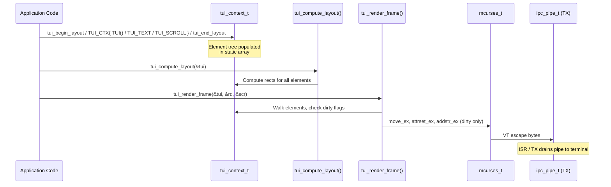
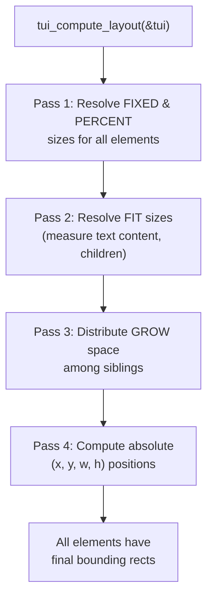
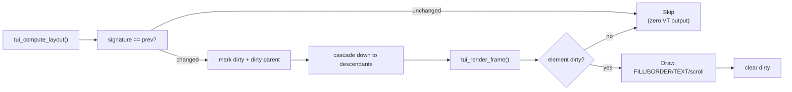

# TUI — Terminal User Interface Layout Engine
### Damage-Tracked • Clay-Inspired • UTF-8 Native • Zero Malloc

---

> **STATUS (implemented & verified).** The full pipeline works end to end:
> `tui_begin_layout → TUI()/TUI_TEXT/TUI_SCROLL → tui_end_layout →
> tui_compute_layout → tui_render_frame`. Damage tracking is real (an
> unchanged frame emits **zero** bytes; a localized change repaints only the
> affected subtree). See the runnable smoke test
> [`examples/22-tui-render`](../examples/22-tui-render/22-tui-render.ino),
> which renders a header / bordered body / scroll log / status bar and is
> validated head-less under protosim.
>
> **API note.** The declarative macros take **pointers to config structs**,
> built as compound literals — there is no `TUI_LAYOUT()`/`TUI_STYLE()`
> macro. The shape is:
> ```c
> TUI(TUI_ID("id"),
>     &(tui_layout_config_t){ .width = TUI_SIZING_GROW(), .height = ... },
>     &(tui_style_config_t){ .attr = ..., .border = TUI_BORDER_SINGLE })
> { /* children */ }
> ```
> All examples below use this real API.

---

## Table of Contents

1. [Overview](#1-overview)
2. [Architecture](#2-architecture)
3. [Quick Start](#3-quick-start)
4. [Layout System](#4-layout-system)
5. [Styling](#5-styling)
6. [Scroll Buffers](#6-scroll-buffers)
7. [Damage Tracking](#7-damage-tracking)
8. [Memory Budget](#8-memory-budget)
9. [Integration with Protoduino Processes](#9-integration-with-protoduino-processes)
10. [API Reference](#10-api-reference)

---

## 1. Overview

The Protoduino **TUI library** is a Clay-inspired, damage-tracked, UTF-8 native terminal user interface layout engine designed for resource-constrained microcontrollers. It lets you describe screen layouts using a declarative macro API — no manual cursor arithmetic, no hand-coded VT escape sequences, no dynamic memory allocation.

### What makes this TUI different

| Property | Detail |
|---|---|
| **Clay-inspired macros** | Declare your UI tree with nested `TUI() { ... }` blocks. The engine computes positions and sizes automatically. |
| **Damage tracking** | Only changed elements are re-rendered. Unchanged regions produce zero VT output. |
| **UTF-8 native** | Text is stored and measured as UTF-8 byte ranges. No intermediate rune16/rune32 buffers. |
| **Zero malloc** | All buffers are caller-allocated. The element array, render queue, and scroll buffers are static. |
| **Integer-only math** | All layout calculations use `uint8_t` / `int16_t` arithmetic. No floating point. |
| **Instance-parameterized** | No global state. Multiple TUI contexts can coexist (e.g., dual-screen setups). |

The TUI library sits above `mcurses` in the protoduino stack. User code describes a layout tree; the engine computes element positions; the damage renderer emits only the VT sequences needed to update changed regions via mcurses, which writes to an `ipc_pipe_t`.

> **TARGET HARDWARE** — All examples assume an AVR ATmega328P (Arduino Uno) or ATmega2560 (Mega) unless stated otherwise. The TUI compiles clean on ARM Cortex-M, ESP32, and host GCC for unit testing via protosim.

---

## 2. Architecture

### 2.1 Pipeline overview

The TUI rendering pipeline is a unidirectional data flow from user layout declarations to terminal output:



### 2.2 Component responsibilities

| Component | File | Responsibility |
|---|---|---|
| **tui.h** | `src/lib/tui/tui.h` | Umbrella header that pulls in the layout, render, and scroll modules. |
| **tui_layout.h/.c** | `src/lib/tui/tui_layout.*` | Core types (`tui_context_t`, `tui_element_t`), the declarative macros (`TUI_CTX`, `TUI`, `TUI_TEXT`, `TUI_SCROLL`), config structs, the integer flexbox layout engine, and the damage diff. |
| **tui_render.h/.c** | `src/lib/tui/tui_render.*` | Damage-tracked renderer. Walks the element tree, skips clean elements, emits mcurses draw calls for dirty ones. |
| **tui_scroll.h/.c** | `src/lib/tui/tui_scroll.*` | Scrollable text buffer (`tui_scrollbuf_t`). Ring-buffer of UTF-8 text lines for shell output, logs, etc. |
| **mcurses.h** | `src/lib/text/mcurses.h` | Low-level terminal abstraction. Cursor movement, attributes, character output via `ipc_pipe_t`. |

### 2.3 Data flow diagram



---

## 3. Quick Start

### 3.1 Complete minimal example

```c
#include <protoduino.h>
#include "lib/text/mcurses.h"
#include "lib/tui/tui_layout.h"
#include "lib/tui/tui_render.h"
#include "lib/tui/tui_scroll.h"

/* 1. Allocate I/O buffers and instances */
static uint8_t tx_buf[128], rx_buf[32];
static ipc_pipe_t tx_pipe, rx_pipe;
static mcurses_t scr;
static tui_context_t tui;
static tui_render_queue_t rq;

void setup(void) {
    /* 2. Initialise pipes, mcurses, and the TUI context */
    ipc_pipe_init(&tx_pipe, tx_buf, sizeof(tx_buf), NULL, NULL);
    ipc_pipe_init(&rx_pipe, rx_buf, sizeof(rx_buf), NULL, NULL);
    mcurses_init(&scr, &tx_pipe, &rx_pipe, 24, 80);
    initscr_ex(&scr);
    tui_init(&tui, 24, 80);
    tui_render_init(&rq);
}

void render_ui(void) {
    /* 3. Declare UI layout.
     *    tui_begin_layout() opens the frame; TUI_CTX(&tui){...} binds the
     *    context for the TUI()/TUI_TEXT() macros; tui_end_layout() closes it. */
    tui_begin_layout(&tui);

    TUI_CTX(&tui) {
        TUI(TUI_ID("root"),
            &(tui_layout_config_t){ .direction = TUI_DIR_TOP_TO_BOTTOM,
                                    .width  = TUI_SIZING_GROW(),
                                    .height = TUI_SIZING_GROW() },
            &(tui_style_config_t){ .attr = MCURSES_ATTR_NORMAL })
        {
            /* Header — fixed 1-row bar */
            TUI(TUI_ID("header"),
                &(tui_layout_config_t){ .width  = TUI_SIZING_GROW(),
                                        .height = TUI_SIZING_FIXED(1) },
                &(tui_style_config_t){ .attr = MCURSES_ATTR_REVERSE })
            {
                TUI_TEXT("  Protoduino Shell v2.0", MCURSES_ATTR_REVERSE);
            }

            /* Body — takes remaining space */
            TUI(TUI_ID("body"),
                &(tui_layout_config_t){ .width  = TUI_SIZING_GROW(),
                                        .height = TUI_SIZING_GROW() },
                &(tui_style_config_t){ .attr = MCURSES_ATTR_NORMAL })
            {
                TUI_TEXT("Welcome to the TUI.", MCURSES_ATTR_NORMAL);
            }

            /* Status bar — fixed 1-row bar */
            TUI(TUI_ID("status"),
                &(tui_layout_config_t){ .width  = TUI_SIZING_GROW(),
                                        .height = TUI_SIZING_FIXED(1) },
                &(tui_style_config_t){ .attr = MCURSES_ATTR_REVERSE |
                                               MCURSES_FG(7) | MCURSES_BG(5) })
            {
                TUI_TEXT("  Ready", MCURSES_ATTR_REVERSE);
            }
        }
    }

    tui_end_layout(&tui);

    /* 4. Compute layout (+ damage diff) and render only dirty elements */
    tui_compute_layout(&tui);
    tui_render_frame(&tui, &rq, &scr);
}
```

> The text-attribute argument to `TUI_TEXT(str, attr)` styles the glyphs
> themselves; the container's `tui_style_config_t.attr` styles its background
> fill and border. They are independent.

> **C++ / `.ino` caveat.** Sketches compile as C++, and avr-g++ only accepts
> designated initializers **in declaration order**, starting from the first
> member, when the values are compound literals (the `TUI_SIZING_*` macros
> are). So write `tui_layout_config_t` fields as `.width`, then `.height`,
> then `.direction`/`.padding`/`.gap` — and include `.width` even if you only
> need `.height` (e.g. `{ .width = TUI_SIZING_GROW(), .height = TUI_SIZING_FIXED(1) }`).
> Out-of-order or `.width`-skipping forms fail with
> *"sorry, unimplemented: non-trivial designated initializers"*. (Plain C does
> not have this restriction.)

### 3.2 What happens under the hood

1. `tui_begin_layout()` resets the element counter and opens a new frame.
2. `TUI_CTX(&ctx) { ... }` binds the context to the implicit `_tui_ctx` used by the `TUI()` / `TUI_TEXT()` / `TUI_SCROLL()` macros.
3. Each `TUI()` macro pushes one `tui_element_t` into the context's static array, recording parent/child relationships, the layout config, and style.
4. `TUI_TEXT(str, attr)` attaches a UTF-8 string pointer (RAM or PROGMEM) and its glyph attribute; `TUI_SCROLL(sb, attr)` attaches a scroll buffer.
5. `tui_end_layout()` closes the tree.
6. `tui_compute_layout()` walks the tree top-down, resolving sizes and computing `(x, y, w, h)` for every element, then runs the **damage diff** (signature comparison vs. the previous frame).
7. `tui_render_frame()` walks the tree again, skipping clean elements and drawing only dirty ones via mcurses.

---

## 4. Layout System

### 4.1 Sizing modes

Every element has independent sizing for width and height. Four modes are available. Each macro yields a `tui_size_t` value assigned to `.width` / `.height` of a `tui_layout_config_t`:

| Mode | Macro(s) | Behaviour |
|---|---|---|
| **Fixed** | `TUI_SIZING_FIXED(n)` | Element is exactly `n` rows or columns. |
| **Grow** | `TUI_SIZING_GROW()` / `TUI_SIZING_GROW_MIN(min)` | Element expands to fill remaining space (optional minimum). Remaining space is divided among siblings that GROW. |
| **Fit** | `TUI_SIZING_FIT()` / `TUI_SIZING_FIT_MAX(max)` | Element shrinks to fit its content (text length or children), optionally capped at `max`. |
| **Percent** | `TUI_SIZING_PERCENT(pct)` | Element takes `pct`% of its parent's inner dimension. Integer percentage (1–100). |

> Note `TUI_SIZING_GROW()` and `TUI_SIZING_FIT()` take **no** argument; use the `_MIN`/`_MAX` variants to supply a bound.

### 4.2 Direction

Each container element has a **direction** (`tui_layout_config_t.direction`) that controls how its children are arranged:

| Direction | Constant | Meaning |
|---|---|---|
| Column | `TUI_DIR_TOP_TO_BOTTOM` | Children stack vertically (top to bottom). **Default.** |
| Row | `TUI_DIR_LEFT_TO_RIGHT` | Children flow horizontally (left to right). |

### 4.3 Padding, gap, and borders

Layout fields live in `tui_layout_config_t`; the border lives in `tui_style_config_t` (the third `TUI()` argument):

```c
TUI(TUI_ID("box"),
    &(tui_layout_config_t){ .direction = TUI_DIR_TOP_TO_BOTTOM,
                            .width   = TUI_SIZING_GROW(),
                            .height  = TUI_SIZING_GROW(),
                            .padding = 1,        /* uniform, all four sides */
                            .gap     = 0 },
    &(tui_style_config_t){ .attr   = MCURSES_ATTR_NORMAL,
                           .border = TUI_BORDER_SINGLE })
{ /* ... */ }
```

| Field | Where | Type | Description |
|---|---|---|---|
| `padding` | `tui_layout_config_t` | `uint8_t` | **Uniform** inset (all four sides) in cells. Reduces inner area. |
| `gap` | `tui_layout_config_t` | `uint8_t` | Space inserted between sibling children along the layout direction. |
| `border` | `tui_style_config_t` | `uint8_t` (`tui_border_style_t`) | Border style drawn around the element. Consumes 1 cell on each side. |

> Padding is a single `uint8_t` applied to all sides — there is no per-side `tui_padding_t`.

### 4.4 Border styles

`tui_border_style_t`, set on `tui_style_config_t.border`:

| Constant | Value | Appearance |
|---|---|---|
| `TUI_BORDER_NONE` | 0 | No border drawn. |
| `TUI_BORDER_SINGLE` | 1 | `┌─┐│ │└─┘` — single-line Unicode box drawing. |
| `TUI_BORDER_DOUBLE` | 2 | `╔═╗║ ║╚═╝` — double-line Unicode box drawing. |
| `TUI_BORDER_ROUND` | 3 | `╭─╮│ │╰─╯` — rounded-corner Unicode box drawing. |

> **UTF-8** — Border characters are emitted as UTF-8 byte sequences via mcurses; the terminal must support Unicode box-drawing. (There is no ASCII-only border style.)

### 4.5 Layout examples

#### Full-width header + body + footer

```c
TUI(TUI_ID("root"), &(tui_layout_config_t){ .direction = TUI_DIR_TOP_TO_BOTTOM,
                                             .width  = TUI_SIZING_GROW(),
                                             .height = TUI_SIZING_GROW() }, NULL) {
    TUI(TUI_ID("hdr"),  &(tui_layout_config_t){ .height = TUI_SIZING_FIXED(1) }, NULL) { /* ... */ }
    TUI(TUI_ID("body"), &(tui_layout_config_t){ .height = TUI_SIZING_GROW()   }, NULL) { /* ... */ }
    TUI(TUI_ID("ftr"),  &(tui_layout_config_t){ .height = TUI_SIZING_FIXED(1) }, NULL) { /* ... */ }
}
```

```
┌──────────────────────────────────────┐
│ Header (1 row, FIXED)                │  ← row 0
├──────────────────────────────────────┤
│                                      │
│ Body (GROW — fills remaining)        │  ← rows 1..22
│                                      │
├──────────────────────────────────────┤
│ Footer (1 row, FIXED)                │  ← row 23
└──────────────────────────────────────┘
```

#### Two-column layout (sidebar + content)

```c
TUI(TUI_ID("root"), &(tui_layout_config_t){ .direction = TUI_DIR_TOP_TO_BOTTOM }, NULL) {
    TUI(TUI_ID("hdr"), &(tui_layout_config_t){ .height = TUI_SIZING_FIXED(1) }, NULL) { /* ... */ }

    TUI(TUI_ID("cols"), &(tui_layout_config_t){ .direction = TUI_DIR_LEFT_TO_RIGHT,
                                                .height = TUI_SIZING_GROW() }, NULL) {
        TUI(TUI_ID("sidebar"), &(tui_layout_config_t){ .width = TUI_SIZING_FIXED(20) },
                               &(tui_style_config_t){ .border = TUI_BORDER_SINGLE }) { /* ... */ }
        TUI(TUI_ID("content"), &(tui_layout_config_t){ .width = TUI_SIZING_GROW() }, NULL) { /* ... */ }
    }

    TUI(TUI_ID("ftr"), &(tui_layout_config_t){ .height = TUI_SIZING_FIXED(1) }, NULL) { /* ... */ }
}
```

```
┌──────────────────────────────────────┐
│ Header                               │
├──────────────┬───────────────────────┤
│              │                       │
│  Sidebar     │  Content              │
│  (20 cols)   │  (GROW)               │
│              │                       │
├──────────────┴───────────────────────┤
│ Footer                               │
└──────────────────────────────────────┘
```

#### Nested panels

```c
TUI(TUI_ID("panel"),
    &(tui_layout_config_t){ .width   = TUI_SIZING_PERCENT(50),
                            .height  = TUI_SIZING_GROW(),
                            .padding = 1 },           /* uniform inset */
    &(tui_style_config_t){ .border = TUI_BORDER_SINGLE }) {
    TUI(TUI_ID("title"), &(tui_layout_config_t){ .height = TUI_SIZING_FIXED(1) }, NULL) {
        TUI_TEXT(" Panel Title ", MCURSES_ATTR_BOLD);
    }
    TUI(TUI_ID("inner"), &(tui_layout_config_t){ .height = TUI_SIZING_GROW() }, NULL) {
        TUI_TEXT("Panel content goes here.", MCURSES_ATTR_NORMAL);
    }
}
```

### 4.6 Layout computation algorithm



---

## 5. Styling

### 5.1 Attribute model

An element's background/border style is the `.attr` field of the third
`TUI()` argument (a `tui_style_config_t`). A text leaf's glyph style is the
second argument to `TUI_TEXT(str, attr)`. Both use the same `uint16_t`
bitfield as mcurses:

```c
/* Container background/border style */
&(tui_style_config_t){ .attr = MCURSES_ATTR_BOLD | MCURSES_FG(7) | MCURSES_BG(1) }
//                              │                    │              │
//                              │                    │              └─ BG: black
//                              │                    └─ FG: cyan
//                              └─ bold

/* Text glyph style */
TUI_TEXT("hello", MCURSES_ATTR_BOLD | MCURSES_FG(7));
```

> There is no `TUI_STYLE()` macro and no `tui_style_t` type — the style is
> the `tui_style_config_t` compound literal you pass as the third `TUI()`
> argument.

### 5.2 Attribute flags

| Flag | Bit | SGR Code | Effect |
|---|---|---|---|
| `MCURSES_ATTR_NORMAL` | `0x0000` | 0 | Reset all attributes |
| `MCURSES_ATTR_BOLD` | `0x0001` | 1 | Bold / increased intensity |
| `MCURSES_ATTR_DIM` | `0x0002` | 2 | Dim / decreased intensity |
| `MCURSES_ATTR_UNDERLINE` | `0x0004` | 4 | Underlined text |
| `MCURSES_ATTR_BLINK` | `0x0008` | 5 | Blinking text |
| `MCURSES_ATTR_REVERSE` | `0x0010` | 7 | Swap foreground / background |
| `MCURSES_ATTR_INVISIBLE` | `0x0020` | 8 | Hidden text |

### 5.3 Colour encoding

Foreground and background colours occupy bits `[8..11]` and `[12..15]` respectively:

| Macro | Value | Colour |
|---|---|---|
| `MCURSES_FG(0)` / `MCURSES_BG(0)` | 0 | Terminal default |
| `MCURSES_FG(1)` / `MCURSES_BG(1)` | 1 | Black |
| `MCURSES_FG(2)` / `MCURSES_BG(2)` | 2 | Red |
| `MCURSES_FG(3)` / `MCURSES_BG(3)` | 3 | Green |
| `MCURSES_FG(4)` / `MCURSES_BG(4)` | 4 | Yellow |
| `MCURSES_FG(5)` / `MCURSES_BG(5)` | 5 | Blue |
| `MCURSES_FG(6)` / `MCURSES_BG(6)` | 6 | Magenta |
| `MCURSES_FG(7)` / `MCURSES_BG(7)` | 7 | Cyan |
| `MCURSES_FG(8)` / `MCURSES_BG(8)` | 8 | White |

### 5.4 Border styling

Border characters inherit the element's style `.attr`. To draw a cyan border on a blue background with bold text inside:

```c
TUI(TUI_ID("box"),
    &(tui_layout_config_t){ .width  = TUI_SIZING_FIXED(40),
                            .height = TUI_SIZING_FIXED(5) },
    &(tui_style_config_t){ .attr   = MCURSES_ATTR_BOLD | MCURSES_FG(7) | MCURSES_BG(5),
                           .border = TUI_BORDER_SINGLE })
{
    TUI_TEXT("Bold cyan text on blue background", MCURSES_ATTR_BOLD | MCURSES_FG(7) | MCURSES_BG(5));
}
```

---

## 6. Scroll Buffers

### 6.1 Overview

The `tui_scrollbuf_t` provides a scrollable ring buffer of UTF-8 text lines. It is designed for elements that display streaming output — shell command results, log messages, sensor readings — where the content exceeds the visible area.

### 6.2 Allocation

The line storage lives **inside** `tui_scrollbuf_t` (no caller byte array).
Its capacity is fixed at compile time via two macros; override them with
build flags to trade SRAM for history depth:

```c
/* Defaults (tune with -DTUI_SCROLL_LINES=.. -DTUI_SCROLL_LINE_BYTES=..) */
#ifndef TUI_SCROLL_LINES
#  define TUI_SCROLL_LINES       16
#endif
#ifndef TUI_SCROLL_LINE_BYTES
#  define TUI_SCROLL_LINE_BYTES  81   /* 80 columns + NUL */
#endif

static tui_scrollbuf_t scroll;
tui_scroll_init(&scroll);             /* zero lines, view at bottom */
```

### 6.3 Writing lines

```c
/* Append a line + its attribute — oldest line is overwritten when full.
 * UTF-8-safe truncation respects multibyte boundaries. */
tui_scroll_add_line(&scroll, "$ ls -la",                     MCURSES_ATTR_BOLD);
tui_scroll_add_line(&scroll, "total 42",                     MCURSES_ATTR_NORMAL);
tui_scroll_add_line(&scroll, "-rw-r--r-- 1 user  512 main.c", MCURSES_ATTR_NORMAL);
```

`tui_scroll_add_line()` copies the NUL-terminated string into the ring and
sets the buffer's dirty flag. When the ring is full the oldest line is
silently dropped.

### 6.4 Attaching to a TUI element

Attach a scroll buffer with `TUI_SCROLL(sb, attr)` (the `attr` styles the
area's background fill). The element fills the space it is given and the
renderer draws one visible line per row:

```c
TUI(TUI_ID("output"),
    &(tui_layout_config_t){ .width  = TUI_SIZING_GROW(),
                            .height = TUI_SIZING_GROW() },
    &(tui_style_config_t){ .attr = MCURSES_ATTR_NORMAL })
{
    TUI_SCROLL(&scroll, MCURSES_ATTR_NORMAL);
}
```

The renderer calls `tui_scroll_get_line()` for each visible row within the
element's bounding rect, honouring the current scroll offset, and clears the
buffer's dirty flag once drawn.

### 6.5 Scrolling

```c
tui_scroll_up(&scroll);          /* scroll viewport one line into history   */
tui_scroll_down(&scroll);        /* scroll viewport one line toward newest   */
tui_scroll_to_bottom(&scroll);   /* jump to the most recent line             */
```

Each of these sets the buffer's dirty flag, so the next `tui_render_frame()`
repaints the scroll area automatically — no manual `tui_mark_dirty()` needed.

### 6.6 Memory formula

```
Total bytes ≈ TUI_SCROLL_LINES × TUI_SCROLL_LINE_BYTES   (+ 2 bytes/line for attrs)
```

| Lines | Line Bytes | Total (incl. attrs) |
|---|---|---|
| 6 | 42 | ~264 bytes |
| 8 | 41 | ~344 bytes |
| 16 | 81 | ~1,328 bytes |
| 32 | 81 | ~2,656 bytes |

> ⚠️ **MEMORY** — On ATmega328P (2KB SRAM) keep it small (e.g. 6×42 ≈ 264 bytes). The 16×81 default (~1.3 KB) is better suited to ATmega2560 (8KB) or ARM targets (32KB+).

---

## 7. Damage Tracking

### 7.1 The problem

A naive TUI renderer redraws the entire screen every frame. On a 9600-baud UART, redrawing 80×24 = 1,920 characters plus VT escape overhead takes ~200ms — visible flicker and wasted CPU time.

### 7.2 The solution: a per-frame appearance diff

`tui_compute_layout()` condenses each element's visible appearance (id,
type, position, size, style, border, and text/scroll payload) into a 16-bit
**signature** and compares it — by array position — against the previous
frame's signatures (stored in `tui_context_t.prev_sig[]`). Elements whose
signature changed (or that were marked dirty manually) get the dirty flag;
`tui_render_frame()` then draws only those and skips the rest. An unchanged
frame produces **zero** VT output.



### 7.3 What sets the dirty flag

| Action | Auto-dirty? | Notes |
|---|---|---|
| `TUI_TEXT()` with a new string pointer or length | Yes | Signature includes the text pointer + byte length. |
| `TUI_TEXT()` with modified content at the **same** pointer/length | **No** | Signature unchanged — call `tui_mark_dirty()` (or pad to a fixed width). |
| `TUI_SCROLL()` after `tui_scroll_add_line()` / scrolling | Yes | The renderer treats a scroll area as dirty when its buffer's dirty flag is set. |
| Style or border attribute changed | Yes | Signature includes `style` and `border`. |
| Position or size changed (resize, reflow) | Yes | Signature includes `x, y, w, h`. |
| Manual `tui_mark_dirty(&tui, id_hash)` | Yes | Matches an element by its `TUI_ID()` hash; forces re-render. |
| First frame (no previous signatures) | Yes | Every element is treated as new. |

### 7.4 Cascading dirt

When an element changes, the diff marks its **immediate parent** dirty (so
the parent's background fill clears any cells the child vacated, e.g.
shrinking text), then cascades **down** to every descendant of a dirty
container (re-filling a container erases its children, so they must
repaint). It does **not** walk up to the root: a change is bounded to the
parent's subtree. For localized updates, nest dynamic content at least one
container below the root (a change to a direct child of the root repaints
the whole screen, since the root's fill spans it).

### 7.5 Forcing a full redraw

```c
tui_mark_all_dirty(&tui);              /* flag every element */
tui_render_frame(&tui, &rq, &scr);    /* full redraw */
```

Use after terminal resize, reconnect, or recovery from an error condition.

---

## 8. Memory Budget

### 8.1 Per-element cost

Each `tui_element_t` in the static array costs ~26 bytes. The text / scroll /
container payloads share a **union**, so they do not add up — the
container's inline layout config (the largest member) dominates:

| Field | Size | Notes |
|---|---|---|
| ID hash | 1 byte | `uint8_t` — FNV-1a hash of the `TUI_ID()` string |
| Parent / first-child / next-sibling | 3 bytes | `uint8_t` each (index links, `0xFF` = none) |
| Type + flags | 2 bytes | `uint8_t` each |
| Bounding rect (x, y, w, h) | 4 bytes | `uint8_t` each |
| Style (attr) + border + pad | 4 bytes | `uint16_t` attr, `uint8_t` border, `uint8_t` pad |
| Payload **union** | ~11 bytes | container layout config (largest) **or** text {ptr,len} **or** scroll {ptr} |
| **Total per element** | **~26 bytes** | |

### 8.2 Budget table

The render queue is **independent** of the element count — it is sized by
`TUI_MAX_RENDER_CMDS` (each command ≈ 12 bytes), and at the default of 64
commands it is ~768 bytes, the single largest TUI allocation. The context
also carries the damage-diff shadow (`prev_sig[]`, 2 bytes per element).

| `TUI_MAX_ELEMENTS` | Element array (×26) | + diff shadow & stack | **Context total** |
|---|---|---|---|
| 8 | 208 | ~32 | **~240 bytes** |
| 12 | 312 | ~40 | **~352 bytes** |
| 16 | 416 | ~48 | **~464 bytes** |
| 24 | 624 | ~64 | **~688 bytes** |
| 32 | 832 | ~80 | **~912 bytes** |

| `TUI_MAX_RENDER_CMDS` | Render queue (×~12) |
|---|---|
| 24 | ~288 bytes |
| 32 | ~384 bytes |
| 64 (default) | ~768 bytes |

### 8.3 Total system RAM breakdown (ATmega328P)

Realistic small config — matches the verified
[`examples/22-tui-render`](../examples/22-tui-render/22-tui-render.ino)
(`-DTUI_MAX_ELEMENTS=10 -DTUI_MAX_RENDER_CMDS=32 -DTUI_SCROLL_LINES=6 -DTUI_SCROLL_LINE_BYTES=42`):

| Component | Bytes | Notes |
|---|---|---|
| TX pipe buffer | 128 | UART output |
| RX pipe buffer | 16 | UART input |
| `ipc_pipe_t` × 2 | ~24 | Pipe structs |
| `mcurses_t` | ~20 | Screen instance |
| `tui_context_t` (10 elems + diff shadow) | ~300 | Element array + `prev_sig` + stack |
| `tui_render_queue_t` (32 cmds) | ~384 | Render queue |
| Scroll buffer (6×42) | ~264 | Optional |
| Stack + locals + core | ~250 | Estimated |
| **Total** | **~1,386 bytes** | Measured: 1,374 bytes global (67% of 2 KB) |

> **TIP** — Keep `TUI_MAX_ELEMENTS` **and** `TUI_MAX_RENDER_CMDS` to the
> smallest values your UI needs. A full screen redraw can queue many
> commands (per-cell fills, per-cell border), so the render queue, not the
> element array, is usually the dominant cost on AVR.

---

## 9. Integration with Protoduino Processes

### 9.1 TUI inside a PROCESS_THREAD

The TUI library integrates naturally with the protoduino cooperative scheduler. The UI process yields between layout, render, and input phases:

```c
PROCESS_DEFINE(ui, "ui", 4,
    mcurses_t    scr;
    tui_context_t tui;
    tui_render_queue_t rq;
);
PROCESS_INSTANCE(ui, ui_proc);

/* Pipe buffers at file scope (shared with ISR) */
static uint8_t tx_buf[128], rx_buf[32];
static ipc_pipe_t tx_pipe, rx_pipe;

PROCESS_THREAD(ui, ev, data)
{
    ui_t *self = PROCESS_SELF(ui);
    PROCESS_BEGIN();

    /* Initialise pipes and mcurses */
    ipc_pipe_init(&tx_pipe, tx_buf, sizeof(tx_buf),
                  process_ipc_wake, &ui_proc.base);
    ipc_pipe_init(&rx_pipe, rx_buf, sizeof(rx_buf), NULL, NULL);
    mcurses_init(&self->scr, &tx_pipe, &rx_pipe, 24, 80);
    initscr_ex(&self->scr);

    /* Initialise TUI */
    tui_init(&self->tui, 24, 80);
    tui_render_init(&self->rq);

    PROCESS_SET_PIPEIN(&rx_pipe);
    PROCESS_SET_PIPEOUT(&tx_pipe);

    while (1) {
        PROCESS_WAIT_EVENT_UNTIL(
            ev == PROCESS_EVENT_POLL || ev == PROCESS_EVENT_INIT);

        /* --- Declare layout --- */
        tui_begin_layout(&self->tui);
        TUI_CTX(&self->tui) {
            TUI(TUI_ID("root"),
                &(tui_layout_config_t){ .direction = TUI_DIR_TOP_TO_BOTTOM,
                                        .width  = TUI_SIZING_GROW(),
                                        .height = TUI_SIZING_GROW() },
                &(tui_style_config_t){ .attr = MCURSES_ATTR_NORMAL })
            {
                TUI(TUI_ID("hdr"),
                    &(tui_layout_config_t){ .height = TUI_SIZING_FIXED(1),
                                            .width  = TUI_SIZING_GROW() },
                    &(tui_style_config_t){ .attr = MCURSES_ATTR_REVERSE })
                {
                    TUI_TEXT("  Protoduino", MCURSES_ATTR_REVERSE);
                }

                TUI(TUI_ID("body"),
                    &(tui_layout_config_t){ .height = TUI_SIZING_GROW(),
                                            .width  = TUI_SIZING_GROW() },
                    &(tui_style_config_t){ .attr = MCURSES_ATTR_NORMAL })
                {
                    TUI_TEXT("Hello from a process thread!", MCURSES_ATTR_NORMAL);
                }
            }
        }
        tui_end_layout(&self->tui);

        /* --- Layout + render --- */
        tui_compute_layout(&self->tui);
        tui_render_frame(&self->tui, &self->rq, &self->scr);
    }

    PROCESS_END();
}
```

### 9.2 Input handling

Handle keyboard input inside the same process loop:

```c
while (PROCESS_PIPE_AVAILABLE()) {
    uint8_t key;
    size_t  n;
    PROCESS_PIPE_READ(&key, 1, &n);
    if (n == 0) break;

    switch (key) {
        case 'q': PROCESS_EXIT(); break;
        case 'j': tui_scroll_down(&scroll); break;  /* sets the buffer dirty */
        case 'k': tui_scroll_up(&scroll);   break;  /* sets the buffer dirty */
    }
}
```

> Scroll navigation already marks the scroll buffer dirty, so the next
> `tui_render_frame()` repaints the scroll area — no `tui_mark_dirty()`
> needed. Use `tui_mark_dirty(&tui, TUI_ID("name"))` only to force a
> repaint after changing a text leaf's content in place.

### 9.3 Cooperative rendering pattern

For UIs that update at a fixed rate (e.g., sensor display), use a timer event instead of continuous polling:

```c
while (1) {
    PROCESS_WAIT_EVENT();

    if (ev == PROCESS_EVENT_POLL) {
        /* Input arrived — handle keys */
        handle_input(self);
    }

    /* Always re-declare and re-render (damage tracking
       ensures only changes produce output) */
    declare_layout(self);
    tui_compute_layout(&self->tui);
    tui_render_frame(&self->tui, &self->rq, &self->scr);
}
```

> **DESIGN PRINCIPLE** — Re-declaring the layout tree every frame is intentional and cheap. The tree is rebuilt into the same static array. Damage tracking ensures re-render cost is proportional to *what changed*, not to tree size.

---

## 10. API Reference

### Core types

| Type | Description |
|---|---|
| `tui_context_t` | Root TUI context. Holds the element array, build stack, screen dimensions, and the damage-diff shadow. |
| `tui_element_t` | A single UI element: tree links, type/flags, bounding rect, style/border, and a payload union (text / scroll / container layout). |
| `tui_layout_config_t` | Layout parameters: `width`, `height` (`tui_size_t`), `direction`, `padding` (uniform `uint8_t`), `gap`. |
| `tui_style_config_t` | Element style: `attr` (`uint16_t`) + `border` (`uint8_t`, `tui_border_style_t`). |
| `tui_size_t` | One axis's sizing descriptor (mode + value/min/max); build with the `TUI_SIZING_*` macros. |
| `tui_render_queue_t` | Caller-allocated render-command queue and clip state for one frame. |
| `tui_scrollbuf_t` | Scrollable UTF-8 line ring buffer (fixed compile-time capacity). |
| `tui_border_style_t` | Border style enum: `TUI_BORDER_NONE`, `_SINGLE`, `_DOUBLE`, `_ROUND`. |

### Lifecycle functions

| Function | Description |
|---|---|
| `tui_init(ctx, rows, cols)` | Initialise TUI context for given screen dimensions. |
| `tui_render_init(rq)` | Initialise/reset the render queue. |
| `tui_scroll_init(sb)` | Initialise a scroll buffer (capacity fixed by `TUI_SCROLL_LINES` / `TUI_SCROLL_LINE_BYTES`). |

### Layout declaration

| Function / Macro | Description |
|---|---|
| `tui_begin_layout(ctx)` | Open a new layout frame (resets the element counter and build stack). |
| `tui_end_layout(ctx)` | Close the frame. (Damage is computed later in `tui_compute_layout`.) |
| `TUI_CTX(ctx) { ... }` | Bind the context for the `TUI()`/`TUI_TEXT()`/`TUI_SCROLL()` macros. |
| `TUI(id, layout_ptr, style_ptr) { ... }` | Declare a container element. Pass `&(tui_layout_config_t){...}` and `&(tui_style_config_t){...}` (or `NULL`). Children go inside the braces. |
| `TUI_TEXT(str, attr)` | Add a UTF-8 text leaf with glyph attribute `attr`. |
| `TUI_SCROLL(sb, attr)` | Add a scroll-area leaf bound to scroll buffer `sb`; `attr` styles the background fill. |
| `TUI_ID(str)` | Compile-time string ID for an element (FNV-1a, hashed to `uint8_t`). |

> There is no `TUI_LAYOUT()` / `TUI_STYLE()` macro and no `TUI_BEGIN` / `TUI_END` / `TUI_TEXT_P`. Build configs as compound literals; use `tui_begin_layout`/`tui_end_layout` + `TUI_CTX`.

### Sizing macros (build a `tui_size_t`)

| Macro | Description |
|---|---|
| `TUI_SIZING_FIXED(n)` | Fixed size of `n` cells. |
| `TUI_SIZING_GROW()` | Grow to fill remaining space (no minimum). |
| `TUI_SIZING_GROW_MIN(min)` | Grow to fill, but never below `min` cells. |
| `TUI_SIZING_FIT()` | Shrink to content size (no maximum). |
| `TUI_SIZING_FIT_MAX(max)` | Shrink to content, capped at `max` cells. |
| `TUI_SIZING_PERCENT(pct)` | Percentage of parent inner dimension (1–100). |

### Layout computation & dirty tracking

| Function | Description |
|---|---|
| `tui_compute_layout(ctx)` | Resolve all element sizes/positions, then run the damage diff. Call after `tui_end_layout()`. |
| `tui_mark_dirty(ctx, id_hash)` | Force-dirty the element whose `TUI_ID()` hash matches `id_hash`. |
| `tui_mark_all_dirty(ctx)` | Mark all visible elements dirty (forces full redraw). |

### Rendering

| Function | Description |
|---|---|
| `tui_render_frame(ctx, rq, scr)` | Walk the tree and render only dirty elements (FILL/BORDER/TEXT/scroll) to the mcurses screen; clears dirty flags. |
| `tui_render_push(rq, cmd)` | Low-level: append one render command (manual command building). |
| `tui_render_flush(rq, scr)` | Low-level: drain the command queue to mcurses and `refresh_ex`. |

### Scroll buffer operations

| Function | Description |
|---|---|
| `tui_scroll_add_line(sb, str, attr)` | Append a UTF-8 line + attribute (UTF-8-safe truncation; drops oldest when full). |
| `tui_scroll_get_line(sb, viewport_idx, viewport_h)` | Pointer to the visible line at `viewport_idx` (0 = top), or `NULL`. |
| `tui_scroll_get_attr(sb, viewport_idx, viewport_h)` | Attribute for that visible line. |
| `tui_scroll_visible_count(sb, viewport_h)` | Number of lines currently visible. |
| `tui_scroll_up(sb)` / `tui_scroll_down(sb)` | Move viewport one line into / out of history. |
| `tui_scroll_to_bottom(sb)` | Jump to the most recent line. |
| `tui_scroll_clear(sb)` | Clear all lines and reset the viewport. |

> **Not yet implemented** (documented for the roadmap, absent in code): element-query helpers `tui_find` / `tui_get_rect` / `tui_element_count`, and `tui_render_element`. Query an element's rect by keeping its index from `tui_open_element()` if you need it.

---

*Protoduino TUI Library · Developer Reference · Option B: Damage-Tracked Pipeline*
